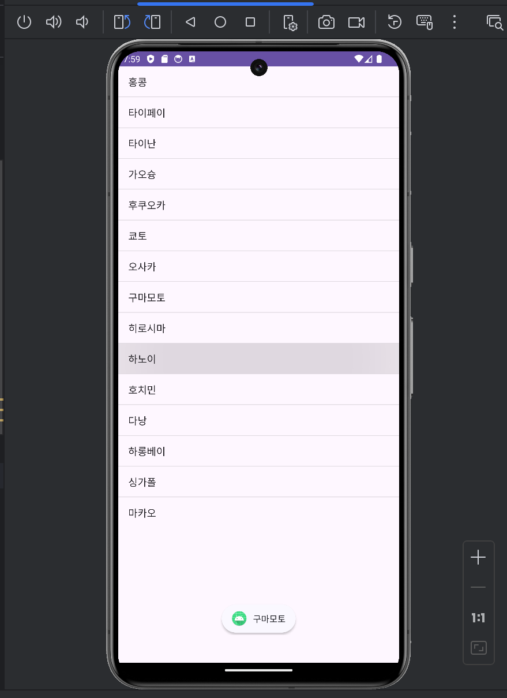
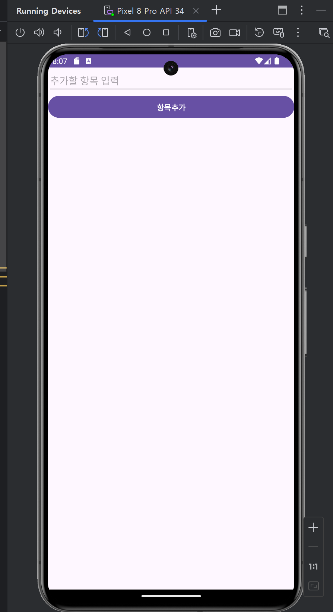

# 어댑터뷰 01. 리스트뷰와 그리드뷰
## 1. 어댑터뷰


### 리스트 뷰
리스트 형태의 데이터를 보여주는 위젯

### ListView란?
ListView는 이름에서도 알 수 있듯이 list형태의 데이터가 있어야 한다. 이것을 `Adapter`를 통해 각각의 데이터와 View를 연결해주는 역할을 한다.

ListView에 표시되는 아이템은 가장 단순하게 텍스트만 출력할수도 있고, 다른 View들의 조합을 이용한 복잡한 형태도 가능하다.


#### 예제

XML 레이아웃
```xml
<?xml version="1.0" encoding="utf-8"?>
<LinearLayout xmlns:android="http://schemas.android.com/apk/res/android"
    xmlns:app="http://schemas.android.com/apk/res-auto"
    xmlns:tools="http://schemas.android.com/tools"
    android:id="@+id/main"
    android:layout_width="match_parent"
    android:layout_height="match_parent"
    android:orientation="vertical"
    tools:context=".MainActivity">

    <ListView
        android:id="@+id/listView"
        android:layout_width="match_parent"
        android:layout_height="wrap_content">


    </ListView>
</LinearLayout>
```

<p align="center">
  
</p>

Main액티비티
```kotlin
package com.example.a2024_05_10_adapterview01

import android.annotation.SuppressLint
import android.os.Bundle
import android.util.Log
import android.view.View
import android.widget.ArrayAdapter
import android.widget.ListView
import android.widget.Toast
import androidx.appcompat.app.AppCompatActivity

class MainActivity : AppCompatActivity() {
    @SuppressLint("MissingInflatedId")
    override fun onCreate(savedInstanceState: Bundle?) {
        super.onCreate(savedInstanceState)

        setContentView(R.layout.activity_main)

        title = "리스트뷰 테스트"

        val listView = findViewById<View>(R.id.listView) as ListView

        // list에서 사용할 item을 배열로 생성
        val mid = arrayOf(
            "홍콩", "타이페이", "타이난", "가오슝", "후쿠오카",
            "쿄토", "오사카", "구마모토", "히로시마", "하노이",
            "호치민", "다낭", "하롱베이", "싱가폴", "마카오"
        )

        Log.d("adb", "$mid")


        // 디자인 1
//        val adapter: ArrayAdapter<String> = ArrayAdapter(
//            this,
//            android.R.layout.simple_list_item_1, mid
//        ) // Resource가 아니라 android

        // 디자인 2

        /**
         *  ArrayAdapter(context, resource, objects)
         *  @param context : 현재 컨텍스트
         *  @param resource : 뷰를 인스턴스화할 때 사용할 TextView가 포함된 레이아웃 파일의 리소스 ID
         *  @param objects : ListView에 표시할 객체
         */

        val adapter: ArrayAdapter<String> = ArrayAdapter( // ListView와 데이터를 이어주는 Adapter를 생성
            this,
            android.R.layout.simple_list_item_multiple_choice, mid
        ) // Resource가 아니라 android
        listView.choiceMode = ListView.CHOICE_MODE_MULTIPLE
        listView.adapter = adapter // listView 에 adapter 데이터를 연결


        Log.d("adb", "$adapter")

        //  AdapterView의 항목을 클릭 했을 때 호출될 콜백을 등록
        // i위치의 파라미터는 인덱스값
        listView.setOnItemClickListener { _, _, i, _ ->
            Toast.makeText(applicationContext, mid[i], Toast.LENGTH_SHORT).show()
            Log.d("adb", "인덱스 번호 : $i")
        }
    }
}
```

<p align="center">
  
</p>


<p align="center">
  
</p>


#### 설명
1. 표시할 데이터를 어댑터에 전달하기 위해 mid라는 이름의 배열을 생성합니다. `mid:Array<String>`
2. listView 인스턴스 생성 XML에서 정의한 ListView를 findViewById 메서드로 찾아 인스턴스를 생성 합니다.
3. 어댑터 연결 : 생성한 ListView 인스턴스에 어탭터를 설정합니다. `ArrayAdapter(context, resource, objects)` 메서드를 사용하여 연결을 수행합니다.
4. 이벤트 처리 : 사용자 입력에 반응해 표시할 동작을 추가해주면 좋을것아 `setOnItemClickListener` 메소드를 이용하여 요소를 클릭 했을 때 Toast 메시지를 표시하도록 했습니다.


list뷰의 레이아웃은  다중선택이 되는  `simple_list_item_multiple_choice` 을 적용하였습니다.
다중선택 적용을 위해서 listview의 choiceMode 를 `CHOICE_MODE_MULTIPLE` 로 추가 설정을 해야 합니다.


`simple_list_item_1` 을 적용했을 때 

<p align="center">
  
</p>

<p align="center">
  
</p>

한가지만 선택이 가능하고 상태를 유지 할 수 없슴

---

####  예제2
사용자가 입력한 데이터를 버튼을 통해 ListView에 항목을 추가하거나 요소 제거가 가능한 리스트 뷰 구현.


xml 레이아웃
```xml
<?xml version="1.0" encoding="utf-8"?>
<LinearLayout xmlns:android="http://schemas.android.com/apk/res/android"
    android:layout_width="match_parent"
    android:layout_height="match_parent"
    android:orientation="vertical">

    <EditText
        android:id="@+id/editItem1"
        android:layout_width="match_parent"
        android:layout_height="wrap_content"
        android:hint="추가할 항목 입력"
        />

    <Button
        android:id="@+id/btnAdd"
        android:layout_width="match_parent"
        android:layout_height="wrap_content"
        android:fontFamily="@font/noto_sans_bold"
        android:text="항목추가" />

    <ListView
        android:id="@+id/listView1"
        android:layout_width="match_parent"
        android:layout_height="wrap_content" />

</LinearLayout>
```

<p align="center">
  
</p>


메인 액티비티

```kotlin
package com.example.a2024_05_10_adapterview01

import android.annotation.SuppressLint
import android.os.Bundle
import android.util.Log
import android.widget.ArrayAdapter
import android.widget.Button
import android.widget.EditText
import android.widget.ListView
import androidx.appcompat.app.AppCompatActivity

class MainActivity2 : AppCompatActivity() {
    @SuppressLint("MissingInflatedId")
    override fun onCreate(savedInstanceState: Bundle?) {
        super.onCreate(savedInstanceState)

        setContentView(R.layout.activity_main2)

        title = "리스트뷰 테스트"


        val midList = mutableListOf<String>()
        Log.d("adb","midList : $midList")
        val listView = findViewById<ListView>(R.id.listView1)


        /**
         *  ArrayAdapter(context, resource, objects)
         *  @param context : 현재 컨텍스트
         *  @param resource : 뷰를 인스턴스화할 때 사용할 TextView가 포함된 레이아웃 파일의 리소스 ID
         *  @param objects : ListView에 표시할 객체
         */
        val adapter: ArrayAdapter<String> = ArrayAdapter(
            this,
            android.R.layout.simple_list_item_1, midList
        )

        listView.adapter = adapter

        val editItem = findViewById<EditText>(R.id.editItem1)

        val btnAdd = findViewById<Button>(R.id.btnAdd)

        // 항목 추가 버튼 클릭 시 동작할 리스너 설정
        btnAdd.setOnClickListener {
            midList.add(editItem.text.toString()) // mutableListOf 에 요소 추가

            // 리스트의 크기와 아이템이 둘 다 변경되는 경우에 사용하는 메서드
            /**
             * 리스트 크기도 변할거고, 새로운 아이템이 들어올꺼니까 리프레쉬하라고 알려주는 것 <-- 새로그린다고보면된다.
             */
            adapter.notifyDataSetChanged()
            Log.d("adb","midList : $midList")

        }

        // listView 아이템을 길게 눌렀을 때
        listView.setOnItemLongClickListener { _, _, position, _ ->
            midList.removeAt(position) // 현재 위치 요소 삭제
            adapter.notifyDataSetChanged() // 새로 리프레쉬
            Log.d("adb","midList : $midList")

            false
        }
    }
}
```
<p align="center">
  
</p>


<p align="center">
  
</p>


설명

- 항목 추가 : 버튼 클릭 리스너를 설정하여 EditText 에서 입력받은 텍스트를 midLIst에 추가하고, `notifyDataSetChanged()` 메소드를 호출하여 ListView를 갱신합니다.

- 항목 삭제 : ListView의 항목을 길게 누르면 해당 위치의 데이터를 midList에서 제거하고, `notifyDataSetChanged()` 메소드를 호출하여 ListView를 갱신합니다.

**핵심**
`notifyDataSetChanged()` : 데이터가 변경 된 후에 호출함으로써, 어댑터에게 연결된 뷰의 데이터가 변경되었음을 알리고, 새로 그리도록 합니다.


---
## 2. 그리드 뷰

- 격자 형태로 나열하여 화면에 표시하는 행과 열이 있는 2차원 뷰 그룹(ViewGroup) 의 한 종류

- 리스트뷰(ListView) 와 마찬가지로 그리드뷰(GridView) 와 같은 뷰 그룹(ViewGroup) 은 스크롤 기능을 지원하며 사용자가 배치된 각 항목(Item) 선택 기능이 가능한 선택 위젯


xml레이아웃

```xml
<?xml version="1.0" encoding="utf-8"?>
<LinearLayout xmlns:android="http://schemas.android.com/apk/res/android"
    xmlns:app="http://schemas.android.com/apk/res-auto"
    xmlns:tools="http://schemas.android.com/tools"
    android:id="@+id/main"
    android:layout_width="match_parent"
    android:layout_height="match_parent"
    android:orientation="vertical"
    tools:context=".MainActivity">

    <GridView
        android:id="@+id/gridView"
        android:layout_width="match_parent"
        android:layout_height="wrap_content"
        android:gravity="center"
        android:numColumns="4" />

</LinearLayout>
```

<p align="center">
  
</p>


numColumns는 열의 개수를 지정합니다.

메인액티비티
```kotlin
package com.example.a2024_05_10_adapterview02

import android.annotation.SuppressLint
import android.content.Context
import android.os.Bundle
import android.util.Log
import android.view.View
import android.view.ViewGroup
import android.widget.BaseAdapter
import android.widget.GridView
import android.widget.ImageView
import androidx.appcompat.app.AlertDialog
import androidx.appcompat.app.AppCompatActivity

class MainActivity : AppCompatActivity() {
    override fun onCreate(savedInstanceState: Bundle?) {
        super.onCreate(savedInstanceState)
        setContentView(R.layout.activity_main)

        title = "그리드뷰 영화 포스터"

        val gridView = findViewById<GridView>(R.id.gridView)

        val myGridAdapter = MyGridAdapter(this)
        gridView.adapter = myGridAdapter

        Log.d("adb", "개수 : ${myGridAdapter.count}") // 40개가 나온다.
    }

    inner class MyGridAdapter(private val context: Context) : BaseAdapter() {
        private val posterId = arrayOf(
            R.drawable.mov01,
            R.drawable.mov02,
            R.drawable.mov03,
            R.drawable.mov04,
            R.drawable.mov05,
            R.drawable.mov06,
            R.drawable.mov07,
            R.drawable.mov08,
            R.drawable.mov09,
            R.drawable.mov10,
            R.drawable.mov11,
            R.drawable.mov12,
            R.drawable.mov13,
            R.drawable.mov14,
            R.drawable.mov15,
            R.drawable.mov16,
            R.drawable.mov17,
            R.drawable.mov18,
            R.drawable.mov19,
            R.drawable.mov20,
            R.drawable.mov21,
            R.drawable.mov22,
            R.drawable.mov23,
            R.drawable.mov24,
            R.drawable.mov25,
            R.drawable.mov26,
            R.drawable.mov27,
            R.drawable.mov28,
            R.drawable.mov29,
            R.drawable.mov30,
            R.drawable.mov31,
            R.drawable.mov32,
            R.drawable.mov33,
            R.drawable.mov34,
            R.drawable.mov35,
            R.drawable.mov36,
            R.drawable.mov37,
            R.drawable.mov38,
            R.drawable.mov39,
            R.drawable.mov40
        )

        private val movieTitle = arrayOf(
            "써니",
            "완득이",
            "괴물",
            "라디오스타",
            "비열한거리",
            "왕이된 남자",
            "아일랜드",
            "웰컴투 동막골",
            "헬보이 : 골든아미",
            "백투더 퓨쳐",

            "여인의 향기",
            "쥬라기 공원",
            "포레스트 검프",
            "Groundhog Day",
            "혹성탈출 : 진화의 시작",
            "아름다운 비행",
            "내이름은 칸",
            "이제 모든것이 끝난다.",
            "마더",
            "킹콩을 들다",

            "쿵푸팬더 2",
            "짱구는 못말려 극장판 15기 : 초시공! 태풍을 부르는 나의 신부",
            "아저씨",
            "아바타",
            "대부1",
            "국가대표1",
            "토이스토리 3",
            "마당을 나온 암탉",
            "죽인 시인의 사회",
            "서유쌍기",

            "킹콩",
            "반지의 제왕",
            "8월의 크리스마스",
            "미녀는 괴로워",
            "나홀로집에1",
            "파이란",
            "더록",
            "로마의길",
            "매트릭스1",
            "가위손"
        )


        override fun getCount(): Int {
            return posterId.size
        }

        override fun getItem(position: Int): Any {
            return 0
        }

        override fun getItemId(position: Int): Long {
            return 0
        }

        @SuppressLint("ViewHolder")
        override fun getView(position: Int, convertView: View?, parent: ViewGroup?): View {
            val imageview = ImageView(context)

            imageview.layoutParams = ViewGroup.LayoutParams(200, 300)
            imageview.scaleType = ImageView.ScaleType.FIT_CENTER
            imageview.setPadding(5, 5, 5, 5)
            imageview.setImageResource(posterId[position])

            imageview.setOnClickListener {
                val dialogView = View.inflate(this@MainActivity, R.layout.dialog, null)
                val dialog = AlertDialog.Builder(this@MainActivity)

                Log.d("adb","dialog : $dialog")
                val imageViewPoster = dialogView.findViewById<ImageView>(R.id.imageViewPoster)

                imageViewPoster.setImageResource(posterId[position])

//              dialog.setTitle("큰 포스터")
                dialog.setTitle(movieTitle[position])
                dialog.setIcon(R.drawable.netflix_macos_bigsur_icon)
                dialog.setView(dialogView)
                dialog.setNegativeButton("닫기", null)
                dialog.show()
            }
            return imageview
        }
    }
}


```

<p align="center">
  
</p>


<p align="center">
  
</p>


1. **레이아웃 설정 및 어댑터 연결**: 
   - 앱이 실행되면 `setContentView`를 통해 XML 레이아웃 파일을 로드하고 `GridView`를 초기화합니다. 
   - `MyGridAdapter` 클래스의 인스턴스를 생성하고 `GridView`에 어댑터로 설정하여 각 영화 포스터를 격자 뷰에 표시하도록 합니다.

2. **어댑터 구현 (`MyGridAdapter`)**:
   - **`getCount()`**: `posterId` 배열의 크기를 반환하여, `GridView`에 몇 개의 아이템이 표시될지 지정합니다.
   - **`getItem(position: Int)`** 및 **`getItemId(position: Int)`**: 각각 아이템과 아이템 ID를 반환하지만, 본 예제에서는 실질적인 데이터 반환 없이 기본값 `0`을 반환합니다.
   - **`getView(position: Int, convertView: View?, parent: ViewGroup?)`**: 실제로 각 포지션에 해당하는 뷰를 생성하고 설정합니다. 각 아이템(이미지뷰)에는 영화 포스터 이미지가 설정되고, 특정 크기와 패딩이 적용됩니다. 

3. **이미지 클릭 이벤트 처리**:
   - 각 `ImageView`에 클릭 리스너를 설정하여 사용자가 이미지를 클릭했을 때 동작합니다.
   - 클릭 시, `AlertDialog`를 통해 상세 이미지와 영화 제목을 보여주는 대화 상자가 나타납니다. 여기에는 큰 사이즈의 포스터 이미지와 영화 제목이 설정된 타이틀이 포함됩니다. 대화 상자는 사용자가 '닫기' 버튼을 클릭할 때까지 화면에 표시됩니다.

4. **리소스 및 레이아웃**:
   - `dialog.xml` 레이아웃은 대화 상자에서 사용되며, 포스터 이미지를 보여주기 위한 `ImageView`를 포함합니다.
   - `posterId` 배열은 각 영화의 포스터 이미지 리소스 ID를 저장하고, `movieTitle` 배열은 영화의 제목을 저장합니다.


참고
- https://www.crocus.co.kr/1581
- https://velog.io/@krrong/Android-ListView-%EC%82%AC%EC%9A%A9%ED%95%98%EA%B8%B0