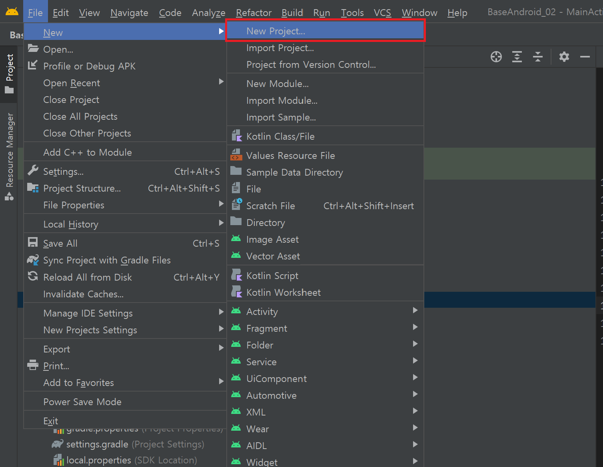

1. 안드로이드 스튜디오 버튼 만들기
`New Project...` 로 새로 시작
<p align="center">
 
</p>

2. `Empty Activity` 선택

<p align="center">
 
</p>

3. 프로젝트 설정
- Name : 자바 제목 작성법
- Package name : 주소 반대
- Language : kotlin
- Minium SDK : API26(Oreo) 기본값21
나머진 편한대로 설정


> [!info] API 26으로 설정하는 이유
> 스프링부트나 코틀린 작업시 최소 26으로 안잡으면
무슨 문제가 있었다고함


<p align="center">
 
</p>
인덱싱과 기타 작업이 끝나고 보면 아무것도 하지않았지만 빨간줄이 보인다.

<p align="center">

</p>

`Gradle Script - build.gradle` 열기
<p align="center">

</p>

- dependencies 에 아래 항목과 일치하는 문장의 버전 수정
- 안드로이드 SDK : 32 수정 후 Sync NoW 클릭

```bash
    implementation 'androidx.core:core-ktx:1.8.0'
    implementation 'androidx.appcompat:appcompat:1.5.1'
    implementation 'com.google.android.material:material:1.6.0'
```

<p align="center">

</p>

이제 오류는 사라졌다.
<p align="center">

</p>

---
버튼 태그 추가

<p align="center">

</p>

```xml
<?xml version="1.0" encoding="utf-8"?>
<androidx.constraintlayout.widget.ConstraintLayout xmlns:android="http://schemas.android.com/apk/res/android"
    xmlns:app="http://schemas.android.com/apk/res-auto"
    xmlns:tools="http://schemas.android.com/tools"
    android:layout_width="match_parent"
    android:layout_height="match_parent"
    tools:context=".MainActivity">

    <TextView
        android:layout_width="wrap_content"
        android:layout_height="wrap_content"
        android:text="Hello World!"
        app:layout_constraintBottom_toBottomOf="parent"
        app:layout_constraintLeft_toLeftOf="parent"
        app:layout_constraintRight_toRightOf="parent"
        app:layout_constraintTop_toTopOf="parent" />

</androidx.constraintlayout.widget.ConstraintLayout>
```
위에서 
androidx.constraintlayout.widget.ConstraintLayout 을 LinearLayout 로 변경
`<TextView>`태그 제거
`<Button>` 태그 추가
`id` 추가
`text` 추가
```xml
<?xml version="1.0" encoding="utf-8"?>
<LinearLayout xmlns:android="http://schemas.android.com/apk/res/android"
    xmlns:app="http://schemas.android.com/apk/res-auto"
    xmlns:tools="http://schemas.android.com/tools"
    android:layout_width="match_parent"
    android:layout_height="match_parent"
    tools:context=".MainActivity">

    <Button
        android:layout_width="match_parent"
        android:layout_height="wrap_content"
        android:id="@+id/button1"
        android:text="버튼입니다"></Button>
</LinearLayout>
```
텍스트 부분에 `Alt + Enter`  Extract Resource 
button1 엔터
<p align="center">

</p>

<p align="center">

</p>

<p align="center">

</p>

그리고 mainActivity.kt를 수정해준다.

```kotlin
package kr.fpkm9999.fpkm999_1

import androidx.appcompat.app.AppCompatActivity
import android.os.Bundle
import android.widget.Button
import android.widget.Toast

class MainActivity : AppCompatActivity() {
    lateinit var button1 : Button // 형 추론이 안되기 때문에 Button 타입을 명시해줘야 함
    // 멤버변수(전역변수)는 선언하면 초기화 해야 함.
    // 만약 값을 나중에 대입 하려면 앞에 lateinit 을 붙임
    // 즉 초기화하지 않은 멤버변수 앞에는 항상 lateinit 을 붙임.
    override fun onCreate(savedInstanceState: Bundle?) {

        super.onCreate(savedInstanceState)
        setContentView(R.layout.activity_main)

        button1 = findViewById(R.id.button1)
        button1.setOnClickListener {
            Toast.makeText(applicationContext,"버튼을 눌렀어요.",Toast.LENGTH_SHORT).show()
        }
    }
}
```

```xml
<?xml version="1.0" encoding="utf-8"?>
<LinearLayout xmlns:android="http://schemas.android.com/apk/res/android"
    xmlns:app="http://schemas.android.com/apk/res-auto"
    xmlns:tools="http://schemas.android.com/tools"
    android:layout_width="match_parent"
    android:layout_height="match_parent"
    tools:context=".MainActivity">

    <Button
        android:layout_width="match_parent"
        android:layout_height="wrap_content"
        android:id="@+id/button1"
        android:text="@string/button1"></Button>
</LinearLayout>
```


strBtn1 추가

```xml
<resources>
    <string name="app_name">Fpkm999_1_14ver</string>
    <string name="strBtn1">버튼입니다.</string>
</resources>
```

실행

<p align="center">

</p>
버튼을 누르면 토스트 메시지가 출력됨.