## 기본 위젯 - 뷰 View의 개요

### 1. 뷰와 뷰그룹
보통 뷰를 위젯이라고도 함.<br>
안드로이드 화면에서 실제로 사용되는 것들을 모두 `View` 라는 클래스의 상속을 받음.
`PDF 참고`

위젯은 단독으로 존재하지 않으며, 위젯을 담아 배치하는 틀이 바로 레이아웃.
레이아웃은  `PDF 참고`

* View 클래스 계층도

`사진참고`

상속관계가 같으면 동일한 xml 속성을 가지고 있다


### 2. View 클래스의 XML 속성


`
androidx.constraintlayout.widget.ConstraintLayout`
얘는 andoirdX 계열임


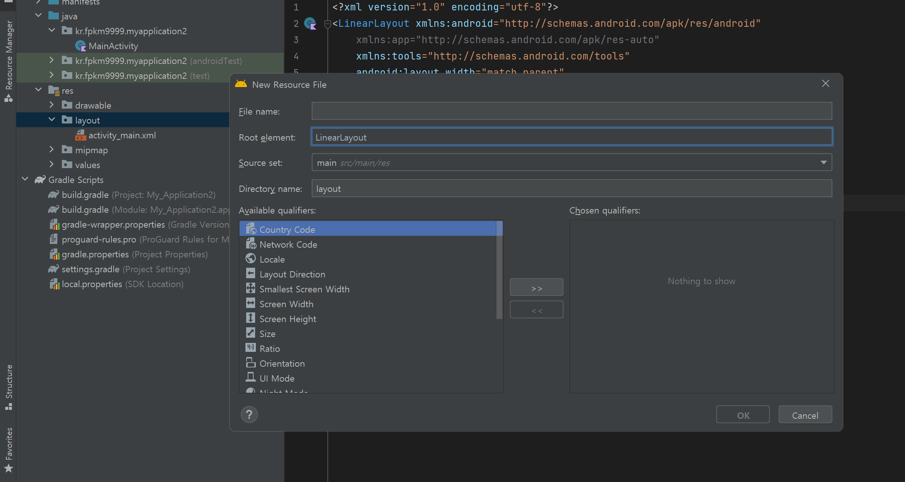

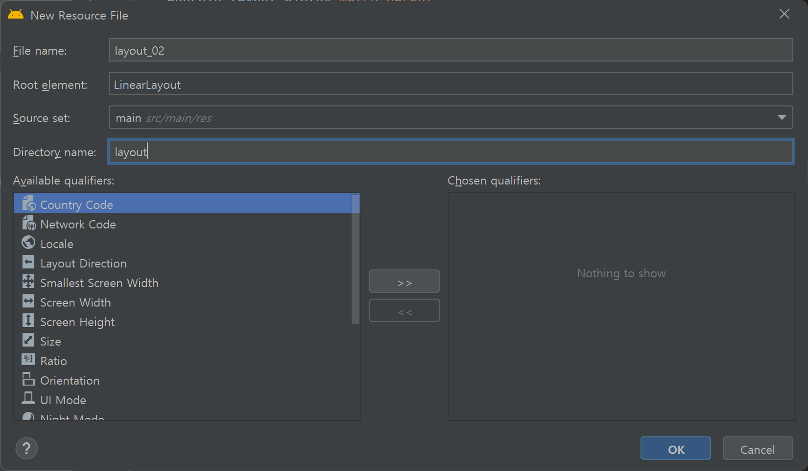


```kotlin
package kr.fpkm9999.myapplication2

import androidx.appcompat.app.AppCompatActivity
import android.os.Bundle

class MainActivity : AppCompatActivity() {
    override fun onCreate(savedInstanceState: Bundle?) {
        super.onCreate(savedInstanceState)
        setContentView(R.layout.activity_main)
    }
}
```
메인엑티비티에 저것만 바꿔주면 레이아웃을 한 프로젝트에서 여러개 교체하며 사용이 가능하다.

```kotlin
package kr.fpkm9999.myapplication2

import androidx.appcompat.app.AppCompatActivity
import android.os.Bundle

class MainActivity : AppCompatActivity() {
    override fun onCreate(savedInstanceState: Bundle?) {
        super.onCreate(savedInstanceState)
        setContentView(R.layout.layout_02)
    }
}
```

---
### 1. id 속성
`id` 속성은 모든 위젯의 아이디를 나타내며, 

Java 코드에서 위젯에 접근하기 위한 코드
```java
위젯 변수 = findViewById(R.id.위젯아이디);
```
xml 작업을 할때 id 속성을 지정한다느건 findViewById에서 쓸거를 지정해야됨. 그걸 필요없는건 id 속성을 지정하지 않아도 됨


---

`layout_02.xml`
```xml
<?xml version="1.0" encoding="utf-8"?>
<LinearLayout xmlns:android="http://schemas.android.com/apk/res/android"
    android:orientation="vertical"
    android:layout_width="match_parent"
    android:layout_height="match_parent">

<TextView
    android:id="@+id/textView1"
    android:layout_width="wrap_content"
    android:layout_height="wrap_content"
    android:text="성별 선택" />

<RadioButton
    android:id="@+id/female"
    android:layout_width="wrap_content"
    android:layout_height="wrap_content"
    android:text="여성"/>

<RadioButton
    android:id="@+id/male"
    android:layout_width="wrap_content"
    android:layout_height="wrap_content"
    android:text="남성"/>
</LinearLayout>
```
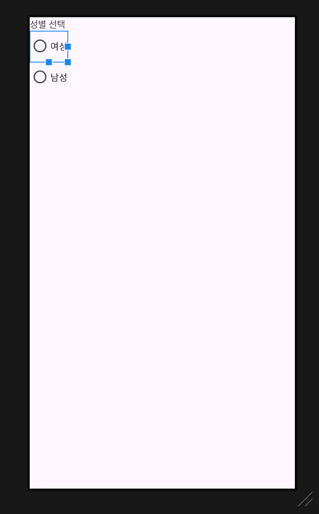
성별 선택의 텍스트 뷰는 클릭 또는 터치할 일이 없음.
결국 Java 코드에서 id 속성을 사용할 일이 없기 떄문에


---
layout_width, height 속성
```xml
<?xml version="1.0" encoding="utf-8"?>
<LinearLayout xmlns:android="http://schemas.android.com/apk/res/android"
    android:orientation="vertical"
    android:layout_width="match_parent"
    android:layout_height="match_parent">

<Button
    android:layout_width="wrap_content"
    android:layout_height="wrap_content"
    android:text="버튼입니다"/>

</LinearLayout>
```

디자인에서 직접 속성을 변경할 수 있다.
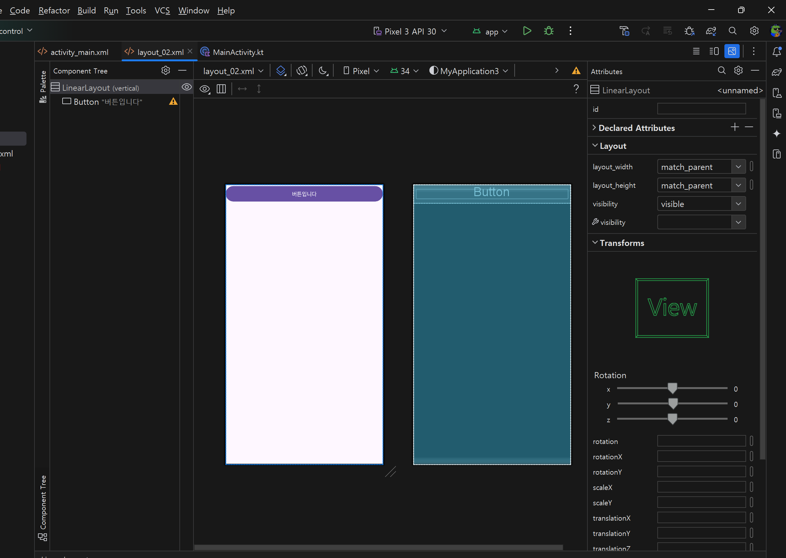


```xml
<?xml version="1.0" encoding="utf-8"?>
<LinearLayout xmlns:android="http://schemas.android.com/apk/res/android"
    android:layout_width="match_parent"
    android:layout_height="match_parent"
    android:orientation="vertical"
    android:visibility="visible">

    <Button
        android:layout_width="wrap_content"
        android:layout_height="match_parent"
        android:text="버튼입니다" />

</LinearLayout>
```
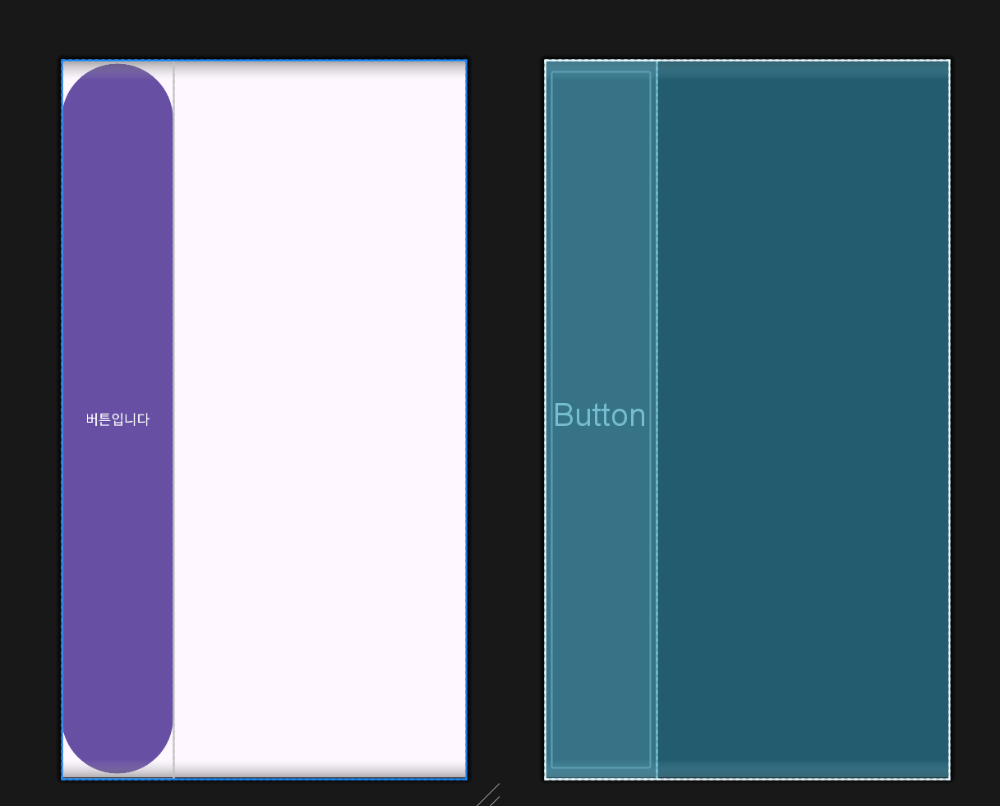


```xml
<?xml version="1.0" encoding="utf-8"?>
<LinearLayout xmlns:android="http://schemas.android.com/apk/res/android"
    android:layout_width="match_parent"
    android:layout_height="match_parent"
    android:orientation="vertical"
    android:visibility="visible">

    <Button
        android:layout_width="match_parent"
        android:layout_height="match_parent"
        android:text="버튼입니다" />

</LinearLayout>
```
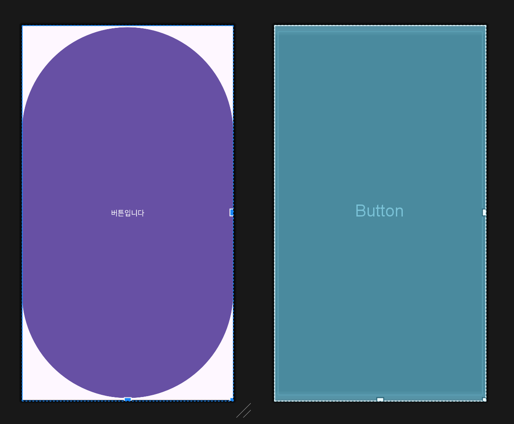

- case5
match_parent <-- LinearLayout에 꽉맞춰서 커짐

절다값을 줄수는 있는데 기기마다 사양이 달라 잘 사용은 안함
```xml
<?xml version="1.0" encoding="utf-8"?>
<LinearLayout xmlns:android="http://schemas.android.com/apk/res/android"
    android:layout_width="match_parent"
    android:layout_height="match_parent"
    android:orientation="vertical"
    android:visibility="visible">

    <Button
        android:layout_width="1080px"
        android:layout_height="1920px"
        android:text="버튼입니다" />

</LinearLayout>
```
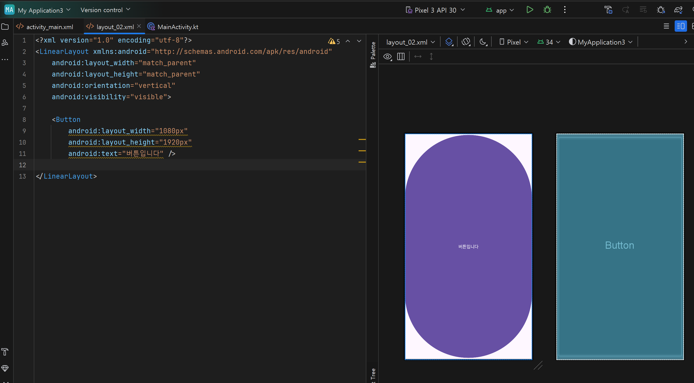

> match_parent vs fill_parent
> 
> match_parent의 예전 단어가 fill_parent
> 기능은 동일함

---

### 3. background 속성
위젯의 색상을 주로 #RRGGBB 값으로 지정.

레이아웃을 빨간색, 버튼은 초록색으로 표현

```xml

```
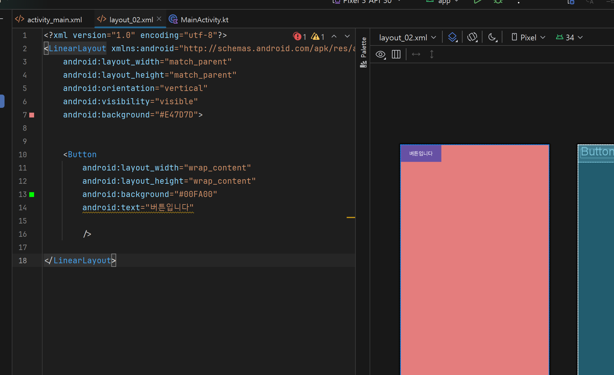


응용

```xml
<?xml version="1.0" encoding="utf-8"?>
<LinearLayout xmlns:android="http://schemas.android.com/apk/res/android"
    android:orientation="vertical"
    android:layout_width="match_parent"
    android:layout_height="match_parent">

    <TextView
        android:layout_width="match_parent"
        android:layout_height="wrap_content"
        android:text="아래에 이름을 입력 : "/>
    <EditText
        android:layout_width="match_parent"
        android:layout_height="wrap_content"
        android:hint="여기에 채우세요"/>
    <Button
        android:layout_width="match_parent"
        android:layout_height="wrap_content"
        android:id="@+id/button1"
        android:text="확인"/>

</LinearLayout>
```
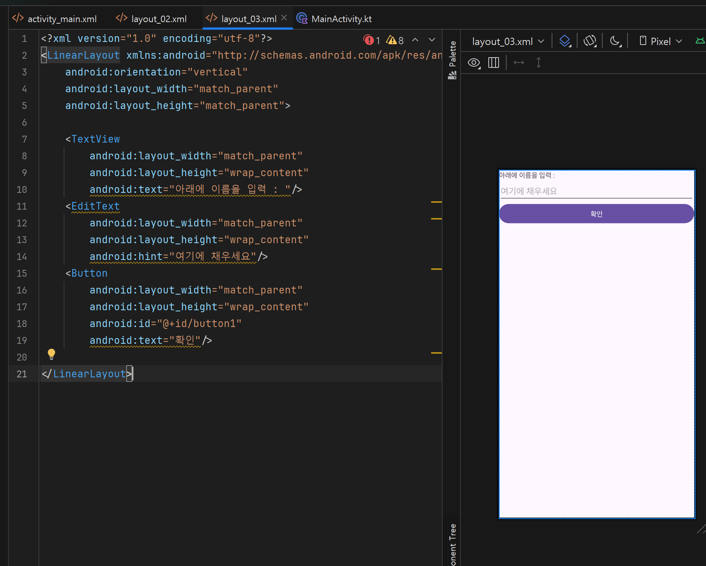

레이아웃에 패딩값 추가
`android:padding="30dp">`

```xml
<?xml version="1.0" encoding="utf-8"?>
<LinearLayout xmlns:android="http://schemas.android.com/apk/res/android"
    android:layout_width="match_parent"
    android:layout_height="match_parent"
    android:orientation="vertical"
    android:padding="30dp">


    <TextView
        android:layout_width="match_parent"
        android:layout_height="wrap_content"
        android:text="아래에 이름을 입력 : " />

    <EditText
        android:layout_width="match_parent"
        android:layout_height="wrap_content"
        android:hint="여기에 채우세요" />

    <Button
        android:id="@+id/button1"
        android:layout_width="match_parent"
        android:layout_height="wrap_content"
        android:text="확인" />

</LinearLayout>
```

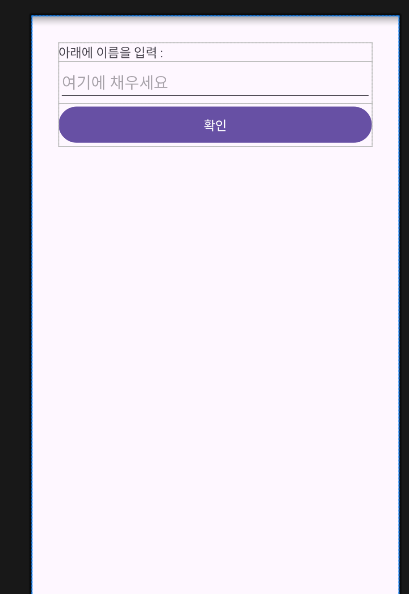


레이아웃에다 패딩을 주면 자식요소도 모두 적용됨
마진값을 각 각 주면

```xml
<?xml version="1.0" encoding="utf-8"?>
<LinearLayout xmlns:android="http://schemas.android.com/apk/res/android"
    android:layout_width="match_parent"
    android:layout_height="match_parent"
    android:orientation="vertical"
    android:padding="30px"
    android:layout_margin="20dp"
    >

    <TextView
        android:layout_width="match_parent"
        android:layout_height="wrap_content"
        android:text="아래에 이름을 입력 : "
        android:layout_margin="20dp" />

    <EditText
        android:layout_width="match_parent"
        android:layout_height="wrap_content"
        android:hint="여기에 채우세요"
        android:layout_margin="20dp" />

    <Button
        android:id="@+id/button1"
        android:layout_width="match_parent"
        android:layout_height="wrap_content"
        android:layout_margin="20dp"
        android:text="확인" />

</LinearLayout>
```
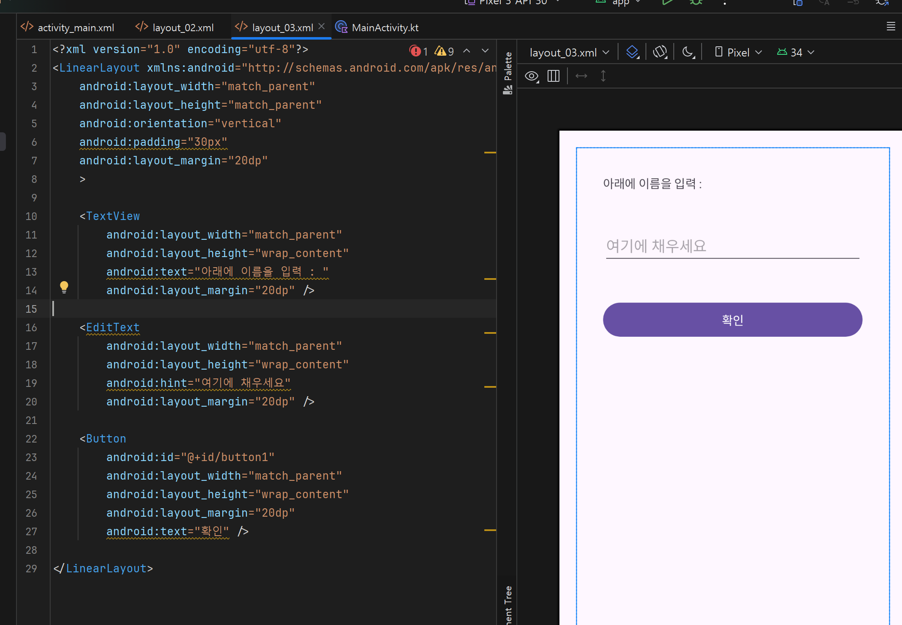


---
```xml
<?xml version="1.0" encoding="utf-8"?>
<LinearLayout xmlns:android="http://schemas.android.com/apk/res/android"
    android:orientation="vertical"
    android:layout_width="match_parent"
    android:layout_height="match_parent">

    <Button
        android:layout_width="match_parent"
        android:layout_height="wrap_content"
        android:text="버튼 1"
        />
    <Button
        android:layout_width="match_parent"
        android:layout_height="wrap_content"
        android:text="버튼 2"
        android:visibility="invisible"
        />
    <Button
        android:layout_width="match_parent"
        android:layout_height="wrap_content"
        android:text="버튼 3"
        android:visibility="visible"
        />
    <Button
        android:layout_width="match_parent"
        android:layout_height="wrap_content"
        android:text="버튼 4"
        android:visibility="gone"/>


</LinearLayout>
```
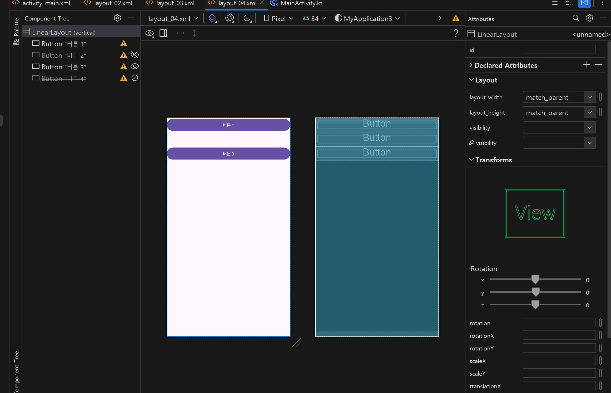

`invisible` 은 안보이지만 공간은 차지하고 있음
`gone` 는 완전히 사라짐


---

```xml
<?xml version="1.0" encoding="utf-8"?>
<LinearLayout xmlns:android="http://schemas.android.com/apk/res/android"
    android:orientation="vertical"
    android:layout_width="match_parent"
    android:layout_height="match_parent">

<Button
    android:layout_width="match_parent"
    android:layout_height="wrap_content"
    android:text="버튼 1"/>
<Button
    android:layout_width="match_parent"
    android:layout_height="wrap_content"
    android:enabled="false"
    android:text="버튼 2"/>
<Button
    android:layout_width="match_parent"
    android:layout_height="wrap_content"
    android:clickable="false"
    android:text="버튼 3"/>
</LinearLayout>
```

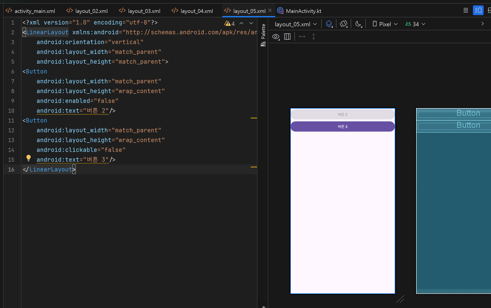

---

```xml
<?xml version="1.0" encoding="utf-8"?>
<LinearLayout xmlns:android="http://schemas.android.com/apk/res/android"
    android:orientation="vertical"
    android:layout_width="match_parent"
    android:layout_height="match_parent">

    <Button
        android:layout_width="match_parent"
        android:layout_height="wrap_content"
        android:text="버튼 1"/>
    <Button
        android:layout_width="match_parent"
        android:layout_height="wrap_content"
        android:text="버튼 2"/>
    <Button
        android:layout_width="match_parent"
        android:layout_height="wrap_content"
        android:rotation="45"
        android:text="버튼 3"/>

</LinearLayout>
```
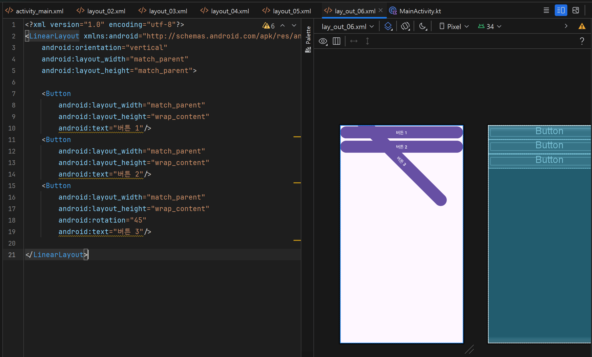

---
### 03 기본위젯 02. 기본 위젯 다루기

#### 1. 텍스트 뷰

- 속성

    text 속성

    textColor 속성

    textSize 속성

    typeface 속성<br>
    글자의 글꼴을 지정

    textStyle 속성


```xml
<?xml version="1.0" encoding="utf-8"?>
<LinearLayout xmlns:android="http://schemas.android.com/apk/res/android"
    android:orientation="vertical"
    android:layout_width="match_parent"
    android:layout_height="match_parent">

    <TextView
        android:layout_width="wrap_content"
        android:layout_height="wrap_content"
        android:text="textSize 속성"
        android:textSize="20dp" />

    <TextView
        android:layout_width="wrap_content"
        android:layout_height="wrap_content"
        android:text="textColor 속성"
        android:textColor="#00FF00"
        android:textSize="30dp" />

    <TextView
        android:layout_width="wrap_content"
        android:layout_height="wrap_content"
        android:text="textStyle 속성"
        android:textSize="30dp"
        android:textStyle="bold|italic" />

    <TextView
        android:layout_width="wrap_content"
        android:layout_height="wrap_content"
        android:text="typeface 속성"
        android:textSize="30dp"
        android:typeface="serif" />

    <TextView
        android:layout_width="wrap_content"
        android:layout_height="wrap_content"
        android:singleLine="true"
        android:text="singleLine 속성 singleLine 속성 singleLine 속성"
        android:textSize="30dp"
        />
</LinearLayout>
```
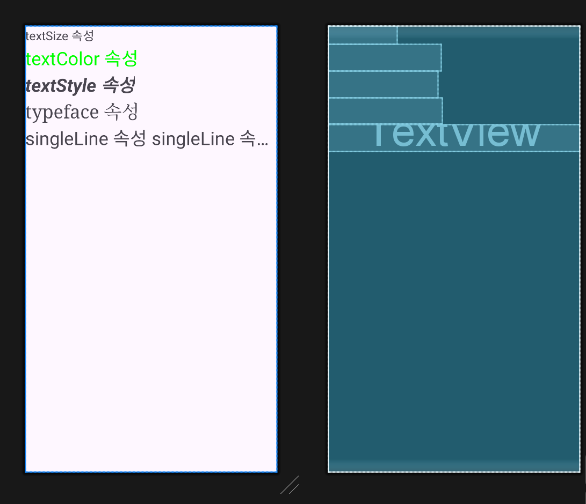


---

```kotlin
package com.example.myapplication

import android.graphics.Color
import android.graphics.Typeface
import androidx.appcompat.app.AppCompatActivity
import android.os.Bundle
import android.widget.TextView

class MainActivity : AppCompatActivity() {

    override fun onCreate(savedInstanceState: Bundle?) {
        super.onCreate(savedInstanceState)
        setContentView(R.layout.activity_main)

        var textView1: TextView = findViewById<TextView>(R.id.textView1)
        var textView2: TextView = findViewById<TextView>(R.id.textView2)
        var textView3: TextView = findViewById<TextView>(R.id.textView3)

        textView1.setText("안녕하세요")
        textView1.setTextColor(Color.RED)
        textView2.textSize = 30.0f

        textView2.setTypeface(Typeface.SERIF, Typeface.BOLD_ITALIC)
        textView3.text = "가나다라마바사아자차카타파하가나다라마바사아자차카타파하가나다라마바사아자차카타파하가나다라마바사아자차카타파하"
        textView3.isSingleLine = true
    }
}
```

```xml
<?xml version="1.0" encoding="utf-8"?>
<LinearLayout xmlns:android="http://schemas.android.com/apk/res/android"
    android:orientation="vertical"
    android:layout_width="match_parent"
    android:layout_height="match_parent">

    <TextView
        android:id="@+id/textView1"
        android:layout_width="match_parent"
        android:layout_height="wrap_content"
        android:text="TextView 연습 1" />

    <TextView
        android:id="@+id/textView2"
        android:layout_width="match_parent"
        android:layout_height="wrap_content"
        android:text="TextView 연습 2" />

    <TextView
        android:id="@+id/textView3"
        android:layout_width="match_parent"
        android:layout_height="wrap_content"
        android:text="TextView 연습 3" />
</LinearLayout>
```

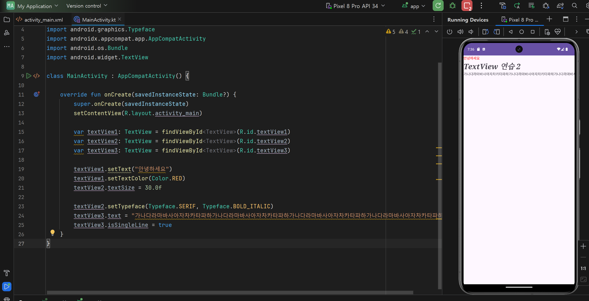


---

#### 3. 버튼과 에디트 텍스트

3) 에디트텍스트에 입력된 값 가져오기 -> 주로 버튼 클릭 이벤트 리스너 안에 삽입
`var myStr : String = myEdit.getText().toString()`

---
간단한 계산기 구현

에디트텍스트 2개, 버튼 4개, 텍스트 뷰 1개를 생성.


```xml
<?xml version="1.0" encoding="utf-8"?>
<LinearLayout xmlns:android="http://schemas.android.com/apk/res/android"
    xmlns:tools="http://schemas.android.com/tools"
    android:layout_width="match_parent"
    android:layout_height="match_parent"
    android:padding="20dp"
    android:orientation="vertical">

    <EditText
        android:id="@+id/editText01"
        android:layout_width="wrap_content"
        android:layout_height="wrap_content"
        android:layout_margin="10dp"
        android:hint="숫자1" />

    <EditText
        android:id="@+id/editText02"
        android:layout_width="wrap_content"
        android:layout_height="wrap_content"
        android:layout_margin="10dp"
        android:hint="숫자2" />

    <Button
        android:id="@+id/btnAdd"
        android:layout_width="match_parent"
        android:layout_height="wrap_content"
        android:layout_margin="10dp"
        android:text="더하기"/>

    <Button
        android:id="@+id/btnSub"
        android:layout_width="match_parent"
        android:layout_height="wrap_content"
        android:layout_margin="10dp"
        android:text="빼기"/>

    <Button
        android:id="@+id/btnMul"
        android:layout_width="match_parent"
        android:layout_height="wrap_content"
        android:layout_margin="10dp"
        android:text="곱하기"/>

    <Button
        android:id="@+id/btnDiv"
        android:layout_width="match_parent"
        android:layout_height="wrap_content"
        android:layout_margin="10dp"
        android:text="나누기"/>

    <TextView
        android:id="@+id/textViewResult"
        android:layout_width="wrap_content"
        android:layout_height="wrap_content"
        android:textSize="30dp"
        android:layout_margin="10dp"
        android:text="계산결과: "
        android:textColor="#E91E63"
        />

</LinearLayout>
```

```kotlin
package com.example.my_calc_01

import android.os.Bundle
import android.widget.Button
import android.widget.EditText
import android.widget.TextView
import androidx.appcompat.app.AppCompatActivity

class MainActivity : AppCompatActivity() {
    val editText01: EditText = findViewById(R.id.editText01)
    val editText02: EditText = findViewById(R.id.editText02)
    val textViewResult: TextView = findViewById(R.id.textViewResult)


    override fun onCreate(savedInstanceState: Bundle?) {
        super.onCreate(savedInstanceState)
        setContentView(R.layout.activity_main)


        val btnAdd = findViewById<Button>(R.id.btnAdd)
        val btnSub = findViewById<Button>(R.id.btnSub)
        val btnMul = findViewById<Button>(R.id.btnMul)
        val btnDiv = findViewById<Button>(R.id.btnDiv)

        btnAdd.setOnClickListener { calculate("+") }
        btnSub.setOnClickListener { calculate("-") }
        btnMul.setOnClickListener { calculate("*") }
        btnDiv.setOnClickListener { calculate("/") }
    }

    // 계산 함수
    private fun calculate(operator: String) {
        val num1 = editText01.text.toString().toDouble()
        val num2 = editText02.text.toString().toDouble()

        var result = 0.0

        when (operator) {
            "+" -> result = num1 + num2
            "-" -> result = num1 - num2
            "*" -> result = num1 * num2
            "/" -> result = num1 / num2
        }

        textViewResult.text = "계산결과: $result"
    }
}
```

화면


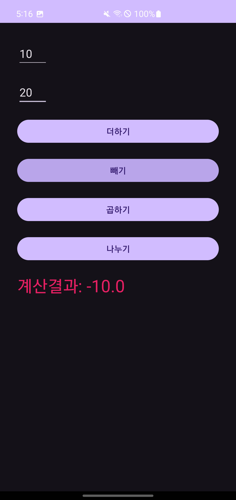

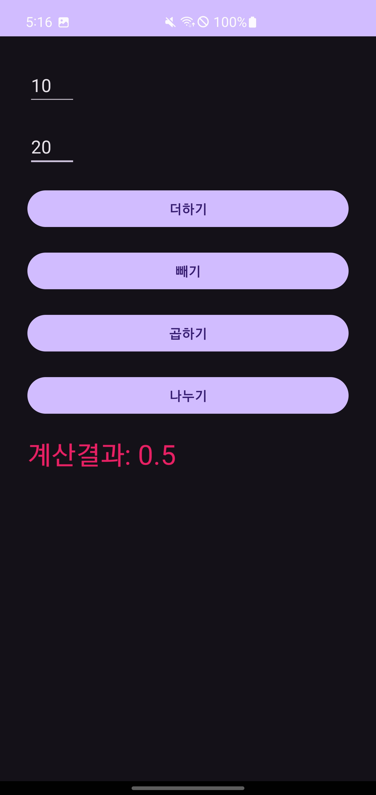

