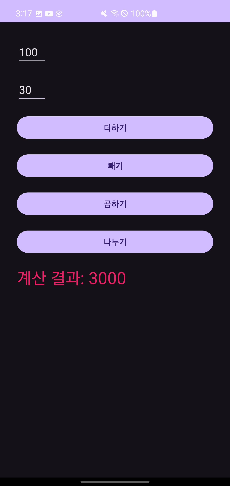

### 계산기 프로젝트

`case1`

```kotlin
package com.example.sebin_calc_01

import android.os.Bundle
import android.widget.Button
import android.widget.EditText
import android.widget.TextView
import androidx.activity.enableEdgeToEdge
import androidx.appcompat.app.AppCompatActivity

class MainActivity : AppCompatActivity() {

    private lateinit var editText01: EditText
    private lateinit var editText02: EditText
    private lateinit var btnAdd: Button
    private lateinit var btnSub: Button
    private lateinit var btnMul: Button
    private lateinit var btnDiv: Button
    private lateinit var textViewResult: TextView
    lateinit var num1: String
    lateinit var num2: String
    var result: Int? = null


    override fun onCreate(savedInstanceState: Bundle?) {
        super.onCreate(savedInstanceState)
        setContentView(R.layout.activity_main)

        editText01 = findViewById(R.id.editText01)
        editText02 = findViewById(R.id.editText02)
        textViewResult = findViewById(R.id.textViewResult)

        btnAdd = findViewById<Button>(R.id.btnAdd)
        btnSub = findViewById<Button>(R.id.btnSub)
        btnMul = findViewById<Button>(R.id.btnMul)
        btnDiv = findViewById<Button>(R.id.btnDiv)

        btnAdd.setOnClickListener { calculate("+") }
        btnSub.setOnClickListener { calculate("-") }
        btnMul.setOnClickListener { calculate("*") }
        btnDiv.setOnClickListener { calculate("/") }
    }

    private fun calculate(operator: String) {
        val num1 = editText01.text.toString().toDouble()
        val num2 = editText02.text.toString().toDouble()

        var result = 0.0

        when (operator) {
            "+" -> result = num1 + num2
            "-" -> result = num1 - num2
            "*" -> result = num1 * num2
            "/" -> result = num1 / num2
        }

        textViewResult.text = "계산결과: $result"
    }
}
```

`case2`

```kotlin
package com.example.sebin_calc_01

import android.os.Bundle
import android.os.PersistableBundle
import android.widget.Button
import android.widget.EditText
import android.widget.TextView
import androidx.activity.enableEdgeToEdge
import androidx.appcompat.app.AppCompatActivity

class MainActivity : AppCompatActivity() {

    private lateinit var editText01: EditText
    private lateinit var editText02: EditText
    private lateinit var btnAdd: Button
    private lateinit var btnSub: Button
    private lateinit var btnMul: Button
    private lateinit var btnDiv: Button
    private lateinit var textViewResult: TextView
    lateinit var num1: String
    lateinit var num2: String
    var result: Int? = null


    override fun onCreate(savedInstanceState: Bundle?) {
        super.onCreate(savedInstanceState)
        setContentView(R.layout.activity_main)

        title = "초간단 계산기"

        editText01 = findViewById(R.id.editText01)
        editText02 = findViewById(R.id.editText02)
        textViewResult = findViewById(R.id.textViewResult)

        btnAdd = findViewById<Button>(R.id.btnAdd)
        btnSub = findViewById<Button>(R.id.btnSub)
        btnMul = findViewById<Button>(R.id.btnMul)
        btnDiv = findViewById<Button>(R.id.btnDiv)

        btnAdd.setOnClickListener {
            num1 = editText01.text.toString()
            num2 = editText02.text.toString()
            result = Integer.parseInt(num1) + Integer.parseInt(num2)
            textViewResult.setText("계산 결과: $result")
        }
        btnSub.setOnClickListener {
            num1 = editText01.text.toString()
            num2 = editText02.text.toString()
            result = Integer.parseInt(num1) - Integer.parseInt(num2)
            textViewResult.setText("계산 결과: $result")
        }
        btnMul.setOnClickListener {
            num1 = editText01.text.toString()
            num2 = editText02.text.toString()
            result = Integer.parseInt(num1) * Integer.parseInt(num2)
            textViewResult.setText("계산 결과: $result")
        }
        btnDiv.setOnClickListener {
            num1 = editText01.text.toString()
            num2 = editText02.text.toString()
            result = Integer.parseInt(num1) / Integer.parseInt(num2)
            textViewResult.setText("계산 결과: $result")
        }
    }


    private fun calculate(operator: String) {
        val num1 = editText01.text.toString().toDouble()
        val num2 = editText02.text.toString().toDouble()

        var result = 0.0

        when (operator) {
            "+" -> result = num1 + num2
            "-" -> result = num1 - num2
            "*" -> result = num1 * num2
            "/" -> result = num1 / num2
        }

        textViewResult.text = "계산결과: $result"
    }
}
```

`case3`

```kotlin
package com.example.sebin_calc_01

import android.os.Bundle
import android.os.PersistableBundle
import android.widget.Button
import android.widget.EditText
import android.widget.TextView
import androidx.activity.enableEdgeToEdge
import androidx.appcompat.app.AppCompatActivity

class MainActivity : AppCompatActivity() {

    private lateinit var editText01: EditText
    private lateinit var editText02: EditText
    private lateinit var btnAdd: Button
    private lateinit var btnSub: Button
    private lateinit var btnMul: Button
    private lateinit var btnDiv: Button
    private lateinit var textViewResult: TextView
    lateinit var num1: String
    lateinit var num2: String
    var result: Int? = null


    override fun onCreate(savedInstanceState: Bundle?) {
        super.onCreate(savedInstanceState)
        setContentView(R.layout.activity_main)

        title = "초간단 계산기"

        editText01 = findViewById(R.id.editText01)
        editText02 = findViewById(R.id.editText02)
        textViewResult = findViewById(R.id.textViewResult)

        btnAdd = findViewById<Button>(R.id.btnAdd)
        btnSub = findViewById<Button>(R.id.btnSub)
        btnMul = findViewById<Button>(R.id.btnMul)
        btnDiv = findViewById<Button>(R.id.btnDiv)

        btnAdd.setOnClickListener {
            num1 = editText01.text.toString()
            num2 = editText02.text.toString()
            result = num1.toInt() + num2.toInt()
            textViewResult.setText("계산 결과: $result")
        }
        btnSub.setOnClickListener {
            num1 = editText01.text.toString()
            num2 = editText02.text.toString()
            result = num1.toInt() - num2.toInt()
            textViewResult.setText("계산 결과: $result")
        }
        btnMul.setOnClickListener {
            num1 = editText01.text.toString()
            num2 = editText02.text.toString()
            result = num1.toInt() * num2.toInt()
            textViewResult.setText("계산 결과: $result")
        }
        btnDiv.setOnClickListener {
            num1 = editText01.text.toString()
            num2 = editText02.text.toString()
            result = num1.toInt() / num2.toInt()
            textViewResult.setText("계산 결과: $result")
        }
    }
    
}
```

<p align="center">
 
</p>
<p align="center">
 
</p>
<p align="center">
 
</p>
<p align="center">
 
</p>

---

추가
    1. 나머지값을 구하는 버튼을 추가.
    2. 값을 입력하지 않고 버튼을 클릭할 때 오류 메시지를 토스트 메시지로 나타냄
    3. 실수값을 계산
    4. 0으로 나누면 토스트 메시지를 나타내고 게산하지 않음.


```kotlin
package com.example.sebin_calc_01

import android.os.Bundle
import android.os.PersistableBundle
import android.widget.Button
import android.widget.EditText
import android.widget.TextView
import android.widget.Toast
import androidx.activity.enableEdgeToEdge
import androidx.appcompat.app.AppCompatActivity

class MainActivity : AppCompatActivity() {

    private lateinit var editText01: EditText
    private lateinit var editText02: EditText
    private lateinit var btnAdd: Button
    private lateinit var btnSub: Button
    private lateinit var btnMul: Button
    private lateinit var btnDiv: Button
    private lateinit var textViewResult: TextView
    private lateinit var btnRem: Button
    lateinit var num1: String
    lateinit var num2: String
    var result: Double? = null
    private lateinit var btn: Button

    override fun onCreate(savedInstanceState: Bundle?) {
        super.onCreate(savedInstanceState)
        setContentView(R.layout.activity_main)


        title = "초간단 계산기"

        editText01 = findViewById(R.id.editText01)
        editText02 = findViewById(R.id.editText02)
        textViewResult = findViewById(R.id.textViewResult)

        btnAdd = findViewById<Button>(R.id.btnAdd)
        btnSub = findViewById<Button>(R.id.btnSub)
        btnMul = findViewById<Button>(R.id.btnMul)
        btnDiv = findViewById<Button>(R.id.btnDiv)
        btnRem = findViewById<Button>(R.id.btnRem)


        btnAdd.setOnClickListener {
            num1 = editText01.text.toString()
            num2 = editText02.text.toString()

            if (isNull(num1, num2)) {
                Toast.makeText(applicationContext, "값을 입력해주세요.", Toast.LENGTH_SHORT).show()
            } else {
                result = num1.toDouble() + num2.toDouble()
                textViewResult.setText("계산 결과: $result")
            }
        }
        btnSub.setOnClickListener {
            num1 = editText01.text.toString()
            num2 = editText02.text.toString()

            if (isNull(num1, num2)) {
                Toast.makeText(applicationContext, "값을 입력해주세요.", Toast.LENGTH_SHORT).show()
            } else {
                result = num1.toDouble() - num2.toDouble()
                textViewResult.setText("계산 결과: $result")
            }
        }
        btnMul.setOnClickListener {

            num1 = editText01.text.toString()
            num2 = editText02.text.toString()

            if (isNull(num1, num2)) {
                Toast.makeText(applicationContext, "값을 입력해주세요.", Toast.LENGTH_SHORT).show()
            } else {
                result = num1.toDouble() * num2.toDouble()
                textViewResult.setText("계산 결과: $result")
            }

        }
        btnDiv.setOnClickListener {
            num1 = editText01.text.toString()
            num2 = editText02.text.toString()

            if (isNull(num1, num2)) {
                Toast.makeText(applicationContext, "값을 입력해주세요.", Toast.LENGTH_SHORT).show()
            } else {
                if (!num2.equals("0")) {
                    result = num1.toDouble() / num2.toDouble()
                    textViewResult.setText("계산 결과: $result")
                }else{
                    Toast.makeText(applicationContext, "0을 입력하셨습니다.", Toast.LENGTH_SHORT).show()
                }

            }


        }
        btnRem.setOnClickListener {
            num1 = editText01.text.toString()
            num2 = editText02.text.toString()

            if (isNull(num1, num2)) {
                Toast.makeText(applicationContext, "값을 입력해주세요.", Toast.LENGTH_SHORT).show()
            } else {
                result = num1.toDouble() % num2.toDouble()
                textViewResult.setText("계산 결과: $result")
            }


        }
    }

    private fun isNull(num1: String, num2: String): Boolean {
        if (num1.toString().isEmpty() || num2.toString().isEmpty()) {
//            Toast.makeText(applicationContext, "값을 입력해주세요.", Toast.LENGTH_SHORT).show()
            return true
        }
        return false
    }


}
```

`최종`

```kotlin
package com.example.sebin_calc_01

import android.os.Bundle
import android.os.PersistableBundle
import android.widget.Button
import android.widget.EditText
import android.widget.TextView
import android.widget.Toast
import androidx.activity.enableEdgeToEdge
import androidx.appcompat.app.AppCompatActivity

class MainActivity : AppCompatActivity() {

    private lateinit var editText01: EditText
    private lateinit var editText02: EditText
    private lateinit var btnAdd: Button
    private lateinit var btnSub: Button
    private lateinit var btnMul: Button
    private lateinit var btnDiv: Button
    private lateinit var textViewResult: TextView
    private lateinit var btnRem: Button
    lateinit var num1: String
    lateinit var num2: String
    var result: Double? = null
    private lateinit var btn: Button

    override fun onCreate(savedInstanceState: Bundle?) {
        super.onCreate(savedInstanceState)
        setContentView(R.layout.activity_main)


        title = "초간단 계산기"

        editText01 = findViewById(R.id.editText01)
        editText02 = findViewById(R.id.editText02)
        textViewResult = findViewById(R.id.textViewResult)

        btnAdd = findViewById<Button>(R.id.btnAdd)
        btnSub = findViewById<Button>(R.id.btnSub)
        btnMul = findViewById<Button>(R.id.btnMul)
        btnDiv = findViewById<Button>(R.id.btnDiv)
        btnRem = findViewById<Button>(R.id.btnRem)


        btnAdd.setOnClickListener {
            num1 = editText01.text.toString()
            num2 = editText02.text.toString()

            if (isNull(num1, num2)) {
                return@setOnClickListener
            }

            result = num1.toDouble() + num2.toDouble()
            textViewResult.text = "계산 결과: $result"
        }
        btnSub.setOnClickListener {
            num1 = editText01.text.toString()
            num2 = editText02.text.toString()

            if (isNull(num1, num2)) {
                return@setOnClickListener
            }
            result = num1.toDouble() - num2.toDouble()
            textViewResult.text = "계산 결과: $result"
        }
        btnMul.setOnClickListener {

            num1 = editText01.text.toString()
            num2 = editText02.text.toString()

            if (isNull(num1, num2)) {
                return@setOnClickListener
            }
            result = num1.toDouble() * num2.toDouble()
            textViewResult.text = "계산 결과: $result"

        }
        btnDiv.setOnClickListener {
            num1 = editText01.text.toString()
            num2 = editText02.text.toString()

            if (isNull(num1, num2)) {
                return@setOnClickListener
            }
            if (!num2.equals("0")) {
                result = num1.toDouble() / num2.toDouble()
                textViewResult.text = "계산 결과: $result"
            } else {
                Toast.makeText(applicationContext, "0을 입력하셨습니다.", Toast.LENGTH_SHORT).show()
            }


        }
        btnRem.setOnClickListener {
            num1 = editText01.text.toString()
            num2 = editText02.text.toString()

            if (isNull(num1, num2)) {
                return@setOnClickListener
            }
            result = num1.toDouble() % num2.toDouble()
            textViewResult.text = "계산 결과: $result"


        }
    }

    private fun isNull(num1: String, num2: String): Boolean {
        if (num1.toString().isEmpty() || num2.toString().isEmpty()) {
            Toast.makeText(applicationContext, "값을 입력해주세요.", Toast.LENGTH_SHORT).show()
            return true
        }
        return false
    }


}
```

### 기본 위젯 활용

#### 1. 컴파운드버튼


1. 체크 박스


사용
```kotlin
<?xml version="1.0" encoding="utf-8"?>
<LinearLayout xmlns:android="http://schemas.android.com/apk/res/android"
    android:orientation="vertical"
    android:layout_width="match_parent"
    android:layout_height="match_parent">

    <CheckBox
        android:id="@+id/android"
        android:layout_width="match_parent"
        android:layout_height="wrap_content"
        android:checked="true"
        android:text="안드로이드폰"
        />
    <CheckBox
        android:id="@+id/iphone"
        android:layout_width="match_parent"
        android:layout_height="wrap_content"
        android:text="아이폰" />
    <CheckBox
        android:id="@+id/window"
        android:layout_width="match_parent"
        android:layout_height="wrap_content"
        android:checked="true"
        android:text="윈도우폰" />


</LinearLayout>
```
<p align="center">
 
</p>

kotlin 코드에서는 강제로 체크를 켜거나 끄는 `setChecked()`,
체크 상태를 반대로 바꾸는 `toggle()`,
체크 되었는지 확인하는 `isChecked()` 등의 메서드를 많이 사용

2. 스위치 버튼


소스

```xml
<?xml version="1.0" encoding="utf-8"?>
<LinearLayout xmlns:android="http://schemas.android.com/apk/res/android"
    xmlns:tools="http://schemas.android.com/tools"
    android:orientation="vertical"
    android:layout_width="match_parent"
    android:layout_height="match_parent">

    <Switch
        android:layout_width="wrap_content"
        android:layout_height="wrap_content"
        android:checked="true"/>
    <Switch
        android:layout_width="wrap_content"
        android:layout_height="wrap_content"
        android:checked="false"
        />
    <ToggleButton
        android:layout_width="wrap_content"
        android:layout_height="wrap_content"
        android:checked="true"/>
    <ToggleButton
        android:layout_width="wrap_content"
        android:layout_height="wrap_content"
        android:checked="false"/>"
    </LinearLayout>
```

<p align="center">
 
</p>
<p align="center">
 
</p>


3. 라디오 버튼과 라디오 그룹


소스
```xml
<?xml version="1.0" encoding="utf-8"?>
<LinearLayout xmlns:android="http://schemas.android.com/apk/res/android"
    android:layout_width="match_parent"
    android:layout_height="match_parent"
    android:orientation="vertical">

    <RadioGroup
        android:id="@+id/rGroup1"
        android:layout_width="wrap_content"
        android:layout_height="wrap_content">

        <RadioButton
            android:id="@+id/radio0"
            android:layout_width="wrap_content"
            android:layout_height="wrap_content"
            android:checked="true"
            android:text="남성" />

        <RadioButton
            android:id="@+id/radio1"
            android:layout_width="wrap_content"
            android:layout_height="wrap_content"
            android:text="여성" />

    </RadioGroup>
</LinearLayout>
```
<p align="center">
 
</p>

<p align="center">
 
</p>