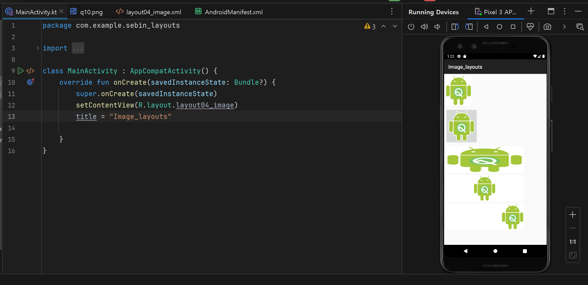
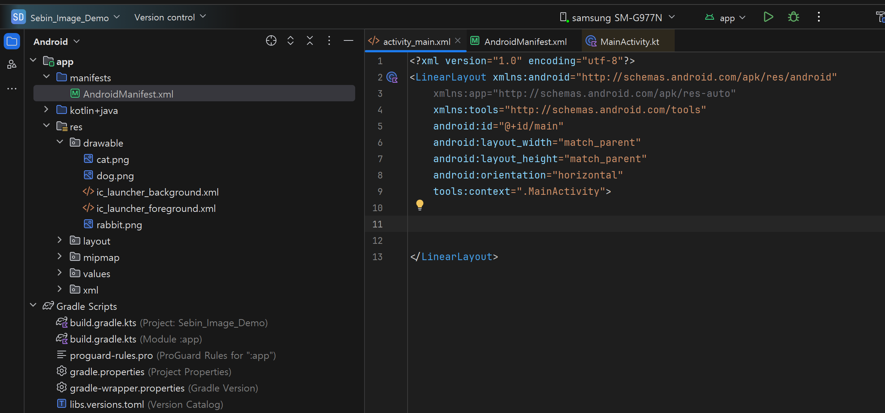
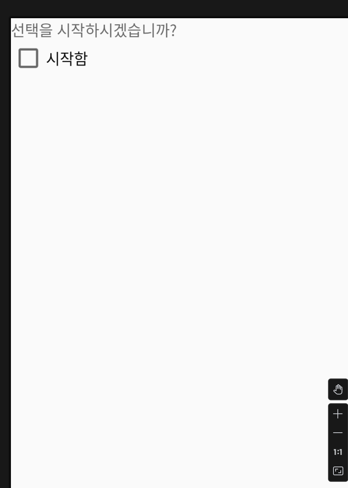
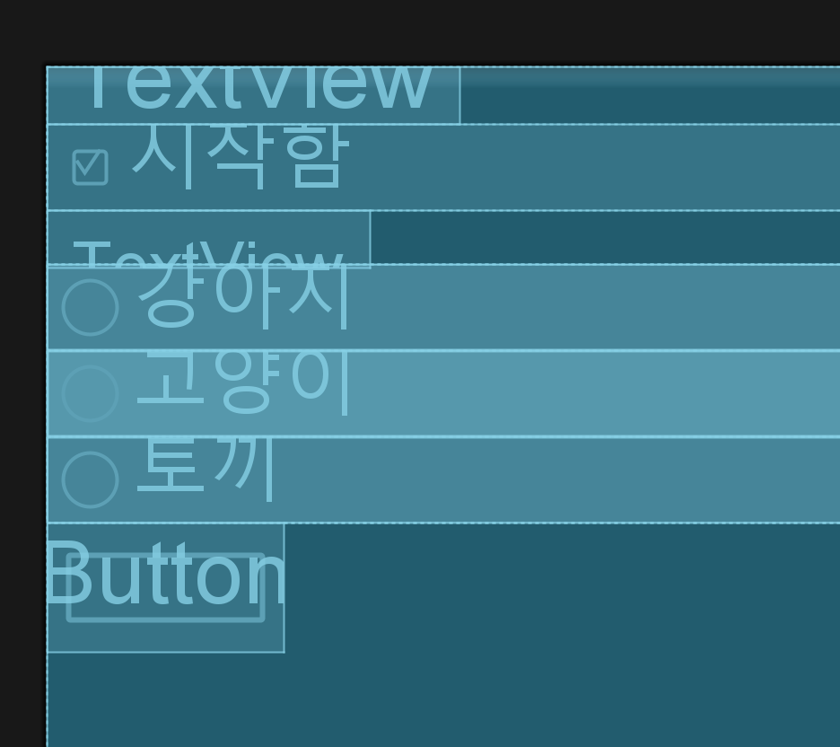
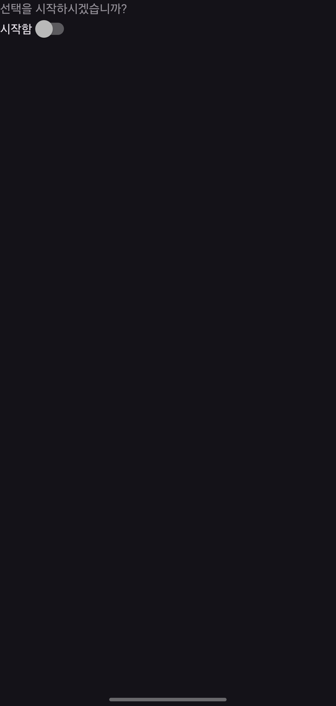
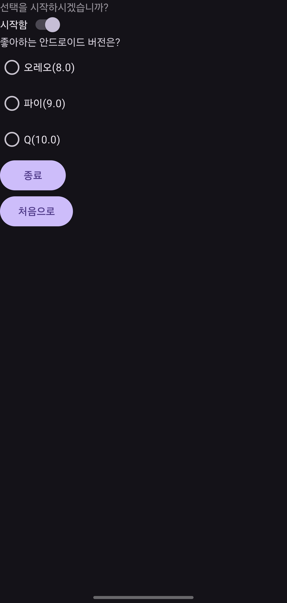
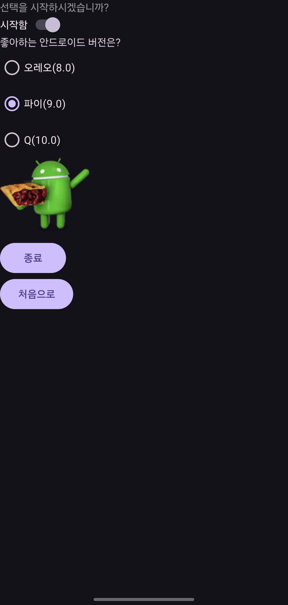

### 이미지뷰와 이미지버튼의 XML 속성

### 1. ImageView
`ImageView`는 Android에서 이미지를 표시하는 데 사용되는 위젯입니다. 다음은 주요 XML 속성입니다:

- `android:src`: 이미지뷰에 표시될 이미지를 지정합니다.
- `android:contentDescription`: 접근성을 위해 이미지의 설명을 제공합니다.
- `android:scaleType`: 이미지의 크기 조정 방식을 설정합니다. 예를 들어 `centerCrop`, `fitXY` 등이 있습니다.
- `android:tint`: 이미지에 색상 필터를 적용합니다.

```xml
<ImageView
    android:layout_width="wrap_content"
    android:layout_height="wrap_content"
    android:src="@drawable/image_name"
    android:contentDescription="@string/description"
    android:scaleType="fitCenter"
    android:tint="#FF5722" />
```

### 2. ImageButton
`ImageButton`은 이미지를 포함하는 버튼으로, 사용자의 터치에 반응하여 동작을 실행할 수 있습니다. 주요 XML 속성은 `ImageView`와 유사하며, 추가적으로 클릭 이벤트를 처리할 수 있습니다:

- `android:background`: 버튼의 배경을 설정합니다. 투명 배경을 원할 경우 `@android:color/transparent`를 사용할 수 있습니다.

```xml
<ImageButton
    android:layout_width="wrap_content"
    android:layout_height="wrap_content"
    android:src="@drawable/image_name"
    android:background="@android:color/transparent"
    android:contentDescription="@string/description" />
```


### 안드로이드 스튜디오에서 이미지를 불러오는 과정
1.이미지 리소스를 프로젝트에 포함시킨다.

2. `ImageView` 컴포넌트를 사용하여 화면에 표시한다.


상세 과정
#### 1. 이미지 리소스 추가하기

1. **이미지 파일 준비**: 사용할 이미지 파일을 준비합니다. 이 파일은 일반적으로 PNG, JPG 등의 형식이 될 수 있습니다. (SVG는 불가능)
2. **리소스 폴더에 이미지 추가**: 이미지 파일을 안드로이드 스튜디오의 `res/drawable` 폴더에 복사합니다. 이 폴더는 애플리케이션의 그래픽 리소스를 저장하는 곳입니다.

### 2. XML 레이아웃 파일에서 이미지뷰 설정

`ImageView` 위젯을 XML 레이아웃 파일에 추가하여 이미지를 표시합니다. `ImageView`의 `android:src` 속성을 사용하여 표시할 이미지를 지정할 수 있습니다.

```xml
<ImageView
    android:id="@+id/imageView"
    android:layout_width="wrap_content"
    android:layout_height="wrap_content"
    android:src="@drawable/your_image_name" />
```

여기서 `@drawable/your_image_name`은 `drawable` 폴더에 추가한 이미지 파일의 이름을 지정합니다.

### 3. 액티비티에서 이미지뷰 제어

액티비티의 Java 또는 Kotlin 코드에서 `ImageView`를 제어하여 프로그래밍 방식으로 이미지를 변경하거나 다른 이미지 속성을 설정할 수 있습니다.

```kotlin
val imageView: ImageView = findViewById(R.id.imageView)
imageView.setImageResource(R.drawable.another_image)
```

이 코드는 `ImageView`에 다른 이미지를 설정합니다. 이 방법을 통해 사용자 상호작용에 응답하거나 앱의 상태 변경에 따라 이미지를 동적으로 업데이트할 수 있습니다.

### 4. 이미지 조정

`ImageView`의 여러 속성을 조정하여 이미지의 표시 방식을 변경할 수 있습니다. 예를 들어, `android:scaleType` 속성을 사용하여 이미지의 크기 조정 방식을 설정할 수 있습니다.

```xml
<ImageView
    android:scaleType="centerCrop" />
```

이 속성은 이미지가 `ImageView`의 경계를 벗어나지 않도록 크기를 조정하면서 이미지의 중앙을 기준으로 크롭합니다.

---

실습

```xml
<?xml version="1.0" encoding="utf-8"?>
<LinearLayout xmlns:android="http://schemas.android.com/apk/res/android"
    android:layout_width="match_parent"
    android:layout_height="match_parent"
    android:orientation="vertical">

    <ImageView
        android:layout_width="wrap_content"
        android:layout_height="wrap_content"
        android:layout_margin="5dp"
        android:background="#ffffff"
        android:src="@drawable/q10" />

    <ImageButton
        android:layout_width="wrap_content"
        android:layout_height="wrap_content"
        android:layout_margin="5dp"
        android:src="@drawable/q10" />

    <ImageView
        android:layout_width="300dp"
        android:layout_height="100dp"
        android:layout_margin="5dp"
        android:background="#ffffff"
        android:scaleType="fitXY"
        android:src="@drawable/q10" />
    <ImageView
        android:layout_width="300dp"
        android:layout_height="100dp"
        android:layout_margin="5dp"
        android:background="#ffffff"
        android:scaleType="fitCenter"
        android:src="@drawable/q10" />

    <ImageView
        android:layout_width="300dp"
        android:layout_height="100dp"
        android:layout_margin="5dp"
        android:background="#ffffff"
        android:scaleType="fitEnd"
        android:src="@drawable/q10" />

</LinearLayout>
```


- **ImageView (첫 번째)**:
  - `wrap_content`: 너비와 높이가 이미지의 실제 크기에 맞춰져 있습니다.
  - `android:background="#ffffff"`: 배경색을 흰색으로 설정합니다.
  - `android:src="@drawable/q10"`: `q10`이라는 이름의 이미지 리소스를 사용하여 이미지를 표시합니다.
  - `android:layout_margin="5dp"`: 모든 방향으로 5dp의 마진을 추가합니다.

- **ImageButton**:
  - 이 버튼은 이미지를 표시하는 버튼으로, 위와 비슷한 속성을 가지고 있습니다. 버튼이므로 클릭 가능하며, 특정 동작을 할당할 수 있습니다.

- **ImageView (두 번째, 세 번째, 네 번째)**:
  - 이 세 이미지 뷰는 너비가 `300dp`이고 높이가 `100dp`입니다.
  - `android:scaleType`: 이미지의 크기 조정 방식을 다르게 설정합니다.
    - `fitXY`: 이미지를 뷰의 크기에 맞게 X와 Y 방향으로 늘립니다.
    - `fitCenter`: 이미지를 중앙에 맞추고 비율을 유지하면서 최대한 뷰에 맞춥니다.
    - `fitEnd`: 이미지를 뷰의 끝에 맞추고 비율을 유지하면서 최대한 뷰에 맞춥니다.

각 `ImageView`와 `ImageButton`은 `android:src` 속성을 통해 `@drawable/q10` 리소스를 사용하며, 이는 동일한 이미지를 다양한 방식으로 보여줍니다.

<p align="center">

</p>


---

`Sebin_Image_Demo` 프로젝트

프로젝트 생성후 아래와 같이 세팅

<p align="center">

</p>


#### `소스`

#### `activity_main.xml`
```xml
<?xml version="1.0" encoding="utf-8"?>
<LinearLayout xmlns:android="http://schemas.android.com/apk/res/android"
    xmlns:app="http://schemas.android.com/apk/res-auto"
    xmlns:tools="http://schemas.android.com/tools"
    android:id="@+id/main"
    android:layout_width="match_parent"
    android:layout_height="match_parent"
    android:orientation="vertical"
    tools:context=".MainActivity">

    <TextView
        android:id="@+id/textView01"
        android:layout_width="wrap_content"
        android:layout_height="wrap_content"
        android:hint="선택을 시작하시겠습니까?" />

    <CheckBox
        android:id="@+id/checkboxAgree"
        android:layout_width="match_parent"
        android:layout_height="wrap_content"
        android:text="시작함" />

    <TextView
        android:id="@+id/textView02"
        android:layout_width="wrap_content"
        android:layout_height="wrap_content"
        android:text="좋아하는 애완동물은"
        android:visibility="invisible" />

    <RadioGroup
        android:id="@+id/radioGroup"
        android:layout_width="match_parent"
        android:layout_height="wrap_content"
        android:visibility="invisible">


        <RadioButton
            android:id="@+id/radioButtonDog"
            android:layout_width="match_parent"
            android:layout_height="wrap_content"
            android:text="강아지" />

        <RadioButton
            android:id="@+id/radioButtonCat"
            android:layout_width="match_parent"
            android:layout_height="wrap_content"
            android:text="고양이" />

        <RadioButton
            android:id="@+id/radioButtonRabbit"
            android:layout_width="match_parent"
            android:layout_height="wrap_content"
            android:text="토끼" />
    </RadioGroup>

    <Button
        android:id="@+id/btnOk"
        android:layout_width="wrap_content"
        android:layout_height="wrap_content"
        android:text="선택완료"
        android:visibility="invisible" />

    <ImageView
        android:id="@+id/imgPet"
        android:layout_width="wrap_content"
        android:layout_height="wrap_content"
        android:visibility="invisible" />
</LinearLayout>
```

<p align="center">

</p>


<p align="center">

</p>


#### `MainActivity.kt`

```kotlin
package com.example.sebin_image_demo

import android.os.Bundle
import android.view.View
import android.widget.Button
import android.widget.CheckBox
import android.widget.ImageView
import android.widget.RadioButton
import android.widget.RadioGroup
import android.widget.TextView
import android.widget.Toast
import androidx.appcompat.app.AppCompatActivity

class MainActivity : AppCompatActivity() {

    // 1.
    // 9개의 위젯에 대응할 위젯 변수 9개 생성
    private lateinit var textView01: TextView
    private lateinit var checkboxAgree: CheckBox
    private lateinit var textView02: TextView
    private lateinit var radioGroup: RadioGroup
    private lateinit var radioButtonDog: RadioButton
    private lateinit var radioButtonCat: RadioButton
    private lateinit var radioButtonRabbit: RadioButton
    private lateinit var btnOk: Button
    private lateinit var imgPet: ImageView


    override fun onCreate(savedInstanceState: Bundle?) {
        super.onCreate(savedInstanceState)
        setContentView(R.layout.activity_main)

        // 2.
        // 각 위젯을 변수에 대입
        title = "애완동물 사진 보기"

        textView01 = findViewById(R.id.textView01)
        textView02 = findViewById(R.id.textView02)
        checkboxAgree = findViewById(R.id.checkboxAgree)
        radioGroup = findViewById(R.id.radioGroup)
        radioButtonDog = findViewById(R.id.radioButtonDog)
        radioButtonCat = findViewById(R.id.radioButtonCat)
        radioButtonRabbit = findViewById(R.id.radioButtonRabbit)
        btnOk = findViewById(R.id.btnOk)
        imgPet = findViewById(R.id.imgPet)


        // 3. 동작
        // '시작함' 체크박스를 체크 / 언체크 할 떄 마다 동작하는 람다식 정의

        checkboxAgree.setOnCheckedChangeListener { buttonView, isChecked ->
            if (isChecked) {
                textView02.visibility = View.VISIBLE
                radioGroup.visibility = View.VISIBLE
                btnOk.visibility = View.VISIBLE
                imgPet.visibility = View.VISIBLE
            } else {
                textView02.visibility = View.INVISIBLE
                radioGroup.visibility = View.INVISIBLE
                btnOk.visibility = View.INVISIBLE
                imgPet.visibility = View.INVISIBLE
            }
        }
        // 경우의 수는 4가지
        btnOk.setOnClickListener {
            when (radioGroup.checkedRadioButtonId) {
                R.id.radioButtonDog -> imgPet.setImageResource(R.drawable.dog)
                R.id.radioButtonCat -> imgPet.setImageResource(R.drawable.cat)
                R.id.radioButtonRabbit -> imgPet.setImageResource(R.drawable.rabbit)
                else -> Toast.makeText(applicationContext,
                    "동물을 먼저 선택 하세요.",Toast.LENGTH_LONG).show()
            }
        }
    }
}
```

여기서 추가 개선을 한다면.

### 2. 요구사항
- 시작함을 스위치로 변경.
- 좋아하는 안드로이드 버전은? 으로 질문을 변경
- '선택완료'를 없애고, 라디오버튼을 선택할 때마다 즉시 해당 이미지가 나오도록 변경.
- 마지막에 '종료'와 '처음으로' 버튼을 추가.
'종료'를 클릭하면 응용 프로그램이 완전히 종료되게 하고,
'처음으로'를 클릭하면 다시 초기화 되고 처음 화면이 나오게 함.

### `Sebin_Image_Demo2` 프로젝트

#### `activity_main.xml`

```xml
<?xml version="1.0" encoding="utf-8"?>
<LinearLayout xmlns:android="http://schemas.android.com/apk/res/android"
    xmlns:app="http://schemas.android.com/apk/res-auto"
    xmlns:tools="http://schemas.android.com/tools"
    android:id="@+id/main"
    android:layout_width="match_parent"
    android:layout_height="match_parent"
    android:orientation="vertical"
    tools:context=".MainActivity">

    <TextView
        android:id="@+id/textView01"
        android:layout_width="wrap_content"
        android:layout_height="wrap_content"
        android:hint="선택을 시작하시겠습니까?" />

    <Switch
        android:id="@+id/switchAgree"
        android:layout_width="wrap_content"
        android:layout_height="wrap_content"
        android:text="시작함" />

    <TextView
        android:id="@+id/textView02"
        android:layout_width="wrap_content"
        android:layout_height="wrap_content"
        android:text="좋아하는 안드로이드 버전은?"
        android:visibility="invisible" />

    <RadioGroup
        android:id="@+id/radioGroup"
        android:layout_width="match_parent"
        android:layout_height="wrap_content"
        android:visibility="invisible">


        <RadioButton
            android:id="@+id/radioOreo"
            android:layout_width="match_parent"
            android:layout_height="wrap_content"
            android:text="오레오(8.0)" />

        <RadioButton
            android:id="@+id/radioPie"
            android:layout_width="match_parent"
            android:layout_height="wrap_content"
            android:text="파이(9.0)" />

        <RadioButton
            android:id="@+id/radioQ"
            android:layout_width="match_parent"
            android:layout_height="wrap_content"
            android:text="Q(10.0)" />
    </RadioGroup>

    <ImageView
        android:id="@+id/imgAndroid"
        android:layout_width="wrap_content"
        android:layout_height="wrap_content"
        android:visibility="invisible" />

    <Button
        android:id="@+id/btnExit"
        android:layout_width="wrap_content"
        android:layout_height="wrap_content"
        android:visibility="invisible"
        android:text="종료"/>
    <Button
        android:id="@+id/btnHome"
        android:layout_width="wrap_content"
        android:layout_height="wrap_content"
        android:visibility="invisible"
        android:text="처음으로"/>

</LinearLayout>
```
#### `MainActivity.kt`

```kotlin
package com.example.sebin_image_demo2

import android.annotation.SuppressLint
import android.os.Bundle
import android.view.View
import android.widget.Button
import android.widget.ImageView
import android.widget.RadioButton
import android.widget.RadioGroup
import android.widget.Switch
import android.widget.TextView
import android.widget.Toast
import androidx.appcompat.app.AppCompatActivity

class MainActivity : AppCompatActivity() {

    // 1.
    // 9개의 위젯에 대응할 위젯 변수 9개 생성
    private lateinit var textView01: TextView
    private lateinit var switchAgree: Switch
    private lateinit var textView02: TextView
    private lateinit var radioGroup: RadioGroup
    private lateinit var radioOreo: RadioButton
    private lateinit var radioPie: RadioButton
    private lateinit var radioQ: RadioButton

    private lateinit var imgAndroid: ImageView

    private lateinit var btnExit: Button
    private lateinit var btnHome: Button

    @SuppressLint("MissingInflatedId")
    override fun onCreate(savedInstanceState: Bundle?) {
        super.onCreate(savedInstanceState)
        setContentView(R.layout.activity_main)

        // 2.
        // 각 위젯을 변수에 대입
        title = "애완동물 사진 보기"

        textView01 = findViewById(R.id.textView01)
        textView02 = findViewById(R.id.textView02)
        switchAgree = findViewById(R.id.switchAgree)
        radioGroup = findViewById(R.id.radioGroup)
        radioOreo = findViewById(R.id.radioOreo)
        radioPie = findViewById(R.id.radioPie)
        radioQ = findViewById(R.id.radioQ)
        imgAndroid = findViewById(R.id.imgAndroid)

        btnExit = findViewById(R.id.btnExit)
        btnHome = findViewById(R.id.btnHome)

        // 3. 동작
        // '시작함' 체크박스를 체크 / 언체크 할 떄 마다 동작하는 람다식 정의

        switchAgree.setOnCheckedChangeListener { buttonView, isChecked ->
            if (isChecked) {
                textView02.visibility = View.VISIBLE
                radioGroup.visibility = View.VISIBLE
                imgAndroid.visibility = View.VISIBLE

                btnExit.visibility = View.VISIBLE
                btnHome.visibility = View.VISIBLE
            } else {
                textView02.visibility = View.INVISIBLE
                radioGroup.visibility = View.INVISIBLE
                imgAndroid.visibility = View.INVISIBLE

                btnExit.visibility = View.INVISIBLE
                btnHome.visibility = View.INVISIBLE
            }
        }
        // 경우의 수는 4가지
        radioPie.setOnClickListener {
            imgAndroid.setImageResource(R.drawable.pie)
        }
        radioOreo.setOnClickListener {
            imgAndroid.setImageResource(R.drawable.oreo)
        }
        radioQ.setOnClickListener {
            imgAndroid.setImageResource(R.drawable.q10)

        }

        btnExit.setOnClickListener {
            finish()
        }

        btnHome.setOnClickListener {
            textView02.visibility = View.INVISIBLE
            radioGroup.visibility = View.INVISIBLE
            imgAndroid.visibility = View.INVISIBLE

            btnExit.visibility = View.INVISIBLE
            btnHome.visibility = View.INVISIBLE
            switchAgree.isChecked = false
            radioGroup.clearCheck()

        }

    }
}
```

<p align="center">

</p>
<p align="center">

</p>
<p align="center">

</p>


분석

### activity_main.xml

이 XML 파일은 애플리케이션의 사용자 인터페이스 레이아웃을 정의합니다. `LinearLayout`을 사용하여 위젯들을 세로 방향으로 배열하고, 다양한 UI 컴포넌트들을 배치합니다. 이러한 컴포넌트들은 텍스트뷰, 스위치, 라디오 버튼, 이미지 뷰, 버튼 등을 포함합니다.

- **TextViews (`textView01`, `textView02`)**: 사용자에게 텍스트 정보를 표시합니다.
- **Switch (`switchAgree`)**: 사용자가 작업을 시작할지 여부를 선택할 수 있는 스위치입니다.
- **RadioGroup and RadioButtons**: 사용자가 여러 선택지 중 하나를 선택할 수 있도록 하는 라디오 버튼 그룹입니다.
- **ImageView (`imgAndroid`)**: 선택된 안드로이드 버전에 따라 다른 이미지를 표시합니다.
- **Buttons (`btnExit`, `btnHome`)**: 애플리케이션을 종료하거나 초기 상태로 돌아가는 기능을 수행하는 버튼입니다.

### MainActivity.kt

이 Kotlin 파일은 `activity_main.xml`에 정의된 레이아웃을 활성화하고, 각 위젯의 동작을 관리합니다.

- **변수 초기화**: 각 UI 컴포넌트를 Kotlin 변수에 연결합니다. 이렇게 함으로써 코드 내에서 UI 요소를 조작할 수 있습니다.
- **스위치 동작 설정**: 스위치가 토글될 때 보이는 요소들의 가시성을 변경합니다. 스위치가 활성화되면 일부 UI 컴포넌트를 보이게 하고, 비활성화되면 숨깁니다.
- **라디오 버튼 동작 설정**: 각 라디오 버튼이 클릭되면 관련된 이미지를 `ImageView`에 표시합니다. 이를 통해 사용자가 선택한 옵션에 따라 적절한 이미지를 보여줍니다.
- **버튼 동작 설정**:
  - **종료 버튼 (`btnExit`)**: 앱을 종료합니다.
  - **홈 버튼 (`btnHome`)**: 모든 설정을 초기 상태로 되돌리고, 모든 선택을 취소합니다.

전반적으로, 이 코드는 사용자가 앱에서 다양한 입력을 제공하고 그에 따라 즉각적인 피드백을 받을 수 있도록 하는 대화형 인터페이스를 구현합니다.