## 레이아웃의 개요
버튼, 텍스트뷰, 에디트텍스트 등 안드로이드에서 사용하는 위젯은 안드로이드라는 

레이아웃에서 가장 많이 사용되는 것 : 리니어레이아웃
리니어 레이아웃은 선형 레이아웃이라고도 함

*레이아웃의 대표적인 속성.
레이아웃에만 적용되는 것은 아니지만 레이아웃에서 자주 사용되는 속성.

- orientation
- gravity
- padding
- layout_weight : 레이아웃이 전체화면에서 차지하는 공간의 가중값을 설정
- baselineAlinged


레이아웃의 종류

- 리니어레이아웃 (선형 레이아웃)

- 렐러티브레이아웃 (상대 레이아웃)

- 테이블레이아웃

- 그리드 레이아웃

- 프레임 레이아웃 : 중복 겹치는 형태

---
### 1. 기본 레이아웃의 형태

1. orientation
vertical : 수직

#### `소스`
- `android:orientation="vertical"`
```xml
<?xml version="1.0" encoding="utf-8"?>
<LinearLayout xmlns:android="http://schemas.android.com/apk/res/android"
    android:layout_width="match_parent"
    android:layout_height="match_parent"
    android:orientation="vertical">

    <Button
        android:id="@+id/button1"
        android:layout_width="wrap_content"
        android:layout_height="wrap_content"
        android:text="Button" />

    <TextView
        android:id="@+id/textView1"
        android:layout_width="wrap_content"
        android:layout_height="wrap_content"
        android:text="TextView" />

    <CheckBox
        android:id="@+id/checkBox1"
        android:layout_width="wrap_content"
        android:layout_height="wrap_content"
        android:text="CheckBox" />

    <RadioButton
        android:id="@+id/radioButton1"
        android:layout_width="wrap_content"
        android:layout_height="wrap_content"
        android:text="radioButton" />

    <Switch
        android:id="@+id/switch1"
        android:layout_width="wrap_content"
        android:layout_height="wrap_content"
        android:text="Switch" />

</LinearLayout>
```
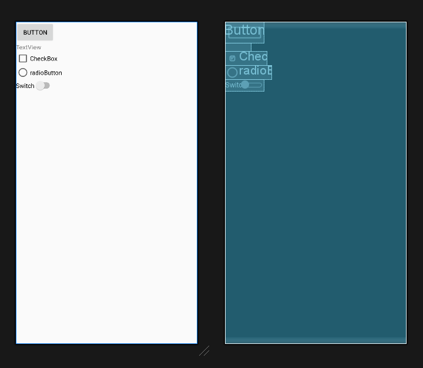


---

`android:orientation="horizontal"` 로 변경
```xml
<?xml version="1.0" encoding="utf-8"?>
<LinearLayout xmlns:android="http://schemas.android.com/apk/res/android"
    android:layout_width="match_parent"
    android:layout_height="match_parent"
    android:orientation="horizontal">

    <Button
        android:id="@+id/button1"
        android:layout_width="wrap_content"
        android:layout_height="wrap_content"
        android:text="Button" />

    <TextView
        android:id="@+id/textView1"
        android:layout_width="wrap_content"
        android:layout_height="wrap_content"
        android:text="TextView" />

    <CheckBox
        android:id="@+id/checkBox1"
        android:layout_width="wrap_content"
        android:layout_height="wrap_content"
        android:text="CheckBox" />

    <RadioButton
        android:id="@+id/radioButton1"
        android:layout_width="wrap_content"
        android:layout_height="wrap_content"
        android:text="radioButton" />

    <Switch
        android:id="@+id/switch1"
        android:layout_width="wrap_content"
        android:layout_height="wrap_content"
        android:text="Switch" />

</LinearLayout>
```

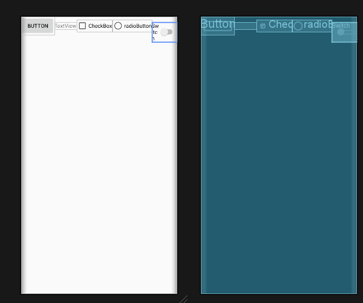


스위치가 가려져 안보일수도있다.

Button 을 
`android:layout_width="match_parent"` 으로 해보자

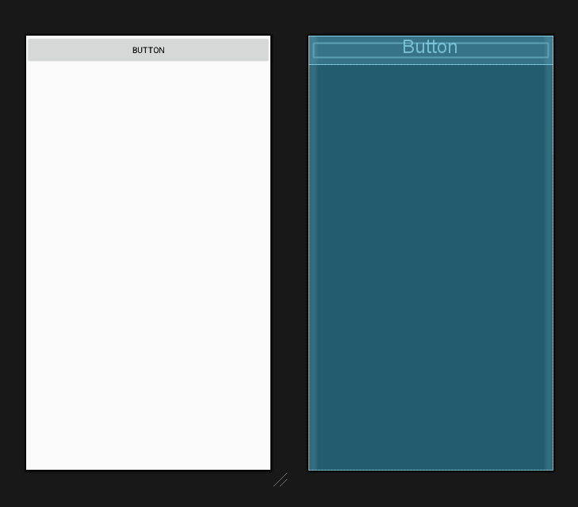

이런 문제로 대체로 vertical로 설정해서 사용함

---

#### 2. grativity 와 layout_gravity 속성


`android:gravity="right|bottom"`


아래쪽 오른쪽으로 간다.

```xml
<?xml version="1.0" encoding="utf-8"?>
<LinearLayout xmlns:android="http://schemas.android.com/apk/res/android"
    android:layout_width="match_parent"
    android:layout_height="match_parent"
    android:gravity="right|bottom"
    android:orientation="vertical">
```
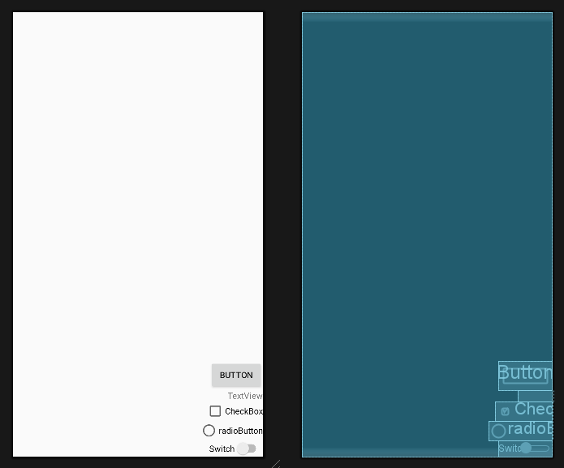


`android:gravity="bottom"`
좌하단으로 간다

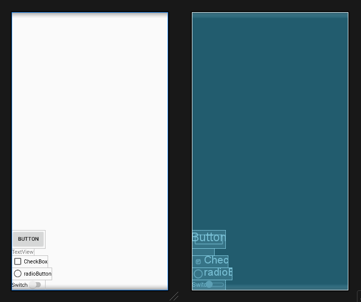


설명
- gravity 속성이 자신에게 포함된 자식(주로 위젯) 을 어디에 위치시킬지를 결정한다면,
- layout_gravity 속성은 자신의 위치를 부모의 어디에 


#### `소스`
```xml
<?xml version="1.0" encoding="utf-8"?>
<LinearLayout xmlns:android="http://schemas.android.com/apk/res/android"
    android:layout_width="match_parent"
    android:layout_height="match_parent"
    android:orientation="vertical">

    <Button
        android:id="@+id/button1"
        android:layout_width="wrap_content"
        android:layout_height="wrap_content"
        android:text="오른쪽" />

    <Button
        android:id="@+id/button2"
        android:layout_width="wrap_content"
        android:layout_height="wrap_content"
        android:text="중앙" />

    <Button
        android:id="@+id/button3"
        android:layout_width="wrap_content"
        android:layout_height="wrap_content"
        android:text="왼쪽" />
    
</LinearLayout>
```
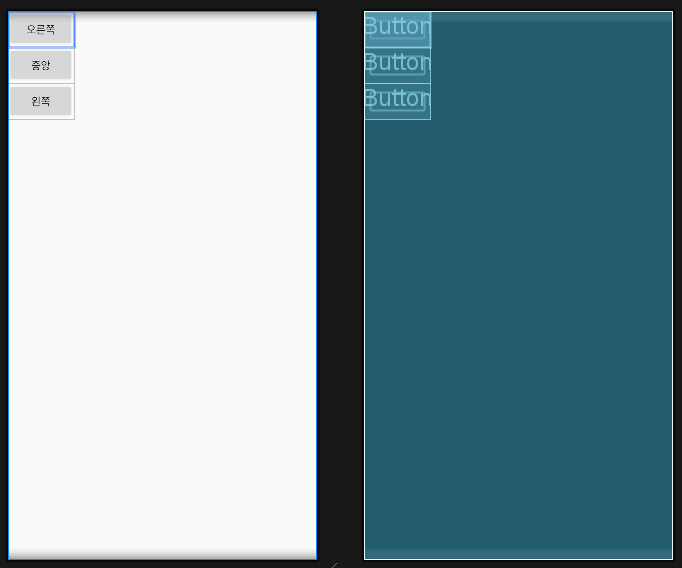

이제 layout_grativity 속성을 주면
```xml
<?xml version="1.0" encoding="utf-8"?>
<LinearLayout xmlns:android="http://schemas.android.com/apk/res/android"
    android:layout_width="match_parent"
    android:layout_height="match_parent"
    android:orientation="vertical">

    <Button
        android:id="@+id/button1"
        android:layout_width="wrap_content"
        android:layout_height="wrap_content"
        android:layout_gravity="right"
        android:text="오른쪽" />

    <Button
        android:id="@+id/button2"
        android:layout_width="wrap_content"
        android:layout_height="wrap_content"
        android:layout_gravity="center"
        android:text="중앙" />

    <Button
        android:id="@+id/button3"
        android:layout_width="wrap_content"
        android:layout_height="wrap_content"
        android:layout_gravity="left"
        android:text="왼쪽" />

</LinearLayout>
```
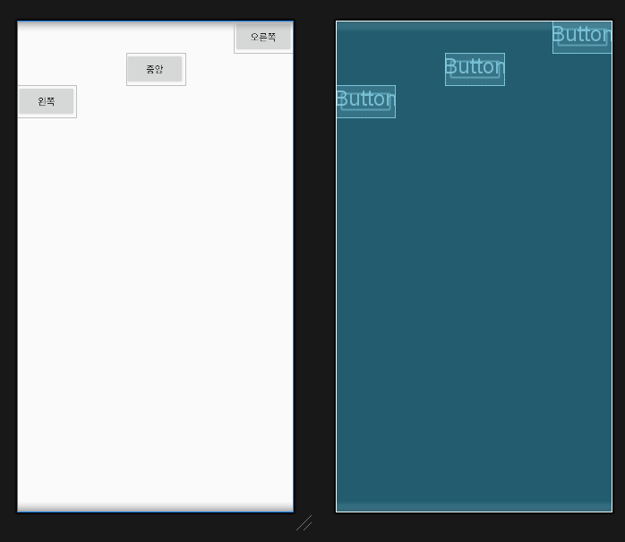

### 3. baselineAligned 속성
크기가 다른 위젯들을 보기 좋게 정렬해주는 것으로 `true` , `false`를 지정


### 2. 중복 리니어 레이아웃 설게

1. layout_weight 속성

#### `소스`

```xml
<?xml version="1.0" encoding="utf-8"?>
<LinearLayout xmlns:android="http://schemas.android.com/apk/res/android"
    android:layout_width="match_parent"
    android:layout_height="match_parent"
    android:orientation="vertical">

    <LinearLayout
        android:layout_width="match_parent"
        android:layout_height="match_parent"
        android:gravity="center"
        android:orientation="vertical">

        <Button
            android:layout_width="wrap_content"
            android:layout_height="wrap_content"
            android:text="버튼1" />

        <Button
            android:layout_width="wrap_content"
            android:layout_height="wrap_content"
            android:text="버튼2" />

    </LinearLayout>

    <LinearLayout
        android:layout_width="match_parent"
        android:layout_height="match_parent"
        android:background="#00FF00"
        android:gravity="center"
        android:orientation="vertical">

        <Button
            android:layout_width="wrap_content"
            android:layout_height="wrap_content"
            android:text="버튼3" />

        <Button
            android:layout_width="wrap_content"
            android:layout_height="wrap_content"
            android:text="버튼4" />
    </LinearLayout>

    <LinearLayout
        android:layout_width="match_parent"
        android:layout_height="match_parent"
        android:background="#0000FF"
        android:gravity="center"
        android:orientation="vertical">

        <Button
            android:layout_width="wrap_content"
            android:layout_height="wrap_content"
            android:text="버튼5" />

        <Button
            android:layout_width="wrap_content"
            android:layout_height="wrap_content"
            android:text="버튼6" />

    </LinearLayout>


</LinearLayout>
```
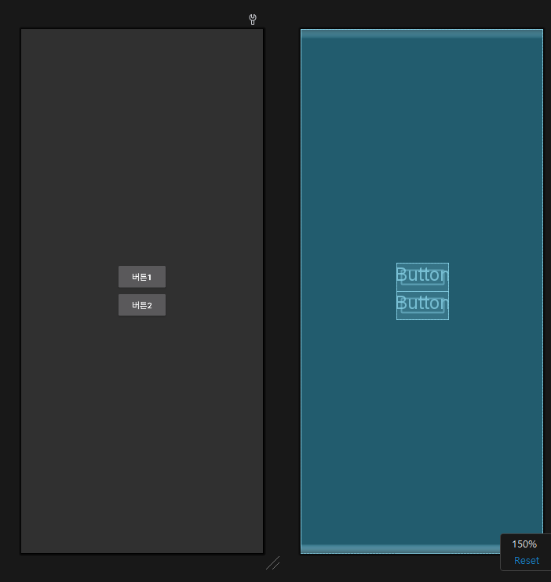


첫번째 화면이 match_parent 라서 두번세번쨰 레이아웃이 안보이는게 정상

`android:layout_weight="1"`
을 내부 리니어에 각각 부여한다.

```xml
<?xml version="1.0" encoding="utf-8"?>
<LinearLayout xmlns:android="http://schemas.android.com/apk/res/android"
    android:layout_width="match_parent"
    android:layout_height="match_parent"
    android:orientation="vertical">

    <LinearLayout
        android:layout_width="match_parent"
        android:layout_height="match_parent"
        android:layout_weight="1"
        android:gravity="center"
        android:orientation="vertical">

        <Button
            android:layout_width="wrap_content"
            android:layout_height="wrap_content"
            android:text="버튼1" />

        <Button
            android:layout_width="wrap_content"
            android:layout_height="wrap_content"
            android:text="버튼2" />

    </LinearLayout>

    <LinearLayout
        android:layout_width="match_parent"
        android:layout_height="match_parent"
        android:background="#00FF00"
        android:layout_weight="1"
        android:gravity="center"
        android:orientation="horizontal">

        <Button
            android:layout_width="wrap_content"
            android:layout_height="wrap_content"
            android:text="버튼3" />

        <Button
            android:layout_width="wrap_content"
            android:layout_height="wrap_content"
            android:text="버튼4" />
    </LinearLayout>

    <LinearLayout
        android:layout_width="match_parent"
        android:layout_height="match_parent"
        android:background="#0000FF"
        android:layout_weight="1"
        android:gravity="center"
        android:orientation="vertical">

        <Button
            android:layout_width="wrap_content"
            android:layout_height="wrap_content"
            android:text="버튼5" />

        <Button
            android:layout_width="wrap_content"
            android:layout_height="wrap_content"
            android:text="버튼6" />

    </LinearLayout>


</LinearLayout>
```


`android:layout_weight="1"`
은 알아서 균등분배 해줌
아마 33.33%로 각각 비율이 잡힘

만약 녹색박스의 레이아웃을 2로 한다면?

```xml
<?xml version="1.0" encoding="utf-8"?>
<LinearLayout xmlns:android="http://schemas.android.com/apk/res/android"
    android:layout_width="match_parent"
    android:layout_height="match_parent"
    android:orientation="vertical">

    <LinearLayout
        android:layout_width="match_parent"
        android:layout_height="0dp"
        android:layout_weight="1"
        android:gravity="center"
        android:orientation="vertical">

        <Button
            android:layout_width="wrap_content"
            android:layout_height="wrap_content"
            android:text="버튼1" />

        <Button
            android:layout_width="wrap_content"
            android:layout_height="wrap_content"
            android:text="버튼2" />

    </LinearLayout>

    <LinearLayout
        android:layout_width="match_parent"
        android:layout_height="0dp"
        android:background="#00FF00"
        android:layout_weight="2"
        android:gravity="center"
        android:orientation="horizontal">

        <Button
            android:layout_width="wrap_content"
            android:layout_height="wrap_content"
            android:text="버튼3" />

        <Button
            android:layout_width="wrap_content"
            android:layout_height="wrap_content"
            android:text="버튼4" />
    </LinearLayout>

    <LinearLayout
        android:layout_width="match_parent"
        android:layout_height="0dp"
        android:background="#0000FF"
        android:layout_weight="1"
        android:gravity="center"
        android:orientation="vertical">

        <Button
            android:layout_width="wrap_content"
            android:layout_height="wrap_content"
            android:text="버튼5" />

        <Button
            android:layout_width="wrap_content"
            android:layout_height="wrap_content"
            android:text="버튼6" />

    </LinearLayout>


</LinearLayout>
```

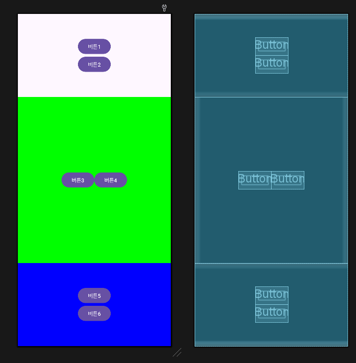


---

실습
리니어 레이아웃으로 다음과 같은 화면을 XML로 작성.
* 리니어레이아웃의 orientation 속성을 vertical 로 설정.
버튼 3개를 생성하고 layout_width 는 110dp로,
layout_height는 100dp로 함.


```xml
<?xml version="1.0" encoding="utf-8"?>
<LinearLayout xmlns:android="http://schemas.android.com/apk/res/android"
    android:layout_width="match_parent"
    android:layout_height="match_parent"
    android:orientation="vertical">
    
    <Button
        android:layout_width="110dp"
        android:layout_height="100dp"
        android:layout_gravity="center"
        android:gravity="top|right"
        android:text="버튼1" />

    <Button
        android:layout_width="110dp"
        android:layout_height="100dp"
        android:layout_gravity="left"
        android:gravity="center|left"
        android:text="버튼2" />

    <Button
        android:layout_width="110dp"
        android:layout_height="100dp"
        android:layout_gravity="bottom|right"
        android:gravity="bottom|right"
        android:text="버튼3" />

</LinearLayout>
```

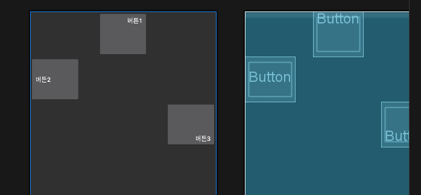

---
## 기타 레이아웃
레이아웃에는 리니어 레이아우

### 1. 렐러티브 레이아웃
레이아웃 내부에 포함된 위젯을 상대적인 위치로 배치.
렐러티브레이아웃 안에 포함된 위젯은 렐러티브레이아웃의 어디쯤에 위치시킬 것인지 지정해야 함.
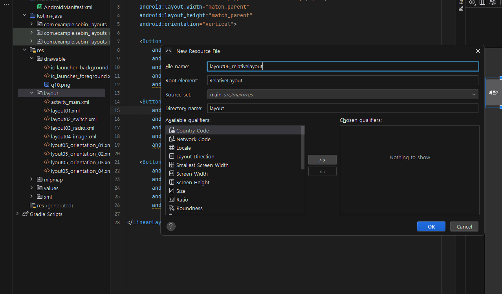

```xml
<?xml version="1.0" encoding="utf-8"?>
<RelativeLayout xmlns:android="http://schemas.android.com/apk/res/android"
    android:layout_width="match_parent"
    android:layout_height="match_parent">

</RelativeLayout>
```

```xml
<?xml version="1.0" encoding="utf-8"?>
<RelativeLayout xmlns:android="http://schemas.android.com/apk/res/android"
    android:layout_width="match_parent"
    android:layout_height="match_parent">

    <Button
        android:layout_width="wrap_content"
        android:layout_height="wrap_content"
        android:layout_alignParentTop="true"
        android:layout_centerHorizontal="true"
        android:text="위쪽" />
    <Button
        android:layout_width="wrap_content"
        android:layout_height="wrap_content"
        android:layout_alignParentLeft="true"
        android:layout_centerVertical="true"
        android:text="좌측" />
    <Button
        android:layout_width="wrap_content"
        android:layout_height="wrap_content"
        android:layout_centerInParent="true"
        android:text="중앙" />
    <Button
        android:layout_width="wrap_content"
        android:layout_height="wrap_content"
        android:layout_alignParentRight="true"
        android:layout_centerVertical="true"
        android:text="우측" />
    <Button
        android:layout_width="wrap_content"
        android:layout_height="wrap_content"
        android:layout_alignParentBottom="true"
        android:layout_centerHorizontal="true"
        android:text="아래" />
</RelativeLayout>
```
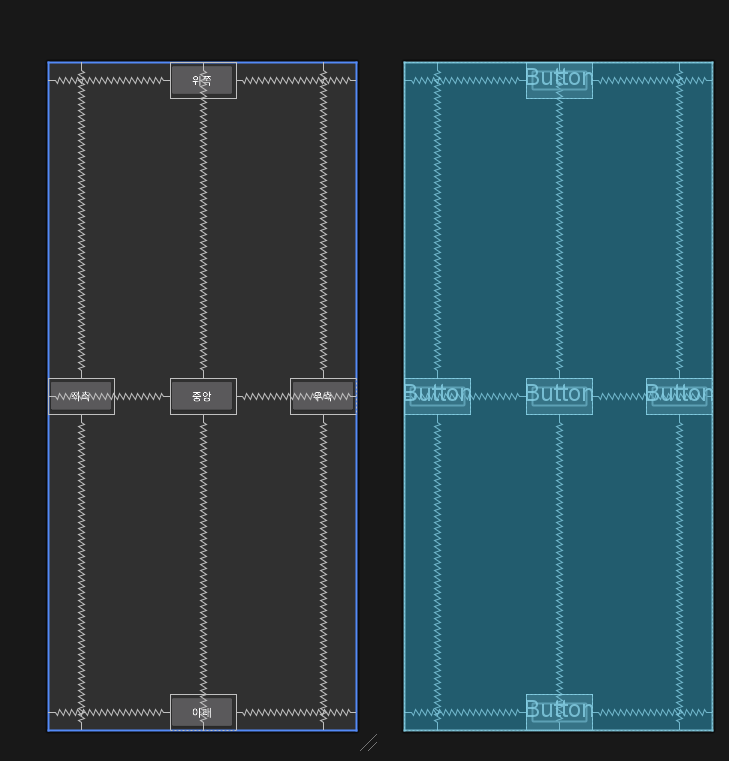


---

기준 위젯 기준으로 한다면

```xml
<?xml version="1.0" encoding="utf-8"?>
<RelativeLayout xmlns:android="http://schemas.android.com/apk/res/android"
    android:layout_width="match_parent"
    android:layout_height="match_parent"
    android:padding="7dip">
    <Button
        android:id="@+id/baseButton"
        android:layout_width="wrap_content"
        android:layout_height="wrap_content"
        android:layout_centerInParent="true"
        android:text="기준 위젯"/>
    <Button
        android:layout_width="wrap_content"
        android:layout_height="wrap_content"
        android:layout_above="@+id/baseButton"
        android:text="above"/>
    <Button
        android:layout_width="wrap_content"
        android:layout_height="wrap_content"
        android:layout_below="@+id/baseButton"
        android:text="below"/>
    <Button
        android:layout_width="wrap_content"
        android:layout_height="wrap_content"
        android:layout_toLeftOf="@+id/baseButton"
        android:text="toLeftOf"/>
    <Button
        android:layout_width="wrap_content"
        android:layout_height="wrap_content"
        android:layout_toRightOf="@+id/baseButton"
        android:text="toRightOf"/>
</RelativeLayout>
```
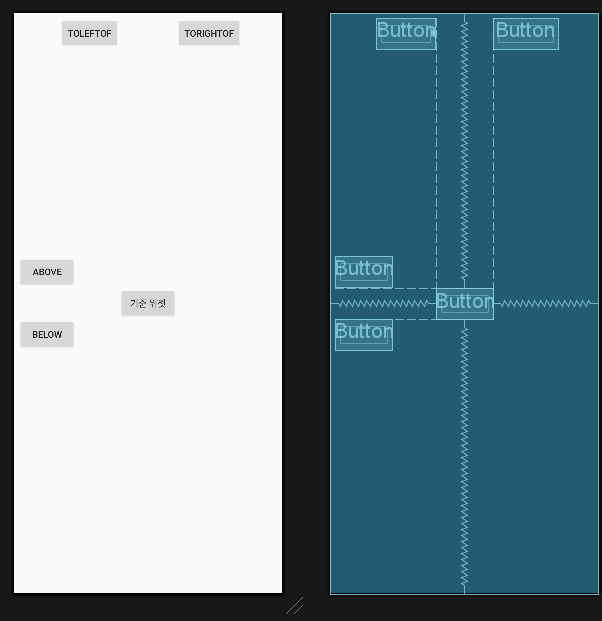

기준위젯에 id를 부여하고
해당 id를 기준으로 above 속성을 사용해서 사용한다.
이거 사용하는이유가

렐러티브레아웃이 속성이 너무많아서 그럼


렐러티브가 성능이 안좋고 그래서 컨트레이트레이아웃이 디폴트로 잡혀있음.

```xml
<?xml version="1.0" encoding="utf-8"?>
<RelativeLayout xmlns:android="http://schemas.android.com/apk/res/android"
    android:layout_width="match_parent"
    android:layout_height="match_parent"
    android:padding="7dip">
    <Button
        android:id="@+id/baseButton"
        android:layout_width="wrap_content"
        android:layout_height="400dp"
        android:layout_centerInParent="true"
        android:text="기준 위젯"/>
    <Button
        android:layout_width="100dp"
        android:layout_height="70dp"
        android:layout_alignTop="@+id/baseButton"
        android:text="alignTop"/>
    <Button
        android:layout_width="100dp"
        android:layout_height="70dp"
        android:layout_alignBaseline="@+id/baseButton"
        android:text="alignBaseline"/>
    <Button
        android:layout_width="100dp"
        android:layout_height="70dp"
        android:layout_alignBottom="@+id/baseButton"
        android:text="alignBottom"/>

</RelativeLayout>
```

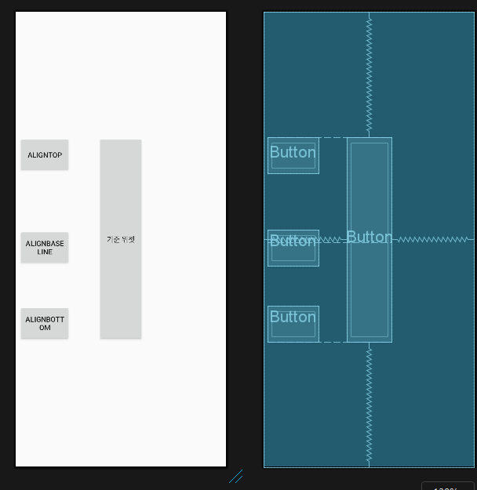


---

## 테이블 레이아웃
테이블 레이아웃은 위젯을 표 형태로 배치할 때 주로 활용.
테이블레이아웃을 사용하여 행과 열의 수를 정하고 그 안에 위젯을 배치하면 편리.


### 테이블 레이아웃 속성
layout_span, layout_column, stretchColumns 등이 있다.

layout_span, layout_column 은 테이블 테이블레이아웃 안에 포함된 위젯에 설정하는 속성.

#### `소스`

```xml
<?xml version="1.0" encoding="utf-8"?>
<TableLayout xmlns:android="http://schemas.android.com/apk/res/android"
    android:layout_width="match_parent"
    android:layout_height="match_parent">
    <TableRow>
        <Button
            android:layout_width="60dp"
            android:text="1" />
        <Button
            android:layout_width="60dp"
            android:layout_span="2"
            android:text="2" />
        <Button
            android:layout_width="60dp"
            android:text="3" />
    </TableRow>

    <TableRow>
        <Button
            android:layout_width="60dp"
            android:layout_column="1"
            android:text="4" />
        <Button
            android:layout_width="60dp"
            android:text="5" />
        <Button
            android:layout_width="60dp"
            android:text="6" />
    </TableRow>

</TableLayout>
```


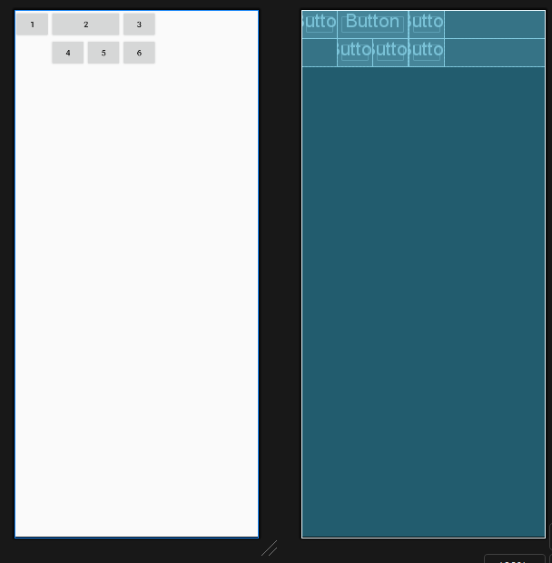

Tr : Tablerows
Td : 각 태그(버튼)이 Td

`android:layout_span="2"` <- 2개의 td크기를 할당
`android:layout_column="1"` <-- 열은 0 부터시작하는데 1번부터 할당

특징
열확장은 가능한데 행확장은 못함

---

### 그리드 레이아웃
테이블레이아웃의 확장버전

이제 행확장도 가능함


소스
```xml
<?xml version="1.0" encoding="utf-8"?>
<GridLayout xmlns:android="http://schemas.android.com/apk/res/android"
    android:layout_width="match_parent"
    android:layout_height="wrap_content"
    android:columnCount="4"
    android:rowCount="2">

    <Button
        android:layout_gravity="fill_vertical"
        android:layout_column="0"
        android:layout_row="0"
        android:layout_rowSpan="2"
        android:text="1" />
    <Button
        android:layout_gravity="fill_horizontal"
        android:layout_column="1"
        android:layout_columnSpan="2"
        android:layout_row="0"
        android:text="2" />
    <Button
        android:layout_column="3"
        android:layout_row="0"
        android:text="3" />
    <Button
        android:layout_column="1"
        android:layout_row="1"
        android:text="4" />
    <Button
        android:layout_column="2"
        android:layout_row="1"
        android:text="5" />
    <Button
        android:layout_column="3"
        android:layout_row="1"
        android:text="6" />
    
</GridLayout>
```


---

### 4. 프레임 레이아웃
단순히 레이아웃 안의 위젯을 왼쪽 상단부터 겹쳐서 출력.

```xml
<?xml version="1.0" encoding="utf-8"?>
<FrameLayout xmlns:android="http://schemas.android.com/apk/res/android"
    android:layout_width="match_parent"
    android:layout_height="match_parent"
    android:foreground="@drawable/t13"
    android:foregroundGravity="center|fill_horizontal">

    <RatingBar
        android:id="@+id/ratingBar1"
        android:layout_width="wrap_content"
        android:layout_height="wrap_content" />
    <ImageView
        android:id="@+id/imageView1"
        android:layout_width="wrap_content"
        android:layout_height="wrap_content"
        android:src="@drawable/u14" />
    <CheckBox
        android:id="@+id/checkBox1"
        android:layout_width="wrap_content"
        android:layout_height="wrap_content"
        android:text="CheckBox" />
</FrameLayout>
```
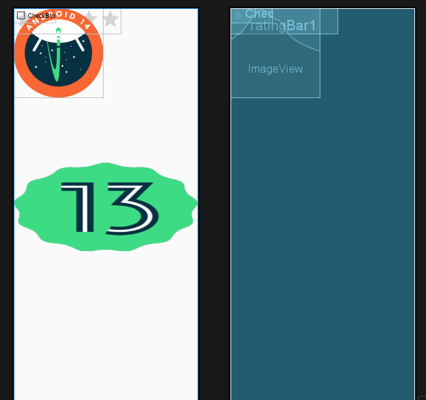


---


문제
요구사항
- 리니어 레이아웃으로 다음 화면을 구성하는 XML 을 작성.
- 단 레이아웃이 구분되어 보이도록 각각 다른 색으로 지정.

```xml
<?xml version="1.0" encoding="utf-8"?>
<LinearLayout xmlns:android="http://schemas.android.com/apk/res/android"
    android:layout_width="match_parent"
    android:layout_height="match_parent"
    android:background="#0000FF"
    android:orientation="vertical">


    <LinearLayout
        android:layout_width="match_parent"
        android:layout_height="0dp"
        android:layout_weight="1"
        android:orientation="horizontal">

        <LinearLayout
            android:layout_width="0dp"
            android:layout_height="match_parent"
            android:layout_weight="1"
            android:background="#F44336"
            android:orientation="vertical"></LinearLayout>

        <LinearLayout
            android:layout_width="0dp"
            android:layout_height="match_parent"
            android:layout_weight="1"
            android:background="#0F0000"
            android:orientation="vertical">

            <LinearLayout
                android:layout_width="match_parent"
                android:layout_height="0dp"
                android:layout_weight="1"
                android:background="#CDDC39"
                android:orientation="vertical">
            </LinearLayout>

            <LinearLayout
                android:layout_width="match_parent"
                android:layout_height="0dp"
                android:layout_weight="1"
                android:background="#0F0000"
                android:orientation="vertical">
            </LinearLayout>
        </LinearLayout>

    </LinearLayout>

    <LinearLayout
        android:layout_width="match_parent"
        android:layout_height="0dp"
        android:layout_weight="1"
        android:background="#3F51B5"
        android:orientation="vertical">
    </LinearLayout>
</LinearLayout>
```

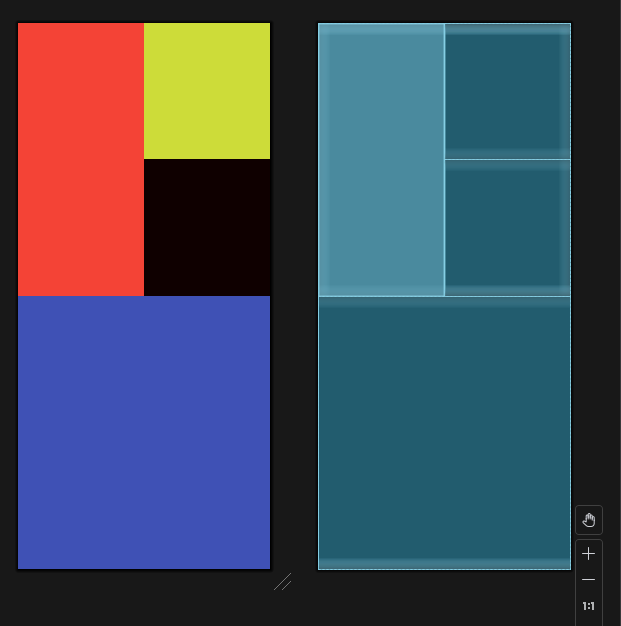


---

## 레이아웃 - Kotlin 으로 화면 구성하기
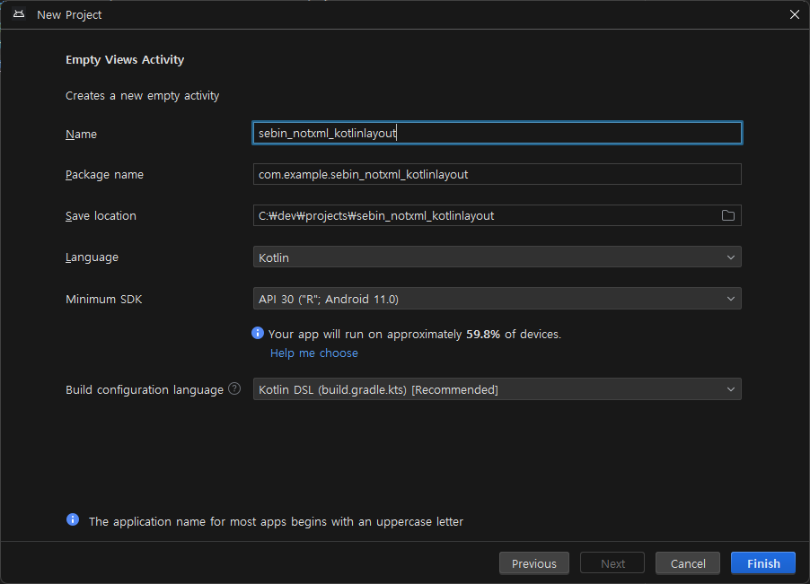

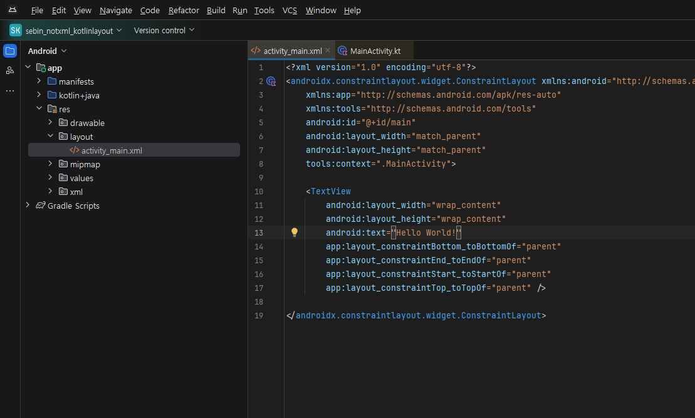

activity_main 삭제
후
`MainActivity.kt` 에서 작업

```kotlin
package com.example.sebin_notxml_kotlinlayout

import android.graphics.Color
import android.os.Bundle
import android.widget.LinearLayout
import androidx.activity.enableEdgeToEdge
import androidx.appcompat.app.AppCompatActivity
import androidx.core.view.ViewCompat
import androidx.core.view.WindowInsetsCompat

class MainActivity : AppCompatActivity() {
    override fun onCreate(savedInstanceState: Bundle?) {
        super.onCreate(savedInstanceState)
//        enableEdgeToEdge()
//        setContentView(R.layout.activity_main)
        val params = LinearLayout.LayoutParams(
            LinearLayout.LayoutParams.MATCH_PARENT,
            LinearLayout.LayoutParams.MATCH_PARENT
        )
        val baseLayout = LinearLayout(this)
        baseLayout.orientation = LinearLayout.VERTICAL
        baseLayout.setBackgroundColor(Color.rgb(0,255,0))
        setContentView(baseLayout, params)

    }
}
```

> 버튼을 만들고, 버튼을 클릭했을 때의 토스트 메시지를 작성.

```kotlin
package com.example.sebin_notxml_kotlinlayout

import android.graphics.Color
import android.os.Bundle
import android.widget.Button
import android.widget.LinearLayout
import android.widget.Toast
import androidx.activity.enableEdgeToEdge
import androidx.appcompat.app.AppCompatActivity
import androidx.core.view.ViewCompat
import androidx.core.view.WindowInsetsCompat

class MainActivity : AppCompatActivity() {
    override fun onCreate(savedInstanceState: Bundle?) {
        super.onCreate(savedInstanceState)
//        enableEdgeToEdge()
//        setContentView(R.layout.activity_main)
        val params = LinearLayout.LayoutParams(
            LinearLayout.LayoutParams.MATCH_PARENT,
            LinearLayout.LayoutParams.MATCH_PARENT
        )
        val baseLayout = LinearLayout(this)
        baseLayout.orientation = LinearLayout.VERTICAL
        baseLayout.setBackgroundColor(Color.rgb(0,255,0))
        setContentView(baseLayout, params)

        // 버튼을 만들고, 버튼을 클릭했을 때의 토스트 메시지를 작성.

        val btn = Button(this)
        btn.text = "버튼입니다."
        btn.setBackgroundColor(Color.MAGENTA)
        baseLayout.addView(btn)

        btn.setOnClickListener {
            Toast.makeText(applicationContext,"코드로 생성한 코드입니다.",Toast.LENGTH_SHORT).show()
        }

    }
}
```

잘 사용하지는 않지만 이런 기능이 있다는 것만 알아 두자.

---

### 주말 숙제
테이블 레이아웃을 활용하여 숫자 버튼도 있는 계산기.


1. 안드로이드 프로젝트 생성.

프로젝트 이름 : Project_04_02

2. 화면 디자인 및 편집.

activity_main.xml

* TableLayout 1개와 TableRow 9개로 구성.
* 에디터텍스트 2개, 숫자 버튼 10개, 연산 버튼 4개, 텍스트뷰 1개를 생성.
* 각 연산 버튼 위젯에 layout_margin을 적당히 지정. (예 : 5dp).
* 결과를 보여줄 텍스트뷰는 빨간색으로, 글자 크기를 20dp 정도.
* 각 위젯의 아이디는 위에서부터 차례로 
Edit1, Edit2, BtnNum0 ~ 9, BtnAdd, BtnSub, BtnMul, BtnDiv, TextResult로 함.

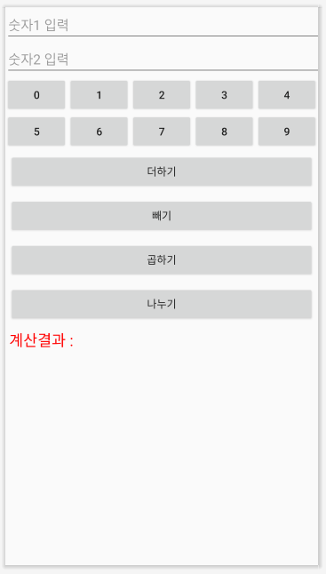

---
