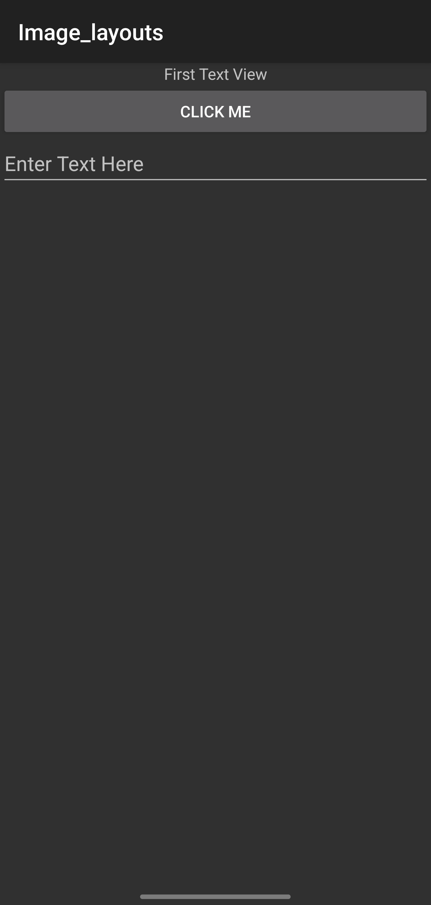
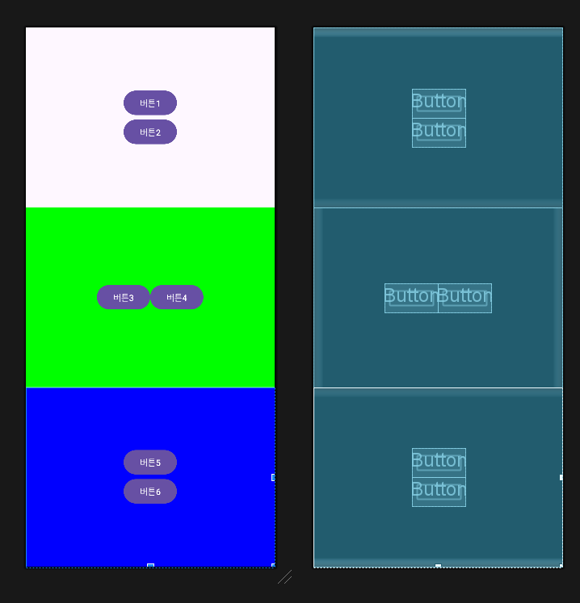

## 레이아웃의 개요
버튼, 텍스트뷰, 에디트텍스트 등 안드로이드에서 사용하는 위젯은 안드로이드라는 

레이아웃에서 가장 많이 사용되는 것 : 리니어레이아웃
리니어 레이아웃은 선형 레이아웃이라고도 함

## 안드로이드 레이아웃 종류

1. **LinearLayout (리니어 레이아웃)**: 위젯들을 수평이나 수직으로 일렬로 배치합니다. 이 레이아웃은 간단한 리스트 디자인이나 수직/수평 정렬이 필요할 때 유용합니다.

2. **RelativeLayout (렐러티브 레이아웃)**: 위젯들을 서로 대비하여 배치합니다. 예를 들어, 한 위젯이 다른 위젯의 오른쪽에 위치하게 할 수 있습니다. 복잡한 배치가 필요할 때 유용합니다.

3. **TableLayout (테이블 레이아웃)**: 위젯들을 행과 열 구조로 정렬합니다. 각 행은 여러 개의 셀을 가질 수 있으며, 각 셀은 하나의 위젯을 포함할 수 있습니다.

4. **GridLayout (그리드 레이아웃)**: 위젯들을 격자 패턴으로 배치합니다. 테이블 레이아웃보다 유연하며 복잡한 격자 형태의 배치를 쉽게 구성할 수 있습니다.

5. **FrameLayout (프레임 레이아웃)**: 위젯을 겹쳐서 배치할 수 있습니다. 이 레이아웃은 일반적으로 하나의 자식 뷰를 담거나, 여러 자식 뷰를 겹치게 할 때 사용합니다.

### 레이아웃 속성

- **orientation**: 리니어 레이아웃에서 사용되며, 위젯들의 배치 방향(수평 or 수직)을 결정합니다.
- **gravity**: 레이아웃 내의 위젯들의 정렬 방법을 결정합니다.
- **padding**: 레이아웃 경계와 내부 위젯 간의 간격을 설정합니다.
- **layout_weight**: 리니어 레이아웃에서 사용되며, 위젯들이 차지하는 공간의 비율을 결정합니다. 더 큰 weight 값을 가진 위젯은 더 많은 공간을 차지합니다.
- **baselineAligned**: 리니어 레이아웃에서 사용되며, 자식들의 베이스라인을 맞춤 여부를 결정합니다.


---
### 1. 기본 레이아웃의 형태

#### `LinearLayout`
1. orientation : vertical(수직)

`android:orientation="vertical"` 속성은 주로 `LinearLayout`에서 사용되며, 이 속성을 설정하면 `LinearLayout` 안에 포함된 자식 요소들을 세로 방향(위에서 아래로)으로 순서대로 배치합니다.


`lyout05_linearlayout_vertical1`
```xml
<LinearLayout
    xmlns:android="http://schemas.android.com/apk/res/android"
    android:layout_width="match_parent"
    android:layout_height="match_parent"
    android:orientation="vertical" > <!-- 세로 방향으로 자식 뷰들을 배치 -->

    <TextView
        android:layout_width="match_parent"
        android:layout_height="wrap_content"
        android:text="First Text View"
        android:gravity="center" />

    <Button
        android:layout_width="match_parent"
        android:layout_height="wrap_content"
        android:text="Click Me" />

    <EditText
        android:layout_width="match_parent"
        android:layout_height="wrap_content"
        android:hint="Enter Text Here" />

</LinearLayout>
```


위XMl 레이아웃에서 `LinearLayout` 은 `orientation` 속성을 `"Vertical"로 설정했으므로
세로 방향으로 자식요소가 배치된다. 각 요소는 먼저 생성된 순으로 TextView, Button, EditText가 위에서 아래로 순서대로 배치가 된다.

`lyout05_linearlayout_vertical2`

- `android:orientation="vertical"`
```xml
<?xml version="1.0" encoding="utf-8"?>
<LinearLayout xmlns:android="http://schemas.android.com/apk/res/android"
    android:layout_width="match_parent"
    android:layout_height="match_parent"
    android:orientation="vertical">

    <Button
        android:id="@+id/button1"
        android:layout_width="wrap_content"
        android:layout_height="wrap_content"
        android:text="Button" />

    <TextView
        android:id="@+id/textView1"
        android:layout_width="wrap_content"
        android:layout_height="wrap_content"
        android:text="TextView" />

    <CheckBox
        android:id="@+id/checkBox1"
        android:layout_width="wrap_content"
        android:layout_height="wrap_content"
        android:text="CheckBox" />

    <RadioButton
        android:id="@+id/radioButton1"
        android:layout_width="wrap_content"
        android:layout_height="wrap_content"
        android:text="radioButton" />

    <Switch
        android:id="@+id/switch1"
        android:layout_width="wrap_content"
        android:layout_height="wrap_content"
        android:text="Switch" />

</LinearLayout>
```


---

`android:orientation="horizontal"` 로 변경
```xml
<?xml version="1.0" encoding="utf-8"?>
<LinearLayout xmlns:android="http://schemas.android.com/apk/res/android"
    android:layout_width="match_parent"
    android:layout_height="match_parent"
    android:orientation="horizontal">

    <Button
        android:id="@+id/button1"
        android:layout_width="wrap_content"
        android:layout_height="wrap_content"
        android:text="Button" />

    <TextView
        android:id="@+id/textView1"
        android:layout_width="wrap_content"
        android:layout_height="wrap_content"
        android:text="TextView" />

    <CheckBox
        android:id="@+id/checkBox1"
        android:layout_width="wrap_content"
        android:layout_height="wrap_content"
        android:text="CheckBox" />

    <RadioButton
        android:id="@+id/radioButton1"
        android:layout_width="wrap_content"
        android:layout_height="wrap_content"
        android:text="radioButton" />

    <Switch
        android:id="@+id/switch1"
        android:layout_width="wrap_content"
        android:layout_height="wrap_content"
        android:text="Switch" />

</LinearLayout>
```


자식 요소들이 세로가 아닌 가로로 배치되는데 `wrap_content`로 width가 잡혀있기 때문에 요소 크기 만큼 가로로 배치된다.

화면 크기에 따라 스위치가 가려져 안보일수도있다.


---

#### 2. grativity 와 layout_gravity 속성


안드로이드 레이아웃에서 `gravity`와 `layout_gravity` 속성은 요소들의 정렬을 결정하는 중요한 속성입니다. 이 두 속성은 비슷하게 들릴 수 있지만, 적용 대상과 효과가 다릅니다.

#### 1. `gravity`
`gravity` 속성은 주로 `TextView`, `Button`, `LinearLayout` 등의 뷰 또는 뷰 그룹에서 사용됩니다. 이 속성은 뷰 내의 내용(텍스트, 아이콘 등)이 어떻게 정렬될지를 결정합니다. 예를 들어, `TextView` 내의 텍스트가 중앙, 왼쪽, 오른쪽, 위쪽, 아래쪽 등 어느 방향에 위치할지를 지정할 수 있습니다.

```xml
<TextView
    android:layout_width="match_parent"
    android:layout_height="wrap_content"
    android:text="Centered Text"
    android:gravity="center" /> <!-- 텍스트를 뷰의 중앙에 배치 -->
```

#### 2. `layout_gravity`
`layout_gravity` 속성은 뷰가 자신의 부모 뷰 내에서 어떻게 정렬될지를 결정합니다. 이 속성은 주로 `LinearLayout`이나 `FrameLayout` 같은 뷰 그룹 내부의 자식 뷰에 적용됩니다. 예를 들어, `Button`이 `LinearLayout` 내에서 오른쪽 끝에 위치하도록 하려면 `layout_gravity`를 사용합니다.

```xml
<LinearLayout
    android:layout_width="match_parent"
    android:layout_height="wrap_content"
    android:orientation="vertical">

    <Button
        android:layout_width="wrap_content"
        android:layout_height="wrap_content"
        android:text="Right Aligned Button"
        android:layout_gravity="right" /> <!-- 버튼을 부모 레이아웃의 오른쪽에 배치 -->
</LinearLayout>
```

### 주의사항
- `gravity`는 해당 뷰 내부에서 작동하는 반면, `layout_gravity`는 해당 뷰를 포함하는 부모 뷰 안에서 작동합니다.
- 모든 레이아웃 타입에서 `layout_gravity`가 작동하는 것은 아닙니다. 예를 들어, `RelativeLayout`에서는 `layout_gravity`가 효과가 없으며, 다른 방식으로 뷰를 정렬해야 합니다.


1. 우측 아래로 위치
`android:gravity="right|bottom"`


```xml
<?xml version="1.0" encoding="utf-8"?>
<LinearLayout xmlns:android="http://schemas.android.com/apk/res/android"
    android:layout_width="match_parent"
    android:layout_height="match_parent"
    android:gravity="right|bottom"
    android:orientation="vertical">
```


`android:gravity="bottom"`
좌하단으로 간다


#### `소스`
```xml
<?xml version="1.0" encoding="utf-8"?>
<LinearLayout xmlns:android="http://schemas.android.com/apk/res/android"
    android:layout_width="match_parent"
    android:layout_height="match_parent"
    android:orientation="vertical">

    <Button
        android:id="@+id/button1"
        android:layout_width="wrap_content"
        android:layout_height="wrap_content"
        android:text="오른쪽" />

    <Button
        android:id="@+id/button2"
        android:layout_width="wrap_content"
        android:layout_height="wrap_content"
        android:text="중앙" />

    <Button
        android:id="@+id/button3"
        android:layout_width="wrap_content"
        android:layout_height="wrap_content"
        android:text="왼쪽" />
    
</LinearLayout>
```


이제 layout_grativity 속성을 주면
```xml
<?xml version="1.0" encoding="utf-8"?>
<LinearLayout xmlns:android="http://schemas.android.com/apk/res/android"
    android:layout_width="match_parent"
    android:layout_height="match_parent"
    android:orientation="vertical">

    <Button
        android:id="@+id/button1"
        android:layout_width="wrap_content"
        android:layout_height="wrap_content"
        android:layout_gravity="right"
        android:text="오른쪽" />

    <Button
        android:id="@+id/button2"
        android:layout_width="wrap_content"
        android:layout_height="wrap_content"
        android:layout_gravity="center"
        android:text="중앙" />

    <Button
        android:id="@+id/button3"
        android:layout_width="wrap_content"
        android:layout_height="wrap_content"
        android:layout_gravity="left"
        android:text="왼쪽" />

</LinearLayout>
```


### 3. baselineAligned 속성
크기가 다른 위젯들을 보기 좋게 정렬해주는 것으로 `true` , `false`를 지정


### 2. 중복 리니어 레이아웃 설게

1. layout_weight 속성

#### `소스`

```xml
<?xml version="1.0" encoding="utf-8"?>
<LinearLayout xmlns:android="http://schemas.android.com/apk/res/android"
    android:layout_width="match_parent"
    android:layout_height="match_parent"
    android:orientation="vertical">

    <LinearLayout
        android:layout_width="match_parent"
        android:layout_height="match_parent"
        android:gravity="center"
        android:orientation="vertical">

        <Button
            android:layout_width="wrap_content"
            android:layout_height="wrap_content"
            android:text="버튼1" />

        <Button
            android:layout_width="wrap_content"
            android:layout_height="wrap_content"
            android:text="버튼2" />

    </LinearLayout>

    <LinearLayout
        android:layout_width="match_parent"
        android:layout_height="match_parent"
        android:background="#00FF00"
        android:gravity="center"
        android:orientation="vertical">

        <Button
            android:layout_width="wrap_content"
            android:layout_height="wrap_content"
            android:text="버튼3" />

        <Button
            android:layout_width="wrap_content"
            android:layout_height="wrap_content"
            android:text="버튼4" />
    </LinearLayout>

    <LinearLayout
        android:layout_width="match_parent"
        android:layout_height="match_parent"
        android:background="#0000FF"
        android:gravity="center"
        android:orientation="vertical">

        <Button
            android:layout_width="wrap_content"
            android:layout_height="wrap_content"
            android:text="버튼5" />

        <Button
            android:layout_width="wrap_content"
            android:layout_height="wrap_content"
            android:text="버튼6" />

    </LinearLayout>


</LinearLayout>
```


첫번째 화면이 match_parent 라서 두번세번쨰 레이아웃이 안보이는게 정상

`android:layout_weight="1"`
을 내부 리니어에 각각 부여한다.

```xml
<?xml version="1.0" encoding="utf-8"?>
<LinearLayout xmlns:android="http://schemas.android.com/apk/res/android"
    android:layout_width="match_parent"
    android:layout_height="match_parent"
    android:orientation="vertical">

    <LinearLayout
        android:layout_width="match_parent"
        android:layout_height="match_parent"
        android:layout_weight="1"
        android:gravity="center"
        android:orientation="vertical">

        <Button
            android:layout_width="wrap_content"
            android:layout_height="wrap_content"
            android:text="버튼1" />

        <Button
            android:layout_width="wrap_content"
            android:layout_height="wrap_content"
            android:text="버튼2" />

    </LinearLayout>

    <LinearLayout
        android:layout_width="match_parent"
        android:layout_height="match_parent"
        android:background="#00FF00"
        android:layout_weight="1"
        android:gravity="center"
        android:orientation="horizontal">

        <Button
            android:layout_width="wrap_content"
            android:layout_height="wrap_content"
            android:text="버튼3" />

        <Button
            android:layout_width="wrap_content"
            android:layout_height="wrap_content"
            android:text="버튼4" />
    </LinearLayout>

    <LinearLayout
        android:layout_width="match_parent"
        android:layout_height="match_parent"
        android:background="#0000FF"
        android:layout_weight="1"
        android:gravity="center"
        android:orientation="vertical">

        <Button
            android:layout_width="wrap_content"
            android:layout_height="wrap_content"
            android:text="버튼5" />

        <Button
            android:layout_width="wrap_content"
            android:layout_height="wrap_content"
            android:text="버튼6" />

    </LinearLayout>


</LinearLayout>
```


`android:layout_weight="1"`
은 알아서 균등분배 해줌
아마 33.33%로 각각 비율이 잡힘

만약 녹색박스의 레이아웃을 2로 한다면?

```xml
<?xml version="1.0" encoding="utf-8"?>
<LinearLayout xmlns:android="http://schemas.android.com/apk/res/android"
    android:layout_width="match_parent"
    android:layout_height="match_parent"
    android:orientation="vertical">

    <LinearLayout
        android:layout_width="match_parent"
        android:layout_height="0dp"
        android:layout_weight="1"
        android:gravity="center"
        android:orientation="vertical">

        <Button
            android:layout_width="wrap_content"
            android:layout_height="wrap_content"
            android:text="버튼1" />

        <Button
            android:layout_width="wrap_content"
            android:layout_height="wrap_content"
            android:text="버튼2" />

    </LinearLayout>

    <LinearLayout
        android:layout_width="match_parent"
        android:layout_height="0dp"
        android:background="#00FF00"
        android:layout_weight="2"
        android:gravity="center"
        android:orientation="horizontal">

        <Button
            android:layout_width="wrap_content"
            android:layout_height="wrap_content"
            android:text="버튼3" />

        <Button
            android:layout_width="wrap_content"
            android:layout_height="wrap_content"
            android:text="버튼4" />
    </LinearLayout>

    <LinearLayout
        android:layout_width="match_parent"
        android:layout_height="0dp"
        android:background="#0000FF"
        android:layout_weight="1"
        android:gravity="center"
        android:orientation="vertical">

        <Button
            android:layout_width="wrap_content"
            android:layout_height="wrap_content"
            android:text="버튼5" />

        <Button
            android:layout_width="wrap_content"
            android:layout_height="wrap_content"
            android:text="버튼6" />

    </LinearLayout>


</LinearLayout>
```


. 각 `LinearLayout`의 `layout_height`는 `0dp`로 설정되어 있고, `layout_weight` 속성을 통해 화면 공간을 동적으로 분배

### 레이아웃 분석:
- **최상위 LinearLayout**:
  - `android:orientation="vertical"`: 자식 뷰들을 수직으로 배치합니다.
  - `android:layout_width="match_parent"`와 `android:layout_height="match_parent"`: 레이아웃이 부모(일반적으로 화면)의 전체 크기에 맞춰집니다.

- **첫 번째 내부 LinearLayout**:
  - `android:layout_weight="1"`: 사용 가능한 공간의 1부를 차지합니다.
  - `android:gravity="center"`: 내부의 버튼들을 중앙에 위치시킵니다.
  - `android:orientation="vertical"`: 내부 요소를 세로로 배치합니다.

- **두 번째 내부 LinearLayout**:
  - `android:layout_weight="2"`: 사용 가능한 공간의 2부를 차지하여, 이 섹션은 첫 번째와 세 번째 섹션보다 두 배 큰 공간을 차지합니다.
  - `android:background="#00FF00"`: 배경색을 녹색으로 설정합니다.
  - `android:gravity="center"`: 내부의 버튼들을 중앙에 위치시킵니다.
  - `android:orientation="horizontal"`: 버튼들을 가로로 배치합니다.

- **세 번째 내부 LinearLayout**:
  - `android:layout_weight="1"`: 사용 가능한 공간의 1부를 차지합니다.
  - `android:background="#0000FF"`: 배경색을 파란색으로 설정합니다.
  - `android:gravity="center"`: 내부의 버튼들을 중앙에 위치시킵니다.
  - `android:orientation="vertical"`: 내부 요소를 세로로 배치합니다.

### 주요 특징 및 고려 사항:
- `layout_height="0dp"`와 `layout_weight` 조합을 사용하여 부모 레이아웃 내에서 동적으로 높이를 분배합니다. 이 방법은 화면 크기가 다양한 장치에서 일관된 사용자 경험을 제공합니다.
- 두 번째 섹션의 `orientation`이 `horizontal`로 설정되어 있어, 이 섹션의 버튼들만 가로로 나란히 배치됩니다.
- 각 섹션의 `gravity="center"` 속성은 모든 버튼이 그들의 각각의 레이아웃 중앙에 위치하도록 보장합니다.

이 구조는 유연하며 다양한 화면 크기와 방향에 적응할 수 있도록 설계되었습니다. 버튼의 배치와 크기가 각 섹션의 `layout_weight`에 따라 조정되므로, 디자인이 의도한 대로 표현될 수 있습니다.

### layout_weight 에 대해서

안드로이드 스튜디오에서 레이아웃 정렬할 은 많다.
xml파일에서 코드를 작성해서 아이템들을 정렬하는데 layout_weight를 사용하면 아주 편리하다.

#### layout_weight
부모의 width 또는 height 를 자식들이 비율에 따라 나누어 가지는 것을 말한다.


#### 사용법

1. 자식의 width / height 중 **비율로 나누어 가질 애를 0dp** 로 설정한다.

2. 자식에 **android:layout_weight="여기 비율 넣기"로 비율 설정**하면 끝이다. 


부모의 width/height는 주고 싶은 만큼 주면 된다.


e.g) 모든 자식의 weight를 `android:layout_weight="1"` 로 설정했다면 다 같은 비율을 가질 것이고 

한 자식을 "2"로 했다면 이 아이템은 더 큰 비율을 가질 것이다. 

---

#### 실습
리니어 레이아웃으로 다음과 같은 화면을 XML로 작성.
* 리니어레이아웃의 `orientation 속성을 vertical` 로 설정.
버튼 3개를 생성하고 `layout_width 는 110dp`로,
`layout_height는 100dp`로 함.


```xml
<?xml version="1.0" encoding="utf-8"?>
<LinearLayout xmlns:android="http://schemas.android.com/apk/res/android"
    android:layout_width="match_parent"
    android:layout_height="match_parent"
    android:orientation="vertical">
    
    <Button
        android:layout_width="110dp"
        android:layout_height="100dp"
        android:layout_gravity="center"
        android:gravity="top|right"
        android:text="버튼1" />

    <Button
        android:layout_width="110dp"
        android:layout_height="100dp"
        android:layout_gravity="left"
        android:gravity="center|left"
        android:text="버튼2" />

    <Button
        android:layout_width="110dp"
        android:layout_height="100dp"
        android:layout_gravity="bottom|right"
        android:gravity="bottom|right"
        android:text="버튼3" />

</LinearLayout>
```


---
## 기타 레이아웃
레이아웃에는 리니어 레이아웃

### 1. 렐러티브 레이아웃
레이아웃 내부에 포함된 위젯을 상대적인 위치로 배치.
렐러티브레이아웃 안에 포함된 위젯은 렐러티브레이아웃의 어디쯤에 위치시킬 것인지 지정해야 함.


```xml
<?xml version="1.0" encoding="utf-8"?>
<RelativeLayout xmlns:android="http://schemas.android.com/apk/res/android"
    android:layout_width="match_parent"
    android:layout_height="match_parent">

</RelativeLayout>
```

```xml
<?xml version="1.0" encoding="utf-8"?>
<RelativeLayout xmlns:android="http://schemas.android.com/apk/res/android"
    android:layout_width="match_parent"
    android:layout_height="match_parent">

    <Button
        android:layout_width="wrap_content"
        android:layout_height="wrap_content"
        android:layout_alignParentTop="true"
        android:layout_centerHorizontal="true"
        android:text="위쪽" />
    <Button
        android:layout_width="wrap_content"
        android:layout_height="wrap_content"
        android:layout_alignParentLeft="true"
        android:layout_centerVertical="true"
        android:text="좌측" />
    <Button
        android:layout_width="wrap_content"
        android:layout_height="wrap_content"
        android:layout_centerInParent="true"
        android:text="중앙" />
    <Button
        android:layout_width="wrap_content"
        android:layout_height="wrap_content"
        android:layout_alignParentRight="true"
        android:layout_centerVertical="true"
        android:text="우측" />
    <Button
        android:layout_width="wrap_content"
        android:layout_height="wrap_content"
        android:layout_alignParentBottom="true"
        android:layout_centerHorizontal="true"
        android:text="아래" />
</RelativeLayout>
```


---

기준 위젯 기준으로 한다면

```xml
<?xml version="1.0" encoding="utf-8"?>
<RelativeLayout xmlns:android="http://schemas.android.com/apk/res/android"
    android:layout_width="match_parent"
    android:layout_height="match_parent"
    android:padding="7dip">
    <Button
        android:id="@+id/baseButton"
        android:layout_width="wrap_content"
        android:layout_height="wrap_content"
        android:layout_centerInParent="true"
        android:text="기준 위젯"/>
    <Button
        android:layout_width="wrap_content"
        android:layout_height="wrap_content"
        android:layout_above="@+id/baseButton"
        android:text="above"/>
    <Button
        android:layout_width="wrap_content"
        android:layout_height="wrap_content"
        android:layout_below="@+id/baseButton"
        android:text="below"/>
    <Button
        android:layout_width="wrap_content"
        android:layout_height="wrap_content"
        android:layout_toLeftOf="@+id/baseButton"
        android:text="toLeftOf"/>
    <Button
        android:layout_width="wrap_content"
        android:layout_height="wrap_content"
        android:layout_toRightOf="@+id/baseButton"
        android:text="toRightOf"/>
</RelativeLayout>
```


기준위젯에 id를 부여하고
해당 id를 기준으로 above 속성을 사용해서 사용한다.
이거 사용하는이유가

렐러티브레아웃이 속성이 너무많아서 그럼


렐러티브가 성능이 안좋고 그래서 컨트레이트레이아웃이 디폴트로 잡혀있음.

```xml
<?xml version="1.0" encoding="utf-8"?>
<RelativeLayout xmlns:android="http://schemas.android.com/apk/res/android"
    android:layout_width="match_parent"
    android:layout_height="match_parent"
    android:padding="7dip">
    <Button
        android:id="@+id/baseButton"
        android:layout_width="wrap_content"
        android:layout_height="400dp"
        android:layout_centerInParent="true"
        android:text="기준 위젯"/>
    <Button
        android:layout_width="100dp"
        android:layout_height="70dp"
        android:layout_alignTop="@+id/baseButton"
        android:text="alignTop"/>
    <Button
        android:layout_width="100dp"
        android:layout_height="70dp"
        android:layout_alignBaseline="@+id/baseButton"
        android:text="alignBaseline"/>
    <Button
        android:layout_width="100dp"
        android:layout_height="70dp"
        android:layout_alignBottom="@+id/baseButton"
        android:text="alignBottom"/>

</RelativeLayout>
```


---

## 테이블 레이아웃
테이블 레이아웃은 위젯을 표 형태로 배치할 때 주로 활용.
테이블레이아웃을 사용하여 행과 열의 수를 정하고 그 안에 위젯을 배치하면 편리.


### 테이블 레이아웃 속성
layout_span, layout_column, stretchColumns 등이 있다.

layout_span, layout_column 은 테이블 테이블레이아웃 안에 포함된 위젯에 설정하는 속성.

#### `소스`

```xml
<?xml version="1.0" encoding="utf-8"?>
<TableLayout xmlns:android="http://schemas.android.com/apk/res/android"
    android:layout_width="match_parent"
    android:layout_height="match_parent">
    <TableRow>
        <Button
            android:layout_width="60dp"
            android:text="1" />
        <Button
            android:layout_width="60dp"
            android:layout_span="2"
            android:text="2" />
        <Button
            android:layout_width="60dp"
            android:text="3" />
    </TableRow>

    <TableRow>
        <Button
            android:layout_width="60dp"
            android:layout_column="1"
            android:text="4" />
        <Button
            android:layout_width="60dp"
            android:text="5" />
        <Button
            android:layout_width="60dp"
            android:text="6" />
    </TableRow>

</TableLayout>
```


Tr : Tablerows
Td : 각 태그(버튼)이 Td

`android:layout_span="2"` <- 2개의 td크기를 할당
`android:layout_column="1"` <-- 열은 0 부터시작하는데 1번부터 할당

특징
열확장은 가능한데 행확장은 못함

---

### 그리드 레이아웃
테이블레이아웃의 확장버전

이제 행확장도 가능함


소스
```xml
<?xml version="1.0" encoding="utf-8"?>
<GridLayout xmlns:android="http://schemas.android.com/apk/res/android"
    android:layout_width="match_parent"
    android:layout_height="wrap_content"
    android:columnCount="4"
    android:rowCount="2">

    <Button
        android:layout_gravity="fill_vertical"
        android:layout_column="0"
        android:layout_row="0"
        android:layout_rowSpan="2"
        android:text="1" />
    <Button
        android:layout_gravity="fill_horizontal"
        android:layout_column="1"
        android:layout_columnSpan="2"
        android:layout_row="0"
        android:text="2" />
    <Button
        android:layout_column="3"
        android:layout_row="0"
        android:text="3" />
    <Button
        android:layout_column="1"
        android:layout_row="1"
        android:text="4" />
    <Button
        android:layout_column="2"
        android:layout_row="1"
        android:text="5" />
    <Button
        android:layout_column="3"
        android:layout_row="1"
        android:text="6" />
    
</GridLayout>
```


---

### 4. 프레임 레이아웃
단순히 레이아웃 안의 위젯을 왼쪽 상단부터 겹쳐서 출력.

```xml
<?xml version="1.0" encoding="utf-8"?>
<FrameLayout xmlns:android="http://schemas.android.com/apk/res/android"
    android:layout_width="match_parent"
    android:layout_height="match_parent"
    android:foreground="@drawable/t13"
    android:foregroundGravity="center|fill_horizontal">

    <RatingBar
        android:id="@+id/ratingBar1"
        android:layout_width="wrap_content"
        android:layout_height="wrap_content" />
    <ImageView
        android:id="@+id/imageView1"
        android:layout_width="wrap_content"
        android:layout_height="wrap_content"
        android:src="@drawable/u14" />
    <CheckBox
        android:id="@+id/checkBox1"
        android:layout_width="wrap_content"
        android:layout_height="wrap_content"
        android:text="CheckBox" />
</FrameLayout>
```


---


문제
요구사항
- 리니어 레이아웃으로 다음 화면을 구성하는 XML 을 작성.
- 단 레이아웃이 구분되어 보이도록 각각 다른 색으로 지정.

```xml
<?xml version="1.0" encoding="utf-8"?>
<LinearLayout xmlns:android="http://schemas.android.com/apk/res/android"
    android:layout_width="match_parent"
    android:layout_height="match_parent"
    android:background="#0000FF"
    android:orientation="vertical">


    <LinearLayout
        android:layout_width="match_parent"
        android:layout_height="0dp"
        android:layout_weight="1"
        android:orientation="horizontal">

        <LinearLayout
            android:layout_width="0dp"
            android:layout_height="match_parent"
            android:layout_weight="1"
            android:background="#F44336"
            android:orientation="vertical"></LinearLayout>

        <LinearLayout
            android:layout_width="0dp"
            android:layout_height="match_parent"
            android:layout_weight="1"
            android:background="#0F0000"
            android:orientation="vertical">

            <LinearLayout
                android:layout_width="match_parent"
                android:layout_height="0dp"
                android:layout_weight="1"
                android:background="#CDDC39"
                android:orientation="vertical">
            </LinearLayout>

            <LinearLayout
                android:layout_width="match_parent"
                android:layout_height="0dp"
                android:layout_weight="1"
                android:background="#0F0000"
                android:orientation="vertical">
            </LinearLayout>
        </LinearLayout>

    </LinearLayout>

    <LinearLayout
        android:layout_width="match_parent"
        android:layout_height="0dp"
        android:layout_weight="1"
        android:background="#3F51B5"
        android:orientation="vertical">
    </LinearLayout>
</LinearLayout>
```


---

## 레이아웃 - Kotlin 으로 화면 구성하기


activity_main 삭제
후
`MainActivity.kt` 에서 작업

```kotlin
package com.example.sebin_notxml_kotlinlayout

import android.graphics.Color
import android.os.Bundle
import android.widget.LinearLayout
import androidx.activity.enableEdgeToEdge
import androidx.appcompat.app.AppCompatActivity
import androidx.core.view.ViewCompat
import androidx.core.view.WindowInsetsCompat

class MainActivity : AppCompatActivity() {
    override fun onCreate(savedInstanceState: Bundle?) {
        super.onCreate(savedInstanceState)
//        enableEdgeToEdge()
//        setContentView(R.layout.activity_main)
        val params = LinearLayout.LayoutParams(
            LinearLayout.LayoutParams.MATCH_PARENT,
            LinearLayout.LayoutParams.MATCH_PARENT
        )
        val baseLayout = LinearLayout(this)
        baseLayout.orientation = LinearLayout.VERTICAL
        baseLayout.setBackgroundColor(Color.rgb(0,255,0))
        setContentView(baseLayout, params)

    }
}
```

> 버튼을 만들고, 버튼을 클릭했을 때의 토스트 메시지를 작성.

```kotlin
package com.example.sebin_notxml_kotlinlayout

import android.graphics.Color
import android.os.Bundle
import android.widget.Button
import android.widget.LinearLayout
import android.widget.Toast
import androidx.activity.enableEdgeToEdge
import androidx.appcompat.app.AppCompatActivity
import androidx.core.view.ViewCompat
import androidx.core.view.WindowInsetsCompat

class MainActivity : AppCompatActivity() {
    override fun onCreate(savedInstanceState: Bundle?) {
        super.onCreate(savedInstanceState)
//        enableEdgeToEdge()
//        setContentView(R.layout.activity_main)
        val params = LinearLayout.LayoutParams(
            LinearLayout.LayoutParams.MATCH_PARENT,
            LinearLayout.LayoutParams.MATCH_PARENT
        )
        val baseLayout = LinearLayout(this)
        baseLayout.orientation = LinearLayout.VERTICAL
        baseLayout.setBackgroundColor(Color.rgb(0,255,0))
        setContentView(baseLayout, params)

        // 버튼을 만들고, 버튼을 클릭했을 때의 토스트 메시지를 작성.

        val btn = Button(this)
        btn.text = "버튼입니다."
        btn.setBackgroundColor(Color.MAGENTA)
        baseLayout.addView(btn)

        btn.setOnClickListener {
            Toast.makeText(applicationContext,"코드로 생성한 코드입니다.",Toast.LENGTH_SHORT).show()
        }

    }
}
```

잘 사용하지는 않지만 이런 기능이 있다는 것만 알아 두자.

---

### 주말 숙제
테이블 레이아웃을 활용하여 숫자 버튼도 있는 계산기.


1. 안드로이드 프로젝트 생성.

프로젝트 이름 : Project_04_02

2. 화면 디자인 및 편집.

activity_main.xml

* TableLayout 1개와 TableRow 9개로 구성.
* 에디터텍스트 2개, 숫자 버튼 10개, 연산 버튼 4개, 텍스트뷰 1개를 생성.
* 각 연산 버튼 위젯에 layout_margin을 적당히 지정. (예 : 5dp).
* 결과를 보여줄 텍스트뷰는 빨간색으로, 글자 크기를 20dp 정도.
* 각 위젯의 아이디는 위에서부터 차례로 
Edit1, Edit2, BtnNum0 ~ 9, BtnAdd, BtnSub, BtnMul, BtnDiv, TextResult로 함.


---
