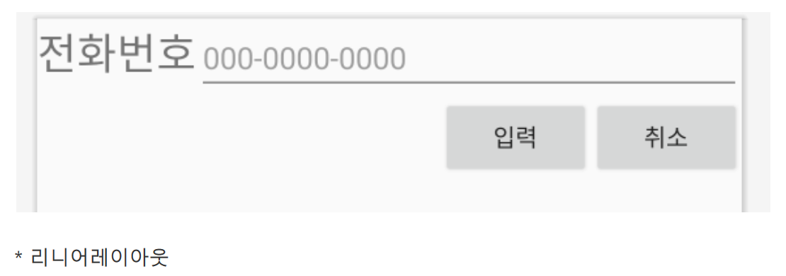
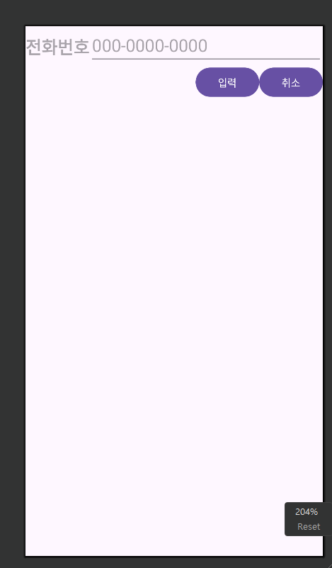
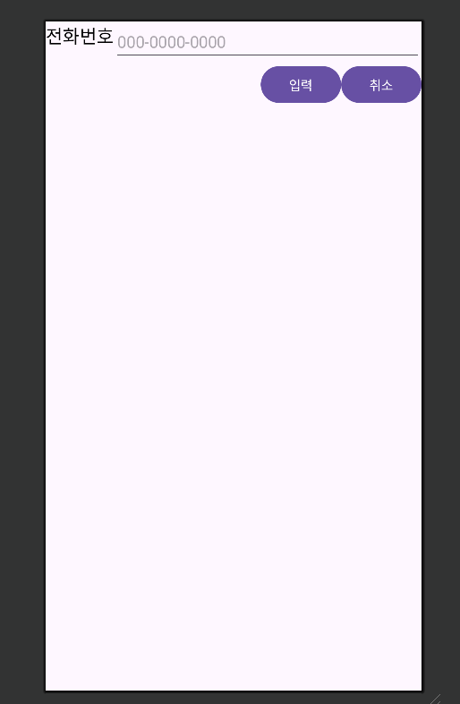

## 2. 요구사항
다음 화면의 XML 코드를 중복 리니어레이아웃으로 각각 작성.
텍스트뷰 1개, 에디트텍스트 1개, 버튼 2개로 구성

<p align="center">
  
</p>


```kotlin
<?xml version="1.0" encoding="utf-8"?>
<LinearLayout xmlns:android="http://schemas.android.com/apk/res/android"
    android:layout_width="match_parent"
    android:layout_height="match_parent"
    android:orientation="vertical">

    <LinearLayout
        android:layout_width="match_parent"
        android:layout_height="wrap_content"
        android:orientation="horizontal">

        <TextView
            android:layout_width="wrap_content"
            android:layout_height="wrap_content"
            android:hint="전화번호"
            android:textSize="24sp"
            android:textStyle="bold" />

        <EditText
            android:layout_width="match_parent"
            android:layout_height="wrap_content"
            android:hint="000-0000-0000"
            android:textSize="24sp" />

    </LinearLayout>

    <LinearLayout
        android:layout_width="wrap_content"
        android:layout_height="wrap_content"
        android:orientation="horizontal"
        android:layout_gravity="right">

        <Button
            android:layout_width="wrap_content"
            android:layout_height="wrap_content"
            android:text="입력" />

        <Button
            android:layout_width="wrap_content"
            android:layout_height="wrap_content"
            android:text="취소" />

    </LinearLayout>

</LinearLayout>
```
<p align="center">
  
</p>

---

```kotlin
<?xml version="1.0" encoding="utf-8"?>
<RelativeLayout xmlns:android="http://schemas.android.com/apk/res/android"
    android:layout_width="match_parent"
    android:layout_height="match_parent">

    <TextView
        android:id="@+id/textView1"
        android:layout_width="wrap_content"
        android:layout_height="wrap_content"
        android:layout_alignParentLeft="true"
        android:text="전화번호"
        android:textColor="@color/black"
        android:textSize="20dp"
        />
    <EditText
        android:id="@+id/editText1"
        android:layout_width="match_parent"
        android:layout_height="wrap_content"
        android:layout_toRightOf="@+id/textView1"
        android:hint="000-0000-0000"
        />
    <Button
        android:id="@+id/btnCancel"
        android:layout_width="wrap_content"
        android:layout_height="wrap_content"
        android:layout_alignParentRight="true"
        android:layout_below="@+id/editText1"
        android:text="취소"
        />
    <Button
        android:id="@+id/btnOK"
        android:layout_width="wrap_content"
        android:layout_height="wrap_content"
        android:layout_alignBaseline="@+id/btnCancel"
        android:layout_toLeftOf="@+id/btnCancel"
        android:text="입력"
        />


</RelativeLayout>
```
<p align="center">
  
</p>
