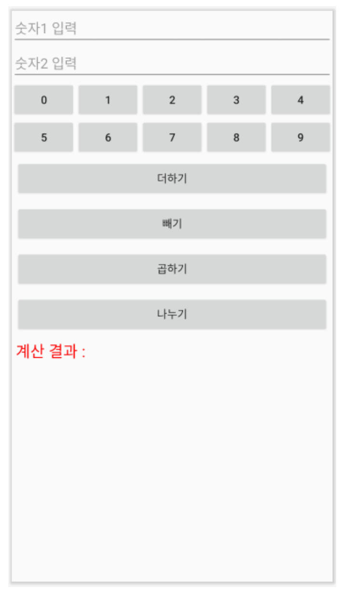
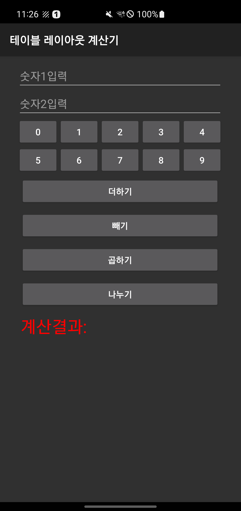
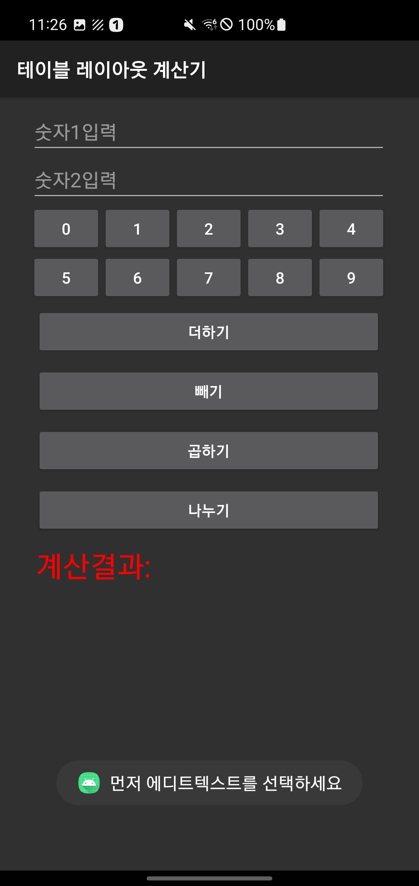
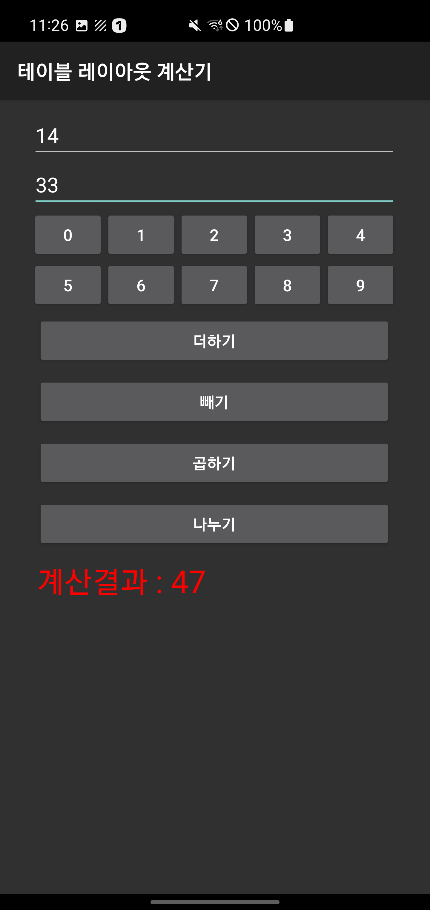
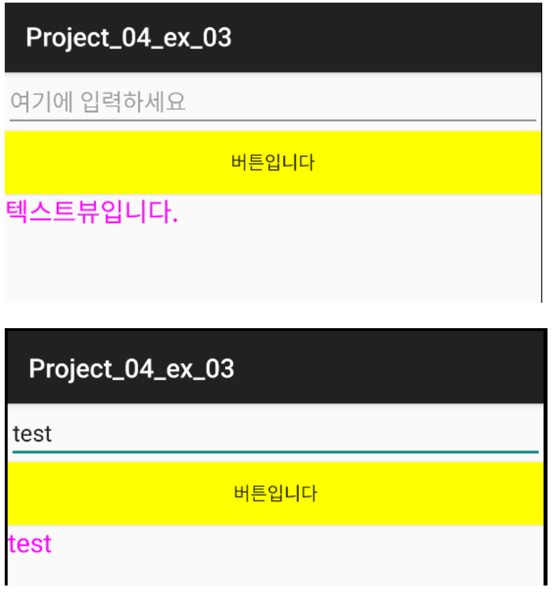
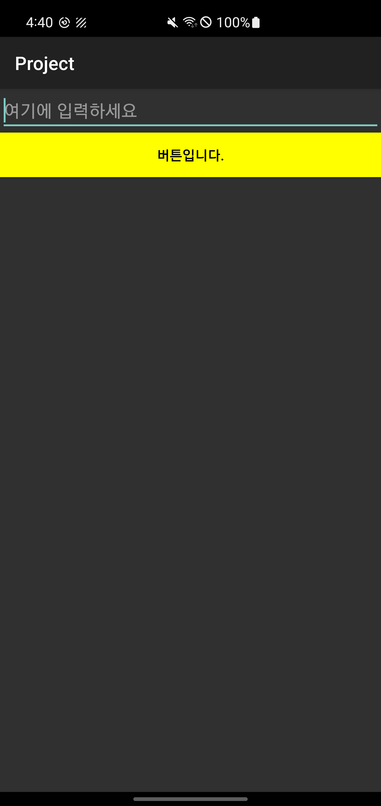
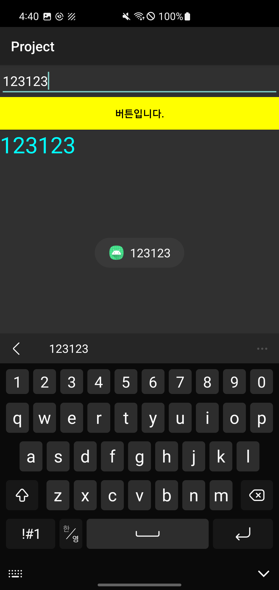
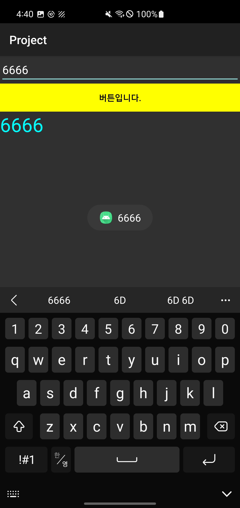

## 계산기 만들기 2

### 요구사항
테이블 레이아웃을 이용한 계산기를 그리드레이아웃으로 변경하여 실행.

그리드레이아웃은 위젯의 높이 조절이 잘 되지 않아 전체 화면이 채워지지 않을 수 있음.
-> 숫자 버튼 부분은 다른 레이아웃 (예: 리니어레이아웃, 테이블레이아웃)을 사용하여 구현

<p align="center">
  
</p>


```kotlin
package com.example.sebin_layouts

import android.annotation.SuppressLint
import android.os.Bundle
import android.widget.Button
import android.widget.EditText
import android.widget.TextView
import android.widget.Toast
import androidx.appcompat.app.AppCompatActivity

class MainActivity : AppCompatActivity() {
    private lateinit var editText1: EditText
    private lateinit var editText2: EditText
    private lateinit var btnAdd: Button
    private lateinit var btnSub: Button
    private lateinit var btnMul: Button
    private lateinit var btnDiv: Button
    private lateinit var textResult: TextView

    private lateinit var num1: String
    private lateinit var num2: String
    private var result: Int? = null

    // 숫자 버튼
    val btnNums = mutableListOf<Button>()

    // 버튼의 id 값
    var btnIds = arrayOf(
        R.id.btnNum0,
        R.id.btnNum1,
        R.id.btnNum2,
        R.id.btnNum3,
        R.id.btnNum4,
        R.id.btnNum5,
        R.id.btnNum6,
        R.id.btnNum7,
        R.id.btnNum8,
        R.id.btnNum9
    )

    @SuppressLint("MissingInflatedId")
    override fun onCreate(savedInstanceState: Bundle?) {
        super.onCreate(savedInstanceState)
        setContentView(R.layout.tablelayout_exam)

        title = "테이블 레이아웃 계산기"

        editText1 = findViewById(R.id.EditText1)
        editText2 = findViewById(R.id.EditText2)

        btnAdd = findViewById(R.id.btnAdd)
        btnSub = findViewById(R.id.btnSub)
        btnMul = findViewById(R.id.btnMul)
        btnDiv = findViewById(R.id.btnDiv)

        textResult = findViewById(R.id.textResult)


        btnAdd.setOnClickListener {
            num1 = editText1.text.toString()
            num2 = editText2.text.toString()

            if (!(num1.isBlank() || num2.isBlank())) {
                result = num1.toInt() + num2.toInt()
                textResult.text = "계산결과 : $result"
            }
        }
        btnSub.setOnClickListener {
            num1 = editText1.text.toString()
            num2 = editText2.text.toString()
            if (!(num1.isBlank() || num2.isBlank())) {

                result = num1.toInt() - num2.toInt()
                textResult.text = "계산결과 : $result"
            }
        }
        btnMul.setOnClickListener {
            num1 = editText1.text.toString()
            num2 = editText2.text.toString()
            if (!(num1.isBlank() || num2.isBlank())) {

                result = num1.toInt() * num2.toInt()
                textResult.text = "계산결과 : $result"
            }
        }
        btnDiv.setOnClickListener {
            num1 = editText1.text.toString()
            num2 = editText2.text.toString()
            if (!(num1.isBlank() || num2.isBlank())) {

                result = num1.toInt() / num2.toInt()
                textResult.text = "계산결과 : $result"
            }
        }

        // 3) 숫자 버튼 10개를 배열 변수에 대입한 후 각 버튼의 클릭 이벤트 리스너를 만듬.
        // 원칙적으로 10개 각 버튼에 대해 코딩해야 하지만 코드가 상당히 길어지기 떄문에 배열로 작성.

        // 버튼 타입의 리스트에 위젯을 등록 후 이벤트 리스너 등록
        for (i in btnIds.indices) {

            btnNums.add(i, findViewById(btnIds[i]))

            // 포커스가 되어있는 에디트텍스트에 버튼의 숫자를 결합. 문자열 결합
            btnNums[i].setOnClickListener {
                if (editText1.isFocused) {
                    num1 = editText1.text.toString() + btnNums[i].text.toString()
                    editText1.setText(num1)
                } else if (editText2.isFocused) {
                    num2 = editText2.text.toString() + btnNums[i].text.toString()
                    editText2.setText(num2)
                } else {
                    Toast.makeText(applicationContext, "먼저 에디트텍스트를 선택하세요", Toast.LENGTH_SHORT)
                        .show()
                }
            }
        }
    }
}
```
- 에디트 텍스트1,2 에 값을 입력하지 않고 숫자버튼을 누르면 토스트메시지로 값을 입력하라고 메시지 전시
- 에디트 텍스트1,2 중 커서가 표시되어 있으면 버튼과 결합하여 숫자버튼의 값을 결합하여 표시
- 기본적인 에디트 텍스트1,2 계산기능(+,-,*,/)

<p align="center">
  
</p>
<p align="center">
  
</p>
<p align="center">
  
</p>


---

다음 화면을 XML 파일 없이 Kotlin 코드만으로 작성

xml 레이아웃을 사용하지않고 코틀린 코드만으로 레이아웃을 구성하기
- 레이아웃에 에디트텍스트 1개, 버튼 1개, 텍스트뷰 1개를 생성.
- 버튼을 클릭하면 에디트텍스트에 쓰인 문자열이 텍스트뷰에 나타남

<p align="center">
  
</p>


```kotlin
package com.example.sebin_notxml_kotlinlayout02


import android.graphics.Color
import android.os.Bundle
import android.widget.Button
import android.widget.EditText
import android.widget.LinearLayout
import android.widget.TextView
import android.widget.Toast
import androidx.appcompat.app.AppCompatActivity

class MainActivity : AppCompatActivity() {
    override fun onCreate(savedInstanceState: Bundle?) {
        super.onCreate(savedInstanceState)
//        setContentView(R.layout.activity_main)
        title = "Project"

        // 리니어 레이아웃의 설정
        val params = LinearLayout.LayoutParams(
            LinearLayout.LayoutParams.MATCH_PARENT,
            LinearLayout.LayoutParams.MATCH_PARENT
        )

        // 리니어 레이아웃 객체 생성 및 설정
        val baseLayout = LinearLayout(this)
        baseLayout.orientation = LinearLayout.VERTICAL
        setContentView(baseLayout, params)

        // 에디트 텍스트 추가
        val editText = EditText(this)
        editText.hint = "여기에 입력하세요"


        // 버튼 추가
        val button = Button(this)
        button.text = "버튼입니다."
        button.setBackgroundColor(Color.YELLOW)
        button.setTextColor(Color.BLACK)
        button.setOnClickListener {
            Toast.makeText(this, editText.text, Toast.LENGTH_SHORT).show()
        }

        // 텍스트뷰 추가 및 설정
        val textView = TextView(this)
        textView.text = "텍스트뷰입니다."
        textView.textSize = 30f
        textView.setTextColor(Color.CYAN)
        button.setOnClickListener {
            textView.text = editText.text
        }
        baseLayout.addView(editText)
        baseLayout.addView(button)
        baseLayout.addView(textView)
        
    }
}
```
- xml 파일을 삭제하게 되면 `setContentView`가 오류가 발생하기에 주석처리
- LinearLayout.LayoutParams 객체를 생성하고 MATCH_PARENT 값을 준다. (레이아웃의 파라미터 값) 
(레이아웃에 필수로 설정해야하는 width,height 속성값을 설정한다.)
- LinearLayout 객체를 생성하고 필요한 속성인 orientation과 backgroundColor를 설정
- setContentView로 생성한 baseLayout를 설정한 파라미터 값 params를 가지고 화면에 출력할 수 있도록 한다.
- 버튼 객체를 만들고 setOnClickListener로 버튼의 이벤트를 정의하고 addView()메서드로 버튼을 레이아웃에 추가한다.

<p align="center">
  
</p>

<p align="center">
  
</p>


<p align="center">
  
</p>