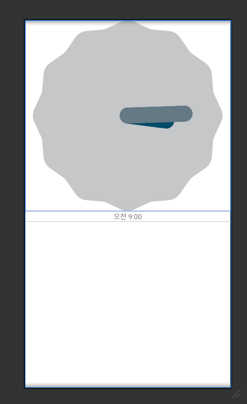
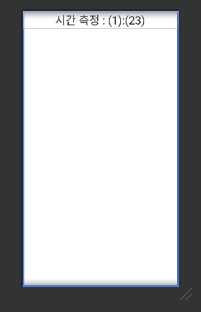
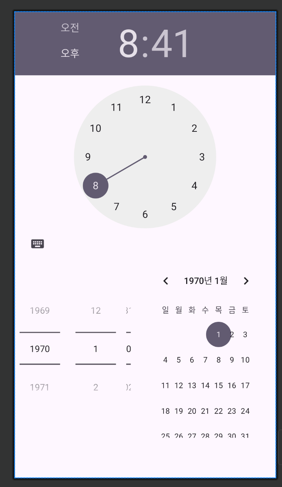
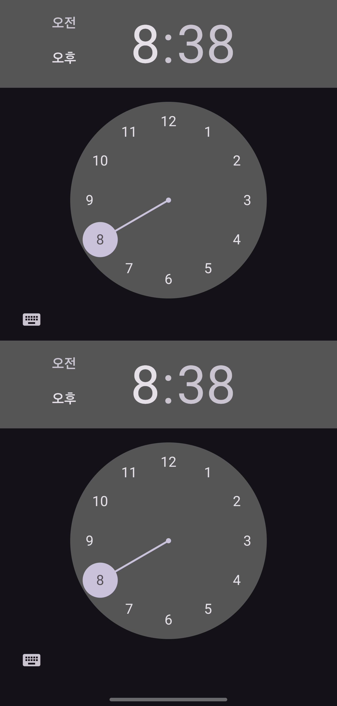
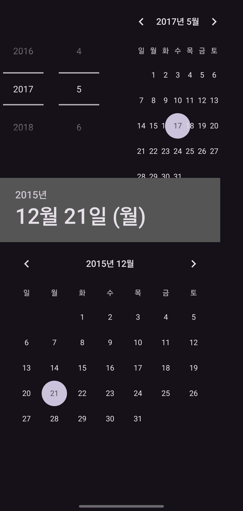
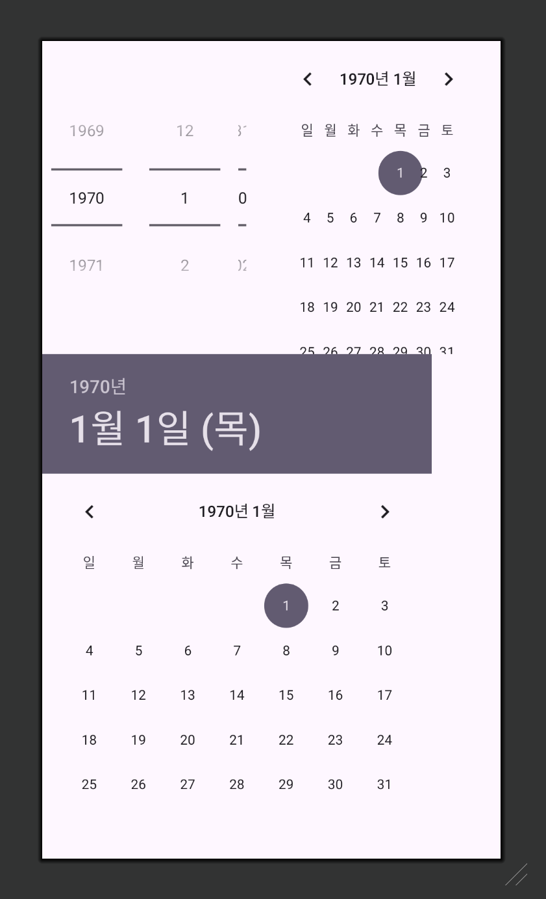
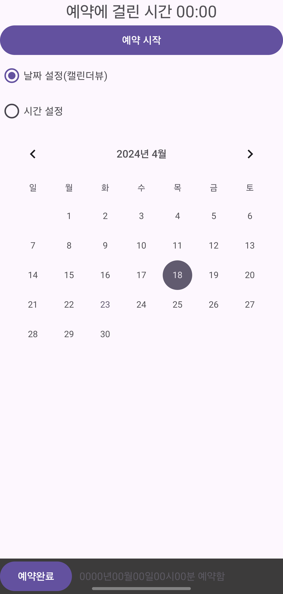
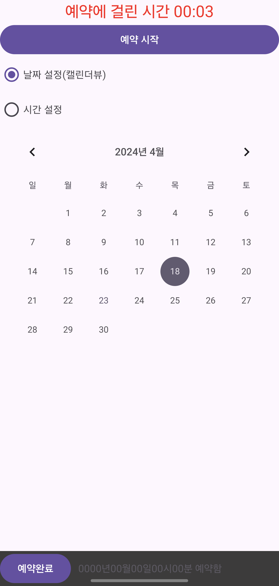
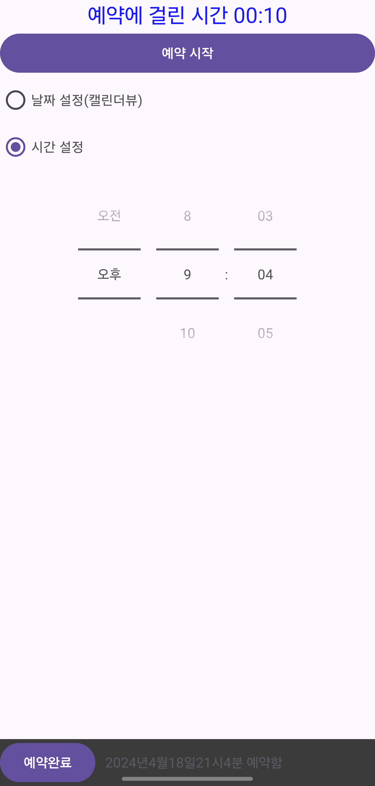

# 1. 날짜와 시간 관련 위젯
타임피커, 데이트피커, 캘린더뷰, 크로노미터, 아날로그시계, 디지털시계 등이 있다.


---
## 1. 아날로그 시계, 디지털 시계
### AnalogClock
아날로그 시계를 표현할 수 있는 뷰


```shell
java.lang.Object
  ↳ android.view.View
     ↳ android.widget.AnalogClock
```
아날로그 시계는 상속 계층도에서 알 수 있듯이 `View` 클래스를 통해서 모든 것이 새로 만들어져 있다.


`아날로그시계, 디지털 시계 XML 코드`

```xml
<?xml version="1.0" encoding="utf-8"?>
<LinearLayout xmlns:android="http://schemas.android.com/apk/res/android"
    android:layout_width="match_parent"
    android:layout_height="match_parent"
    android:orientation="vertical">

    <!-- AnalogClock 코드 -->
    <AnalogClock
        android:layout_width="match_parent"
        android:layout_height="wrap_content" />

    <!-- DigitalClock 코드 -->
    <DigitalClock
        android:layout_width="match_parent"
        android:layout_height="wrap_content"
        android:gravity="center" />
    
</LinearLayout>
```
<p align="center">
 
</p>


미리보기 화면에서도 분침이 변한다.

현재는 둘 다 사용하지 않고
텍스트 시계를 사용한다고 한다.

- [공식문서](https://developer.android.com/reference/android/widget/TextClock.html)

- [질문](https://stackoverflow.com/questions/43819806/analogclock-and-digitalclock-views-are-missing-in-android-studio)

---

## 2. 크로노미터

[구글개발자문서](https://developer.android.com/reference/android/widget/Chronometer)<br>

안드로이드에서는 타이머 기능을 구현 할 수 있는 Chronometer 클래스가 있다.

크로노미터는 타이머형식의 위젯이라고도 할 수 있으며 심플 타이머를 구현하는 클래스

• TextView의 하위 클래스로서 경과 시간을 화면에 텍스트 형태로 표시한다. (=스톱워치)

• 경과 시간은 기본적으로 "MM:SS" 형태로 분,초 단위만을 표시한다.

• `SystemClock.elapsedRealtime()` 값을 타이머에 
기준 시간을 부여할 수 있다.

```shell
java.lang.Object
   ↳ 	android.view.View
  	   ↳ 	android.widget.TextView
  	  	   ↳ 	android.widget.Chronometer
```


예제 소스

```xml
<?xml version="1.0" encoding="utf-8"?>
<LinearLayout xmlns:android="http://schemas.android.com/apk/res/android"
    android:orientation="vertical"
    android:layout_width="match_parent"
    android:layout_height="match_parent">
    <Chronometer
        android:id="@+id/chronometer1"
        android:layout_width="match_parent"
        android:layout_height="wrap_content"
        android:format="시간 측정 : %s"
        android:gravity="center"
        android:textSize="30dp" />

</LinearLayout>
```

`미리보기`
<p align="center">
 
</p>

실제화면


---

## 3. 타임피커, 데이트피커, 캘린더뷰

타입피커는 시간을,
데이트피커와 캘린더뷰는 날짜를 표시하고 조절하는 기능을 가진 위젯이다.


```xml
<?xml version="1.0" encoding="utf-8"?>
<LinearLayout xmlns:android="http://schemas.android.com/apk/res/android"
    android:layout_width="match_parent"
    android:layout_height="match_parent"
    android:orientation="vertical">

    <TimePicker
        android:layout_width="match_parent"
        android:layout_height="wrap_content"
        android:datePickerMode="calendar" />

    <DatePicker
        android:layout_width="match_parent"
        android:layout_height="wrap_content"
        android:datePickerMode="spinner" />

</LinearLayout>
```
<p align="center">
 
</p>

### 타임피커
```xml
<?xml version="1.0" encoding="utf-8"?>
<LinearLayout xmlns:android="http://schemas.android.com/apk/res/android"
    android:orientation="vertical"
    android:layout_width="match_parent"
    android:layout_height="match_parent">

    <!-- 이전 버전 -->
    <TimePicker
        android:layout_width="match_parent"
        android:layout_height="wrap_content"
        android:datePickerMode="spinner" />
    <!-- 최신 버전 -->
    <TimePicker
        android:layout_width="match_parent"
        android:layout_height="wrap_content"
        android:datePickerMode="calendar" />
</LinearLayout>
```

<p align="center">
 
</p>

### 데이트피커

```xml
<?xml version="1.0" encoding="utf-8"?>
<LinearLayout xmlns:android="http://schemas.android.com/apk/res/android"
    android:orientation="vertical"
    android:layout_width="match_parent"
    android:layout_height="match_parent">

    <!-- 이전 버전 -->
    <DatePicker
        android:layout_width="match_parent"
        android:layout_height="wrap_content"
        android:datePickerMode="spinner" />

    <!-- 최신 버전 -->
    <DatePicker
        android:layout_width="match_parent"
        android:layout_height="wrap_content"
        android:datePickerMode="calendar" />
</LinearLayout>
```
<p align="center">
 
</p>


<p align="center">
 
</p>


---

#### 실습

리니어레이아웃
- 리니어레이아웃의 layout_weight 을 1로 설정.
- 프레임레이아웃을 두고 안에 캘린더뷰 1개, 타임피커 1개를 생성.
- 위젯의 아이디는 calendarView1, timePicker1.


```xml
<?xml version="1.0" encoding="utf-8"?>
<LinearLayout xmlns:android="http://schemas.android.com/apk/res/android"
    xmlns:tools="http://schemas.android.com/tools"
    android:layout_width="match_parent"
    android:layout_height="match_parent"
    android:orientation="vertical">

    <Chronometer
        android:id="@+id/chronometer1"
        android:layout_width="match_parent"
        android:layout_height="wrap_content"
        android:format="예약에 걸린 시간 %s"
        android:gravity="center"
        android:textSize="22dp" />

    <Button
        android:id="@+id/btnStart"
        android:layout_width="match_parent"
        android:layout_height="wrap_content"
        android:text="예약 시작"
        android:textColor="@color/white" />

    <RadioGroup
        android:layout_width="wrap_content"
        android:layout_height="wrap_content">

        <RadioButton
            android:id="@+id/rdoCal"
            android:layout_width="wrap_content"
            android:layout_height="wrap_content"
            android:text="날짜 설정(캘린더뷰)" />

        <RadioButton
            android:id="@+id/rdoTime"
            android:layout_width="wrap_content"
            android:layout_height="wrap_content"
            android:text="시간 설정" />
    </RadioGroup>

    <LinearLayout
        android:layout_width="match_parent"
        android:layout_height="0dp"
        android:layout_weight="1"
        android:orientation="vertical">

        <FrameLayout
            android:layout_width="match_parent"
            android:layout_height="wrap_content"
            tools:ignore="UselessParent">

            <CalendarView
                android:id="@+id/calendarView1"
                android:showWeekNumber="false"
                android:layout_width="match_parent"
                android:layout_height="wrap_content" />

            <TimePicker
                android:id="@+id/timePicker1"
                android:layout_width="match_parent"
                android:timePickerMode="spinner"
                android:layout_height="wrap_content" />
        </FrameLayout>
    </LinearLayout>


    <LinearLayout
        android:layout_width="match_parent"
        android:layout_height="wrap_content"
        android:background="#3C3B3B"
        android:orientation="horizontal">
        <Button
            android:id="@+id/btnEnd"
            android:layout_width="wrap_content"
            android:layout_height="wrap_content"
            android:text="예약완료"
            android:layout_marginRight="10dp"
            android:gravity="center"/>

        <TextView
            android:id="@+id/tvYear"
            android:layout_width="wrap_content"
            android:layout_height="wrap_content"
            android:text="0000"
            />
        <TextView
            android:layout_width="wrap_content"
            android:layout_height="wrap_content"
            android:text="년"
            />
        <TextView
            android:id="@+id/tvMonth"
            android:layout_width="wrap_content"
            android:layout_height="wrap_content"
            android:text="00"
            />
        <TextView
            android:layout_width="wrap_content"
            android:layout_height="wrap_content"
            android:text="월"
            />
        <TextView
            android:id="@+id/tvDay"
            android:layout_width="wrap_content"
            android:layout_height="wrap_content"
            android:text="00"
            />
        <TextView
            android:layout_width="wrap_content"
            android:layout_height="wrap_content"
            android:text="일"
            />
        <TextView
            android:id="@+id/tvHour"
            android:layout_width="wrap_content"
            android:layout_height="wrap_content"
            android:text="00"
            />
        <TextView
            android:layout_width="wrap_content"
            android:layout_height="wrap_content"
            android:text="시"
            />
        <TextView
            android:id="@+id/tvMinute"
            android:layout_width="wrap_content"
            android:layout_height="wrap_content"
            android:text="00"
            />
        <TextView
            android:layout_width="wrap_content"
            android:layout_height="wrap_content"
            android:text="분"
            />
        <TextView
            android:layout_width="wrap_content"
            android:layout_height="wrap_content"
            android:text=" 예약함" />
    </LinearLayout>

</LinearLayout>
```

---

`mainActivity.kt` 작업

```kotlin
package com.example.android_kotlin_basic

import android.annotation.SuppressLint
import android.graphics.Color
import android.os.Bundle
import android.os.SystemClock
import android.view.View
import android.widget.Button
import android.widget.CalendarView
import android.widget.Chronometer
import android.widget.RadioButton
import android.widget.TextView
import android.widget.TimePicker
import androidx.appcompat.app.AppCompatActivity

class MainActivity2 : AppCompatActivity() {

    // 전역 변수 선언
    // 12개의 위젯에 대응할 위젯 변수 12개
    // 캘린더 뷰에서 선택할 연, 월,일에 해당하는 변수
    private lateinit var chronometer1: Chronometer

    private lateinit var btnStart: Button
    private lateinit var btnEnd: Button

    private lateinit var rdoCal: RadioButton
    private lateinit var rdoTime: RadioButton

    private lateinit var calendarView1: CalendarView
    private lateinit var timePicker1: TimePicker

    private lateinit var tvYear: TextView
    private lateinit var tvMonth: TextView
    private lateinit var tvDay: TextView
    private lateinit var tvHour: TextView
    private lateinit var tvMinute: TextView

    var selectYear: Int = 0
    var selectMonth: Int = 0
    var selectDay: Int = 0

    @SuppressLint("MissingInflatedId")
    override fun onCreate(savedInstanceState: Bundle?) {
        super.onCreate(savedInstanceState)
        setContentView(R.layout.lnearlayout_time4_exam)

        title = "시간 예약"

        // 버튼
        btnStart = findViewById(R.id.btnStart)
        btnEnd = findViewById(R.id.btnEnd)

        // 크로노미터
        chronometer1 = findViewById(R.id.chronometer1)

        // 라디오버튼 2개
        rdoCal = findViewById(R.id.rdoCal)
        rdoTime = findViewById(R.id.rdoTime)

        // FrameLayout의 2개 위젯
        timePicker1 = findViewById(R.id.timePicker1)
        calendarView1 = findViewById(R.id.calendarView1)

        // 텍스트 뷰 중에서 연, 월, 일, 시, 분 숫자
        tvYear = findViewById(R.id.tvYear)
        tvMonth = findViewById(R.id.tvMonth)
        tvDay = findViewById(R.id.tvDay)
        tvHour = findViewById(R.id.tvHour)
        tvMinute = findViewById(R.id.tvMinute)

        // 처음에 2개는 안보이게 설정
        timePicker1.visibility = View.INVISIBLE
        calendarView1.visibility = View.INVISIBLE

        rdoCal.setOnClickListener {
            timePicker1.visibility = View.INVISIBLE
            calendarView1.visibility = View.VISIBLE
        }
        rdoTime.setOnClickListener {
            timePicker1.visibility = View.VISIBLE
            calendarView1.visibility = View.INVISIBLE
        }

        // 타이머 설정
        btnStart.setOnClickListener {
            chronometer1.base = SystemClock.elapsedRealtime()
            chronometer1.start()
            chronometer1.setTextColor(Color.RED)
        }

        // 버튼을 클릭하면 날짜, 시간을 가져온다.
        btnEnd.setOnClickListener {
            chronometer1.stop()
            chronometer1.setTextColor(Color.BLUE)

            tvYear.text = selectYear.toString()
            tvMonth.text = selectMonth.toString()
            tvDay.text = selectDay.toString()

            tvHour.text = timePicker1.currentHour.toString()
            tvMinute.text = timePicker1.currentMinute.toString()

        }
        calendarView1.setOnDateChangeListener { view, year, month, dayOfMonth ->
            selectYear = year
            selectMonth = month + 1
            selectDay = dayOfMonth
        }

    }
}
```
<p align="center">
 
</p>

<p align="center">
 
</p>

<p align="center">
 
</p>

<p align="center">
 
</p>
