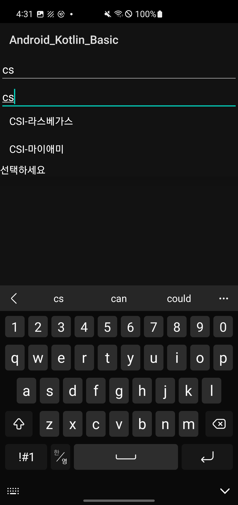
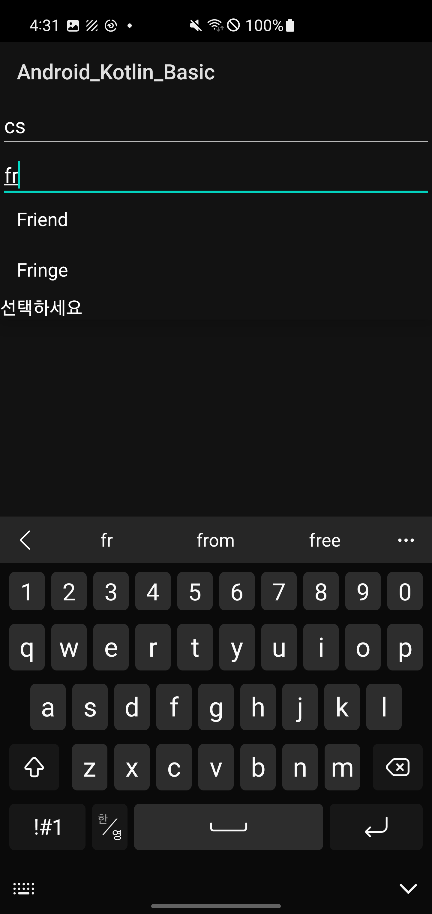
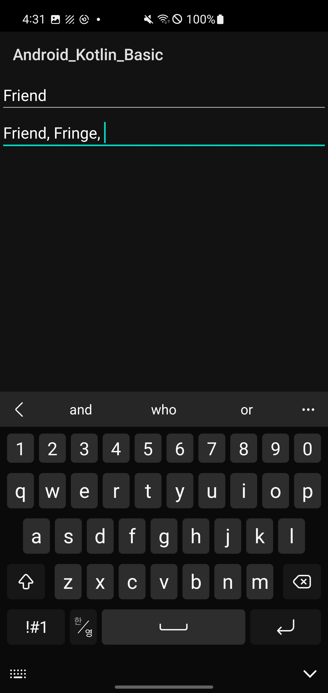
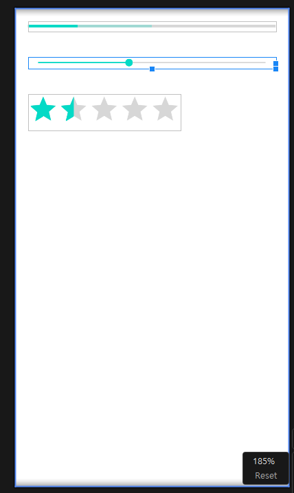

## 계산기2 문제 (계산기1 개선)
* '예약시작'과 '예약 완료'를 없앰.
대신 예약 시작 기능은 크로노미터를 클릭하면 동작하게 하고, 
예약 완료 기능은 화면의 하단 연도(0000)를 롱클릭하면 동작하게 함.
ex) setOnLongClickListener

* 캘린더뷰 대신 데이트피커를 사용하여 날짜를 설정.


* 크로노미터를 클릭하기 전에는 라디오버튼, 데이트피커, 타임피커가 안 보이도록 설정하고,
크로노미터를 클릭하면 라디오버튼이 나타나게 함.
그리고 화면 하단의 연도를 롱클릭하면 라디오버튼, 데이트피커, 타임피커가 다시 사라지게 함.


xml
```xml
<?xml version="1.0" encoding="utf-8"?>
<LinearLayout xmlns:android="http://schemas.android.com/apk/res/android"
    xmlns:tools="http://schemas.android.com/tools"
    android:layout_width="match_parent"
    android:layout_height="match_parent"
    android:orientation="vertical">

    <Chronometer
        android:id="@+id/chronometer1"
        android:layout_width="match_parent"
        android:layout_height="wrap_content"
        android:format="예약에 걸린 시간 %s"
        android:background="#56596564"
        android:gravity="center"
        android:textSize="22dp" />

<!--    <Button-->
<!--        android:id="@+id/btnStart"-->
<!--        android:layout_width="match_parent"-->
<!--        android:layout_height="wrap_content"-->
<!--        android:text="예약 시작"-->
<!--        android:textColor="@color/white" />-->

    <RadioGroup
        android:layout_width="wrap_content"
        android:layout_height="wrap_content">

        <RadioButton
            android:id="@+id/rdoCal"
            android:layout_width="wrap_content"
            android:layout_height="wrap_content"
            android:visibility="invisible"
            android:text="날짜 설정(캘린더뷰)" />

        <RadioButton
            android:id="@+id/rdoTime"
            android:layout_width="wrap_content"
            android:layout_height="wrap_content"
            android:visibility="invisible"

            android:text="시간 설정" />
    </RadioGroup>

    <LinearLayout
        android:layout_width="match_parent"
        android:layout_height="0dp"
        android:layout_weight="1"
        android:orientation="vertical">

        <FrameLayout
            android:layout_width="match_parent"
            android:layout_height="wrap_content"
            tools:ignore="UselessParent">

            <DatePicker
                android:id="@+id/dataPicker1"
                android:layout_width="wrap_content"
                android:layout_height="wrap_content"
                android:spinnersShown="false"
                android:calendarViewShown="false"
                android:datePickerMode="spinner" />
<!--            <CalendarView-->
<!--                android:id="@+id/calendarView1"-->
<!--                android:showWeekNumber="false"-->
<!--                android:layout_width="match_parent"-->

<!--                android:layout_height="wrap_content" />-->

            <TimePicker
                android:id="@+id/timePicker1"
                android:layout_width="match_parent"

                android:timePickerMode="spinner"
                android:layout_height="wrap_content" />
        </FrameLayout>
    </LinearLayout>


    <LinearLayout
        android:layout_width="match_parent"
        android:layout_height="wrap_content"
        android:background="#3C3B3B"
        android:gravity="center"
        android:orientation="horizontal">

<!--        <Button-->
<!--            android:id="@+id/btnEnd"-->
<!--            android:layout_width="wrap_content"-->
<!--            android:layout_height="wrap_content"-->
<!--            android:text="예약완료"-->
<!--            android:layout_marginRight="10dp"-->
<!--            android:gravity="center"/>-->

        <TextView
            android:id="@+id/tvYear"
            android:layout_width="wrap_content"
            android:layout_height="wrap_content"
            android:text="0000"
            />
        <TextView
            android:layout_width="wrap_content"
            android:layout_height="wrap_content"
            android:text="년"
            />
        <TextView
            android:id="@+id/tvMonth"
            android:layout_width="wrap_content"
            android:layout_height="wrap_content"
            android:text="00"
            />
        <TextView
            android:layout_width="wrap_content"
            android:layout_height="wrap_content"
            android:text="월"
            />
        <TextView
            android:id="@+id/tvDay"
            android:layout_width="wrap_content"
            android:layout_height="wrap_content"
            android:text="00"
            />
        <TextView
            android:layout_width="wrap_content"
            android:layout_height="wrap_content"
            android:text="일"
            />
        <TextView
            android:id="@+id/tvHour"
            android:layout_width="wrap_content"
            android:layout_height="wrap_content"
            android:text="00"
            />
        <TextView
            android:layout_width="wrap_content"
            android:layout_height="wrap_content"
            android:text="시"
            />
        <TextView
            android:id="@+id/tvMinute"
            android:layout_width="wrap_content"
            android:layout_height="wrap_content"
            android:text="00"
            />
        <TextView
            android:layout_width="wrap_content"
            android:layout_height="wrap_content"
            android:text="분"
            />
        <TextView
            android:layout_width="wrap_content"
            android:layout_height="wrap_content"
            android:text=" 예약함" />
    </LinearLayout>

</LinearLayout>
```

`activity.kt`

```kotlin
package com.example.android_kotlin_basic

import android.annotation.SuppressLint
import android.graphics.Color
import android.os.Bundle
import android.os.SystemClock
import android.view.View
import android.widget.Button
import android.widget.CalendarView
import android.widget.Chronometer
import android.widget.DatePicker
import android.widget.RadioButton
import android.widget.TextView
import android.widget.TimePicker
import androidx.appcompat.app.AppCompatActivity

class MainActivity2_time4_exam2 : AppCompatActivity() {

    // 전역 변수 선언
    // 12개의 위젯에 대응할 위젯 변수 12개
    // 캘린더 뷰에서 선택할 연, 월,일에 해당하는 변수
    private lateinit var chronometer1: Chronometer

    //    private lateinit var btnStart: Button
//    private lateinit var btnEnd: Button

    private lateinit var rdoCal: RadioButton
    private lateinit var rdoTime: RadioButton

    private lateinit var dataPicker1: DatePicker

    //    private lateinit var calendarView1: CalendarView
    private lateinit var timePicker1: TimePicker

    private lateinit var tvYear: TextView
    private lateinit var tvMonth: TextView
    private lateinit var tvDay: TextView
    private lateinit var tvHour: TextView
    private lateinit var tvMinute: TextView

    var selectYear: Int = 0
    var selectMonth: Int = 0
    var selectDay: Int = 0

    @SuppressLint("MissingInflatedId")
    override fun onCreate(savedInstanceState: Bundle?) {
        super.onCreate(savedInstanceState)
        setContentView(R.layout.lnearlayout_time4_exam2)

        title = "시간 예약"

        // 버튼
//        btnStart = findViewById(R.id.btnStart)
//        btnEnd = findViewById(R.id.btnEnd)

        // 크로노미터
        chronometer1 = findViewById(R.id.chronometer1)

        // 라디오버튼 2개
        rdoCal = findViewById(R.id.rdoCal)
        rdoTime = findViewById(R.id.rdoTime)

        // FrameLayout의 2개 위젯
        timePicker1 = findViewById(R.id.timePicker1)
//        calendarView1 = findViewById(R.id.calendarView1)
        dataPicker1 = findViewById(R.id.dataPicker1)

        // 텍스트 뷰 중에서 연, 월, 일, 시, 분 숫자
        tvYear = findViewById(R.id.tvYear)
        tvMonth = findViewById(R.id.tvMonth)
        tvDay = findViewById(R.id.tvDay)
        tvHour = findViewById(R.id.tvHour)
        tvMinute = findViewById(R.id.tvMinute)

        fun init(){
            rdoCal.isChecked = false
            rdoTime.isChecked = false
            rdoCal.visibility = View.INVISIBLE
            rdoTime.visibility = View.INVISIBLE
            timePicker1.visibility = View.INVISIBLE
            dataPicker1.visibility = View.INVISIBLE
        }

        init()

//        // 처음에 2개는 안보이게 설정
//        timePicker1.visibility = View.INVISIBLE
////        calendarView1.visibility = View.INVISIBLE
//        dataPicker1.visibility = View.INVISIBLE

        class Listener : View.OnClickListener{
            override fun onClick(v: View?) {
                timePicker1.visibility = View.INVISIBLE
                dataPicker1.visibility = View.VISIBLE
            }
        }
        rdoCal.setOnClickListener(Listener())
        // 위와 아래의 코드결과는 동일하다 위코드를 람다식으로 줄인게 아래임
//        rdoCal.setOnClickListener {
//            timePicker1.visibility = View.INVISIBLE
////            calendarView1.visibility = View.VISIBLE
//            dataPicker1.visibility = View.VISIBLE
//        }
        rdoTime.setOnClickListener {
            timePicker1.visibility = View.VISIBLE
//            calendarView1.visibility = View.INVISIBLE
            dataPicker1.visibility = View.INVISIBLE

        }

        // 타이머 설정
//        btnStart.setOnClickListener {
//            chronometer1.base = SystemClock.elapsedRealtime()
//            chronometer1.start()
//            chronometer1.setTextColor(Color.RED)
//        }
        chronometer1.setOnClickListener {
            chronometer1.base = SystemClock.elapsedRealtime()
            chronometer1.start()
            chronometer1.setTextColor(Color.RED)
            rdoCal.visibility = View.VISIBLE
            rdoTime.visibility = View.VISIBLE

        }

        tvYear.setOnLongClickListener {
            chronometer1.stop()
            chronometer1.setTextColor(Color.BLUE)

            tvYear.text = selectYear.toString()
            tvMonth.text = selectMonth.toString()
            tvDay.text = selectDay.toString()

            tvHour.text = timePicker1.currentHour.toString()
            tvMinute.text = timePicker1.currentMinute.toString()

            init()
            return@setOnLongClickListener false
        }

//        tvYear.setOnClickListener {
////            chronometer1.stop()
////            chronometer1.setTextColor(Color.BLUE)
////
////            tvYear.text = selectYear.toString()
////            tvMonth.text = selectMonth.toString()
////            tvDay.text = selectDay.toString()
////
////            tvHour.text = timePicker1.currentHour.toString()
////            tvMinute.text = timePicker1.currentMinute.toString()
////
//////            init()
////            rdoCal.visibility = View.INVISIBLE
////            rdoTime.visibility = View.INVISIBLE
//////
//////
////            timePicker1.visibility = View.INVISIBLE
//////            calendarView1.visibility = View.INVISIBLE
////            dataPicker1.visibility = View.INVISIBLE
//        }


        // 버튼을 클릭하면 날짜, 시간을 가져온다.
//        btnEnd.setOnClickListener {
//            chronometer1.stop()
//            chronometer1.setTextColor(Color.BLUE)
//
//            tvYear.text = selectYear.toString()
//            tvMonth.text = selectMonth.toString()
//            tvDay.text = selectDay.toString()
//
//            tvHour.text = timePicker1.currentHour.toString()
//            tvMinute.text = timePicker1.currentMinute.toString()
//
//        }
//        calendarView1.setOnDateChangeListener { view, year, month, dayOfMonth ->
//            selectYear = year
//            selectMonth = month + 1
//            selectDay = dayOfMonth
//        }

        dataPicker1.setOnDateChangedListener { view, year, month, dayOfMonth ->
            selectYear = year
            selectMonth = month + 1
            selectDay = dayOfMonth
        }


    }
}
```

---

타겟

---

### 기타 위젯
1. 자동완성텍스트뷰와 


```xml
<?xml version="1.0" encoding="utf-8"?>
<LinearLayout xmlns:android="http://schemas.android.com/apk/res/android"
    android:orientation="vertical"
    android:layout_width="match_parent"
    android:layout_height="match_parent">

    <AutoCompleteTextView
        android:id="@+id/autoCompleteTextView1"
        android:layout_width="match_parent"
        android:layout_height="wrap_content"
        android:completionHint="선택하세요"
        android:completionThreshold="2"
        android:hint="자동완성텍스트뷰" >
    </AutoCompleteTextView>

    <MultiAutoCompleteTextView
        android:id="@+id/multiAutoCompleteTextView1"
        android:layout_width="match_parent"
        android:layout_height="wrap_content"
        android:completionHint="선택하세요"
        android:completionThreshold="2"
        android:hint="멀티자동완성텍스트뷰" />
    
</LinearLayout>
```

`android:completionThreshold="2"`
자동완성 전에 최소 입력 숫자
e.g2 

자동 완성 시작되기 전에 사용자가 입력해야 하는 최소 문자 수

코드

Activity

```kotlin
package com.example.android_kotlin_basic

import android.os.Bundle
import android.widget.ArrayAdapter
import android.widget.AutoCompleteTextView
import android.widget.MultiAutoCompleteTextView
import androidx.appcompat.app.AppCompatActivity

class MainActivity_AutocompleteTextView : AppCompatActivity() {
    override fun onCreate(savedInstanceState: Bundle?) {
        super.onCreate(savedInstanceState)
        setContentView(R.layout.autocompletetextview_mutliautocompletetextview01)

        val items = arrayOf("CIS-뉴욕","CSI-라스베가스","CSI-마이애미","Friend","Fringe","Lost")
        val auto = findViewById<AutoCompleteTextView>(R.id.autoCompleteTextView1)
        val adapter = ArrayAdapter<String>(this, android.R.layout.simple_list_item_1, items)
        auto.setAdapter(adapter)

        val multi = findViewById<MultiAutoCompleteTextView>(R.id.multiAutoCompleteTextView1)
        val tokenizer = MultiAutoCompleteTextView.CommaTokenizer()
        multi.setTokenizer(tokenizer)
        multi.setAdapter(adapter)

        // val items = arrayOf("CIS-뉴욕","CSI-라스베가스","CSI-마이애미","Friend","Fringe","Lost")
        // 자동 완성될 문자열을 배열로 정의
    }
}
```

val items = arrayOf("CIS-뉴욕","CSI-라스베가스",
"CSI-마이애미","Friend","Fringe","Lost")
 
자동 완성될 문자열을 배열로 정의

-> ArrayAdapter 는 뷰와 데이터를 연결.
자동완성텍스트뷰와 `items` 를 연결하는 역할을 하여 자동완성 텍스트 뷰에 items 배열의 내용이 출력.

생성자의 두 번째 파라미터는 목록이 출력될 모양을 결정.
simple_dropdown_item_1line 외에도 다양한 모양을 선택할 수 있음.

 

 

 




---

### 프로그레스바, 시크바, 레이팅바

### 1. 프로그레스바

### 1. 시크바


### 레이팅바

```xml
<?xml version="1.0" encoding="utf-8"?>
<LinearLayout xmlns:android="http://schemas.android.com/apk/res/android"
    android:orientation="vertical"
    android:layout_width="match_parent"
    android:layout_height="match_parent">

    <ProgressBar style="?android:attr/progressBarStyleHorizontal"
        android:layout_width="match_parent"
        android:layout_height="wrap_content"
        android:layout_margin="20dp"
        android:max="100"
        android:progress="20"
        android:secondaryProgress="50" />

    <SeekBar
        android:layout_width="match_parent"
        android:layout_height="wrap_content"
        android:layout_margin="20dp"
        android:progress="40" />

    <RatingBar
        android:layout_width="wrap_content"
        android:layout_height="wrap_content"
        android:layout_margin="20dp"
        android:numStars="5"
        android:rating="1.5"
        android:stepSize="0.5" />

</LinearLayout>
```
