##  고급위젯 : 뷰 컨테이너


### 1. 텍스트 뷰 `TextView`
`TextView`는 안드로이드에서 텍스트를 화면에 표시하는 가장 기본적인 뷰 컨테이너.

이를 사용하여 사용자에게 정보를 표시하거나 앱의 일부 텍스트를 강조할 수 있습니다.


#### `TextView` 주요 기능
- **텍스트 속성 변경**: 폰트, 크기, 색상 등 텍스트의 스타일을 손쉽게 변경할 수 있습니다.
- **멀티라인 텍스트 지원**: 긴 텍스트를 여러 줄에 걸쳐 표시하거나 줄바꿈을 관리할 수 있습니다.
- **텍스트 정렬**: 텍스트를 좌측, 우측 또는 중앙 등에 정렬할 수 있습니다.
- **HTML 텍스트 렌더링**: HTML 태그를 사용하여 텍스트에 서식을 적용할 수 있습니다.

TextView 코드

```xml
<?xml version="1.0" encoding="utf-8"?>
<LinearLayout xmlns:android="http://schemas.android.com/apk/res/android"
    android:layout_width="match_parent"
    android:layout_height="match_parent"
    android:gravity="center"
    android:orientation="vertical">

    <TextView
        android:layout_width="wrap_content"
        android:layout_height="wrap_content"
        android:layout_gravity="center"
        android:text="Hello World"
        android:textColor="#FF5522"
        android:textSize="24dp" />
</LinearLayout>
```


<p align="center">
  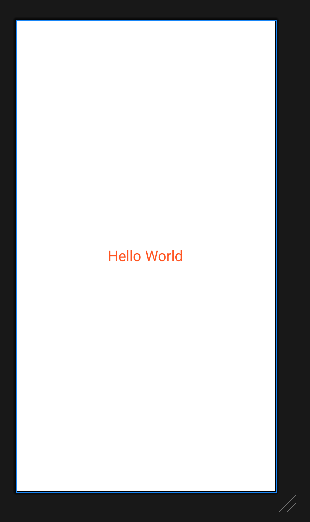
</p>


---

### 2. 스크롤 뷰 `(ScrollView)`
ScrollView는 스크롤 가능한 뷰 컨테이너로, 화면에 한 번에 모두 표시할 수 없는 많은 양의 콘텐츠를 수직(수평) 방향으로 스크롤하여 볼 수 있게 해줌

스크롤뷰 안에는 단 하나의 위젯만 넣을 수 있음

스크롤 뷰의 XML 코드

`수직`
```xml
<?xml version="1.0" encoding="utf-8"?>
<ScrollView xmlns:android="http://schemas.android.com/apk/res/android"
    android:layout_width="match_parent"
    android:layout_height="match_parent"
    android:orientation="vertical">

    <LinearLayout
        android:layout_width="match_parent"
        android:layout_height="match_parent"
        android:orientation="vertical">

        <Button
            android:layout_width="match_parent"
            android:layout_height="100dp"
            android:text="버튼 1" />
        <Button
            android:layout_width="match_parent"
            android:layout_height="100dp"
            android:text="버튼 2" />
        <Button
            android:layout_width="match_parent"
            android:layout_height="100dp"
            android:text="버튼 3" />
        <Button
            android:layout_width="match_parent"
            android:layout_height="100dp"
            android:text="버튼 4" />
        <Button
            android:layout_width="match_parent"
            android:layout_height="100dp"
            android:text="버튼 5" />
        <Button
            android:layout_width="match_parent"
            android:layout_height="100dp"
            android:text="버튼 6" />
        <Button
            android:layout_width="match_parent"
            android:layout_height="100dp"
            android:text="버튼 7" />
        <Button
            android:layout_width="match_parent"
            android:layout_height="100dp"
            android:text="버튼 8" />
        <Button
            android:layout_width="match_parent"
            android:layout_height="100dp"
            android:text="버튼 9" />
        <Button
            android:layout_width="match_parent"
            android:layout_height="100dp"
            android:text="버튼 10" />
        <Button
            android:layout_width="match_parent"
            android:layout_height="100dp"
            android:text="버튼 11" />

    </LinearLayout>
</ScrollView>
```

<p align="center">
  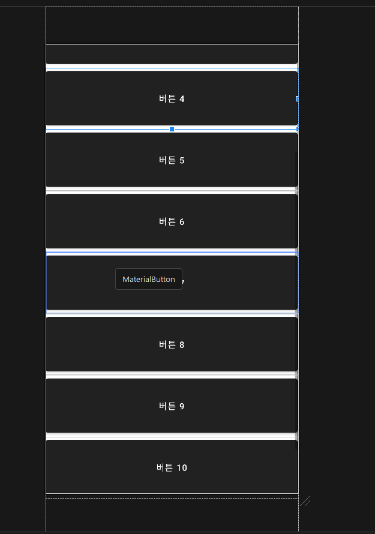
</p>


스크롤이 된다(상하)


스크롤 뷰에는 1개의 위젯만 넣을 수 있기 때문에 리니어레이아웃을 넣는 것이 일반적이다.

#### 좌우로 스크롤을 하고 싶다면

- 스크롤 뷰를 `HorizontalScrollView` 로 변경
- 버튼을 감싸고 있는 리니어 레이아웃을 `android:orientation="horizontal"` 로 변경

```xml
<?xml version="1.0" encoding="utf-8"?>
    <HorizontalScrollView xmlns:android="http://schemas.android.com/apk/res/android"
    android:layout_width="match_parent"
    android:layout_height="match_parent"
    android:orientation="vertical">

    <LinearLayout
        android:layout_width="match_parent"
        android:layout_height="match_parent"
        android:orientation="horizontal">

        <Button
            android:layout_width="match_parent"
            android:layout_height="100dp"
            android:text="버튼 1" />
        <Button
            android:layout_width="match_parent"
            android:layout_height="100dp"
            android:text="버튼 2" />
        <Button
            android:layout_width="match_parent"
            android:layout_height="100dp"
            android:text="버튼 3" />
        <Button
            android:layout_width="match_parent"
            android:layout_height="100dp"
            android:text="버튼 4" />
        <Button
            android:layout_width="match_parent"
            android:layout_height="100dp"
            android:text="버튼 5" />
        <Button
            android:layout_width="match_parent"
            android:layout_height="100dp"
            android:text="버튼 6" />
        <Button
            android:layout_width="match_parent"
            android:layout_height="100dp"
            android:text="버튼 7" />
        <Button
            android:layout_width="match_parent"
            android:layout_height="100dp"
            android:text="버튼 8" />
        <Button
            android:layout_width="match_parent"
            android:layout_height="100dp"
            android:text="버튼 9" />
        <Button
            android:layout_width="match_parent"
            android:layout_height="100dp"
            android:text="버튼 10" />
        <Button
            android:layout_width="match_parent"
            android:layout_height="100dp"
            android:text="버튼 11" />

    </LinearLayout>
</HorizontalScrollView>
```

<p align="center">
  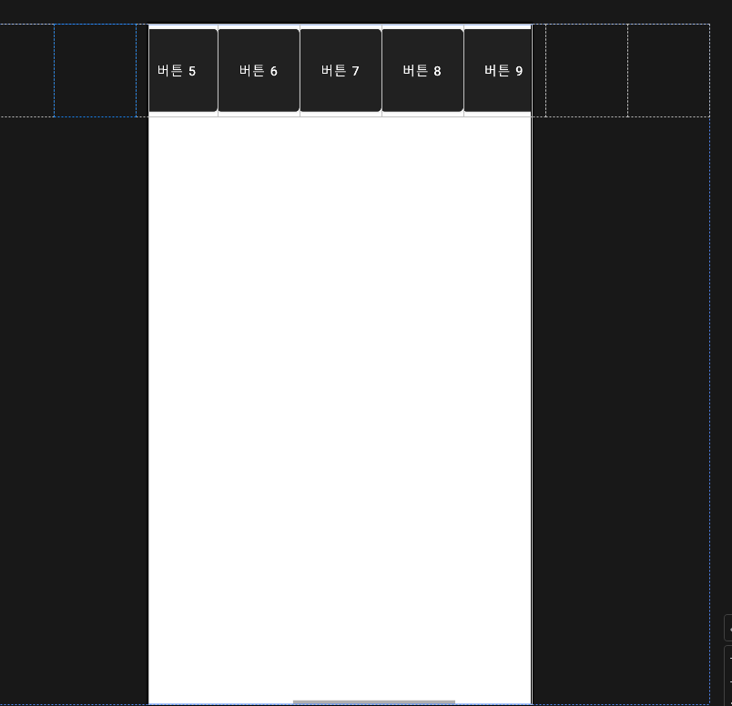
</p>

좌우로 스크롤이 된다.

---

### 3. 슬라이딩드로어 `(Sliding Drawer)`
슬라이딩 드로어(Sliding Drawer)는 주로 모바일 애플리케이션에서 사용되는 UI 요소로, 화면의 한쪽 가장자리에서 나와 다른 콘텐츠를 덮는 형식으로
슬라이드하는 패널.

이 패널은 주로 네비게이션 링크, 사용자 설정, 또는 앱의 추가적인 옵션들을 제공하는 데 사용된다.

슬라이딩드로어 코드
```xml
<?xml version="1.0" encoding="utf-8"?>
<LinearLayout xmlns:android="http://schemas.android.com/apk/res/android"
    android:orientation="vertical"
    android:layout_width="match_parent"
    android:layout_height="match_parent">

    <TextView
        android:layout_width="match_parent"
        android:layout_height="wrap_content"
        android:text="여기는 서랍 밖입니다."
        android:textSize="20dp" />

    <SlidingDrawer
        android:id="@+id/slidingDrawer1"
        android:layout_width="match_parent"
        android:layout_height="match_parent"
        android:content="@id/content"
        android:handle="@id/handle">

        <Button
            android:id="@+id/handle"
            android:layout_width="wrap_content"
            android:layout_height="wrap_content"
            android:text="서랍 손잡이" />

        <LinearLayout
            android:id="@+id/content"
            android:layout_width="match_parent"
            android:layout_height="match_parent"
            android:background="#00ff00"
            android:gravity="center" >

            <TextView
                android:layout_width="wrap_content"
                android:layout_height="wrap_content"
                android:text="여기는 서랍 안입니다."
                android:textSize="20dp" />
        </LinearLayout>

    </SlidingDrawer>
</LinearLayout>
```


<div style="display: flex; justify-content: center; align-items: center;">
  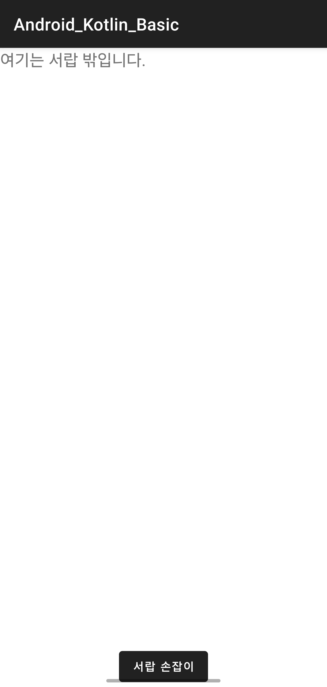
  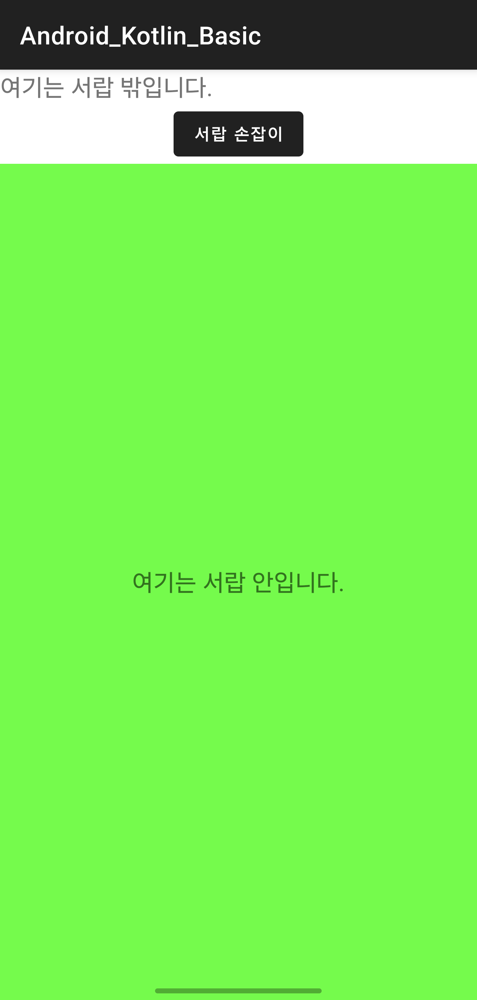
</div>


---

## 복잡한 기능의 뷰 컨테이너
XML 코드만으론느 완성 되지 않고 kotlin코드와 함께 구현해야 하는 뷰 컨테이너도 있음

### 1. 뷰플리퍼 `(viewflipper)`
뷰플리퍼는 여러 화면을 한 화면에 볼 수 있게 해주는 컨테이너.

여러 뷰(View)를 포함하고 각 뷰를 시간 간격이나 제스처에 따라 순차적으로 보여주는 데 사용되는 뷰 컨테이너라고도 할 수 있다.

뷰플리퍼는 주로 간단한 애니메이션 효과와 함께 여러 화면을 전환할 때 사용되며, `슬라이드쇼`나 `광고 배너`와 같은 기능을 구현하는데 적합함.

### 주요 특징

1. **다중 뷰 관리**: 뷰플리퍼는 내부적으로 여러 자식 뷰를 관리하고, `showNext()` 또는 `showPrevious()` 메소드를 호출하여 다음 또는 이전 뷰로 전환할 수 있습니다.

2. **자동 전환 설정**: `setAutoStart(boolean)` 메소드를 사용하여 뷰플리퍼가 자동으로 뷰를 전환하도록 설정할 수 있습니다. `setFlipInterval(int)` 메소드로 전환 간격을 밀리초 단위로 설정

3. **애니메이션 적용**: 뷰플리퍼는 애니메이션 효과를 추가하여 뷰 전환 시 시각적으로 매력적으로 만들 수 있습니다. `setInAnimation(Animation)`과 `setOutAnimation(Animation)` 메소드를 사용하여 전환 애니메이션을 설정


뷰플리퍼 XML

```xml
<?xml version="1.0" encoding="utf-8"?>
<LinearLayout xmlns:android="http://schemas.android.com/apk/res/android"
    android:layout_width="match_parent"
    android:layout_height="match_parent"
    android:orientation="vertical">

    <LinearLayout
        android:layout_width="match_parent"
        android:layout_height="wrap_content"
        android:orientation="horizontal">

        <Button
            android:id="@+id/btnPrev"
            android:layout_width="wrap_content"
            android:layout_height="wrap_content"
            android:layout_weight="1"
            android:text=" 이전화면 " />

        <Button
            android:id="@+id/btnNext"
            android:layout_width="wrap_content"
            android:layout_height="wrap_content"
            android:layout_weight="1"
            android:text=" 다음화면 " />
    </LinearLayout>

    <ViewFlipper
        android:id="@+id/viewFlipper1"
        android:layout_width="match_parent"
        android:layout_height="match_parent">

        <LinearLayout
            android:layout_width="match_parent"
            android:layout_height="match_parent"
            android:background="#ff0000">
            
        </LinearLayout>
        <LinearLayout
            android:layout_width="match_parent"
            android:layout_height="match_parent"
            android:background="#00ff00"
        />
        <LinearLayout
            android:layout_width="match_parent"
            android:layout_height="match_parent"
            android:background="#0000ff"/>
        <LinearLayout
            android:layout_width="match_parent"
            android:layout_height="match_parent"
            android:background="#ff00ff"
            />
    </ViewFlipper>

</LinearLayout>
```

<p align="center">
  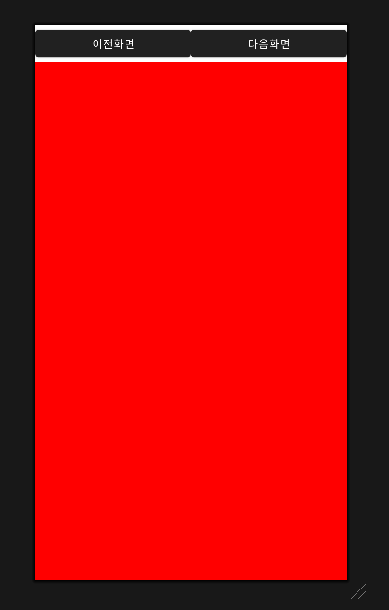
</p>


MainActivity
```kotlin
package com.example.android_kotlin_basic

import android.annotation.SuppressLint
import android.os.Bundle
import android.widget.Button
import android.widget.ViewFlipper
import androidx.appcompat.app.AppCompatActivity

class MainActivity_viewflipper01 : AppCompatActivity() {


    @SuppressLint("MissingInflatedId")
    override fun onCreate(savedInstanceState: Bundle?) {
        super.onCreate(savedInstanceState)

        setContentView(R.layout.viewflipper01)

        val btnPrev = findViewById<Button>(R.id.btnPrev)
        val btnNext = findViewById<Button>(R.id.btnNext)
        val viewFlipper = findViewById<ViewFlipper>(R.id.viewFlipper1)

        btnPrev.setOnClickListener {
            viewFlipper.showPrevious()
        }

        btnNext.setOnClickListener {
            viewFlipper.showNext()

        }
    }
}
```
이전화면/다음화면을 누르면 뷰가 전환된다.


<div style="display: flex; justify-content: center; align-items: center;">
  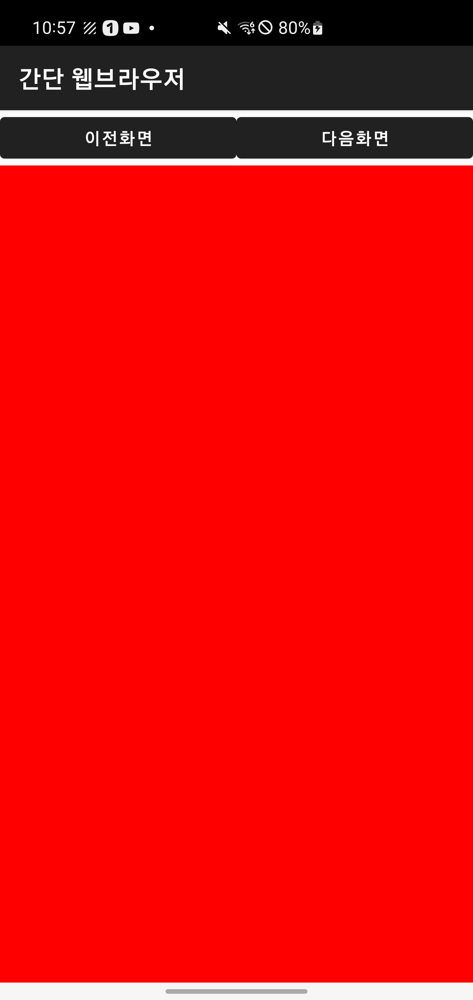
  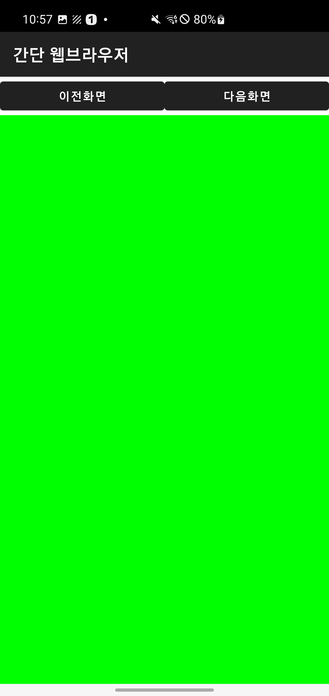
  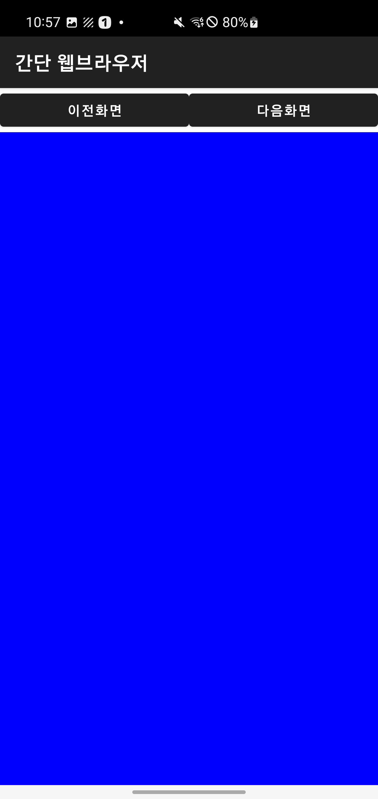
</div>

---

#### 뷰플리퍼 실습
요구사항
뷰플리퍼를 이용하여` 자동 사진 보기 앱`을 작성.

- 적절한 이미지 여러 장이 자동으로 넘어가는 앱.
- `사진보기 시작`과 `사진보기 정지`를 만들고, `사진보기 시작`을 클릭하면 1초 단위로 화면이 자동으로 넘어가게 함.
- 뷰플리퍼 안에 리니어레이아웃을 배치할 필요는 없고 직접 이미지뷰가 나오면 됨.

- +) 화면 넘김 시작 메서드는 `starFlipping()`,
정지 메서드로 `stopFlipping()`,
화면 넘김 간격 메서드로 `setFlipInterval(밀리초)`를 사용.


xml 코드
```xml
<?xml version="1.0" encoding="utf-8"?>
<LinearLayout xmlns:android="http://schemas.android.com/apk/res/android"
    android:layout_width="match_parent"
    android:layout_height="match_parent"
    android:orientation="vertical">

    <LinearLayout
        android:layout_width="match_parent"
        android:layout_height="wrap_content"
        android:orientation="horizontal">

        <Button
            android:id="@+id/btnStart"
            android:layout_width="wrap_content"
            android:layout_height="wrap_content"
            android:layout_weight="1"
            android:text=" 사진보기 시작 " />

        <Button
            android:id="@+id/btnStop"
            android:layout_width="wrap_content"
            android:layout_height="wrap_content"
            android:layout_weight="1"
            android:text=" 사진보기 정지 " />
    </LinearLayout>

    <ViewFlipper
        android:id="@+id/viewFlipper1"
        android:layout_width="match_parent"
        android:layout_height="match_parent">

        <ImageView
            android:layout_width="match_parent"
            android:layout_height="match_parent"
            android:src="@drawable/cupcake"/>

        <ImageView
            android:layout_width="match_parent"
            android:layout_height="match_parent"
            android:src="@drawable/donut"/>

        <ImageView
            android:layout_width="match_parent"
            android:layout_height="match_parent"
            android:src="@drawable/eclair"/>

        <ImageView
            android:layout_width="match_parent"
            android:layout_height="match_parent"
            android:src="@drawable/froyo"/>

        <ImageView
            android:layout_width="match_parent"
            android:layout_height="match_parent"
            android:src="@drawable/gingerbread"/>

        <ImageView
            android:layout_width="match_parent"
            android:layout_height="match_parent"
            android:src="@drawable/honeycomb"/>

        <ImageView
            android:layout_width="match_parent"
            android:layout_height="match_parent"
            android:src="@drawable/icecream"/>

        <ImageView
            android:layout_width="match_parent"
            android:layout_height="match_parent"
            android:src="@drawable/jellybean"/>

        <ImageView
            android:layout_width="match_parent"
            android:layout_height="match_parent"
            android:src="@drawable/kitkat"/>

        <ImageView
            android:layout_width="match_parent"
            android:layout_height="match_parent"
            android:src="@drawable/lollipop"/>

        <ImageView
            android:layout_width="match_parent"
            android:layout_height="match_parent"
            android:src="@drawable/marshmallow"/>

        <ImageView
            android:layout_width="match_parent"
            android:layout_height="match_parent"
            android:src="@drawable/nougat"/>

        <ImageView
            android:layout_width="match_parent"
            android:layout_height="match_parent"
            android:src="@drawable/oreo"/>

        <ImageView
            android:layout_width="match_parent"
            android:layout_height="match_parent"
            android:src="@drawable/pie"/>

        <ImageView
            android:layout_width="match_parent"
            android:layout_height="match_parent"
            android:src="@drawable/q10"/>

        <ImageView
            android:layout_width="match_parent"
            android:layout_height="match_parent"
            android:src="@drawable/r11"/>

        <ImageView
            android:layout_width="match_parent"
            android:layout_height="match_parent"
            android:src="@drawable/t13"/>


        <ImageView
            android:layout_width="match_parent"
            android:layout_height="match_parent"
            android:src="@drawable/u14"/>
    </ViewFlipper>

</LinearLayout>
```

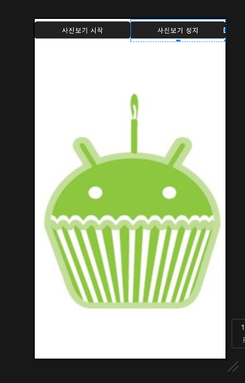


MainActivity

```kotlin
package com.example.android_kotlin_basic

import android.annotation.SuppressLint
import android.os.Bundle
import android.widget.Button
import android.widget.ViewFlipper
import androidx.appcompat.app.AppCompatActivity

class MainActivity_viewflipper02_exam : AppCompatActivity() {


    @SuppressLint("MissingInflatedId")
    override fun onCreate(savedInstanceState: Bundle?) {
        super.onCreate(savedInstanceState)
        setContentView(R.layout.viewflipper02_exam)

        title = "뷰플리퍼 2"

        val btnStart = findViewById<Button>(R.id.btnStart)
        val btnStop = findViewById<Button>(R.id.btnStop)
        val viewFlipper1 = findViewById<ViewFlipper>(R.id.viewFlipper1)

        viewFlipper1.flipInterval = 1000

        btnStart.setOnClickListener {
            viewFlipper1.startFlipping()
        }
        btnStop.setOnClickListener {
            viewFlipper1.stopFlipping()

        }

    }
}
```
<div style="display: flex; justify-content: center; align-items: center;">
  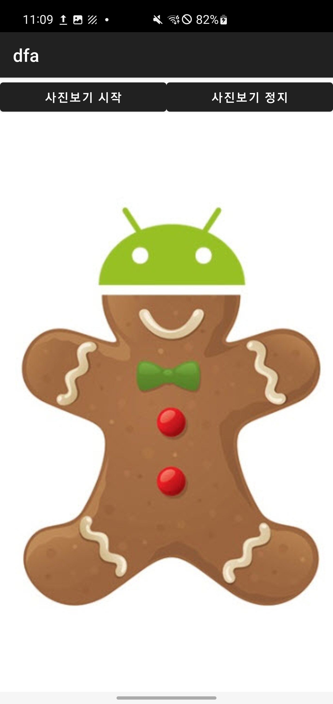
  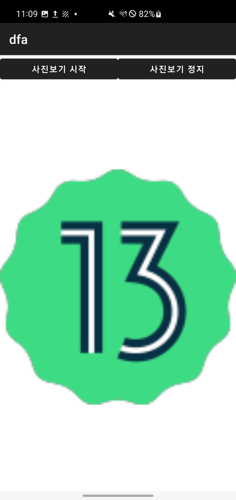
  
</div>

사진보기 시작을 누르면 1초마다 안드로이드 다음버전 로고가뜸 (~안드로이드14) 사진보기정지를 누르지 않는 이상 무한 반복


---

### 2. 탭호스트

탭호스트 뷰(TabHost)는 `탭을 구현하는 데 사용되는 위젯`

이 위젯을 통해 사용자는 화면의 상단이나 하단에 배치된 탭을 통해 다양한 콘텐츠를 빠르게 전환할 수 있다.

`TabHost`는 하나의 컨테이너 안에서 여러 탭을 관리하며, 각 탭은 독립된 뷰를 가질 수 있다.

### 주요 구성 요소

1. **TabHost**: 탭의 컨테이너 역할을 합니다. 모든 탭 관련 데이터와 뷰를 관리합니다.
2. **TabWidget**: 사용자에게 보여지는 탭의 실제 목록입니다. 일반적으로 화면의 상단에 위치하며, 사용자가 탭할 수 있는 시각적 요소를 제공합니다.
3. **FrameLayout**: 각 탭에 해당하는 뷰가 실제로 표시되는 영역입니다. 사용자가 탭을 선택할 때마다 `FrameLayout` 내의 내용이 변경됩니다.


### 사용시 주의점

`TabHost`는 구식 API로 간주되며, 많은 현대 안드로이드 애플리케이션에서는 `Fragment`와 `ViewPager`를 사용하여 탭 인터페이스를 구현하는 것이 더 선호되는 추세.

+) 탭호스트의 형식
id값이 정해져있다.

```xml
<?xml version="1.0" encoding="utf-8"?>
<TabHost xmlns:android="http://schemas.android.com/apk/res/android"
    android:id="@android:id/tabhost"
    android:layout_width="match_parent"
    android:layout_height="match_parent">

    <LinearLayout
        android:id="@+id/linearLayout1"
        android:layout_width="match_parent"
        android:layout_height="match_parent"
        android:orientation="vertical">

        <TabWidget
            android:id="@android:id/tabs"
            android:layout_width="match_parent"
            android:layout_height="wrap_content" />

        <FrameLayout
            android:id="@android:id/tabcontent"
            android:layout_width="match_parent"
            android:layout_height="match_parent">

            <LinearLayout
                android:id="@+id/tabSong"
                android:layout_width="match_parent"
                android:layout_height="match_parent"
                android:background="#f00000"
                android:orientation="vertical"></LinearLayout>

            <LinearLayout
                android:id="@+id/tabArtist"
                android:layout_width="match_parent"
                android:layout_height="match_parent"
                android:background="#f0f000"
                android:orientation="vertical"></LinearLayout>

            <LinearLayout
                android:id="@+id/tabAlbum"
                android:layout_width="match_parent"
                android:layout_height="match_parent"
                android:background="#f000f0"
                android:orientation="vertical"></LinearLayout>

        </FrameLayout>
    </LinearLayout>
</TabHost>
```
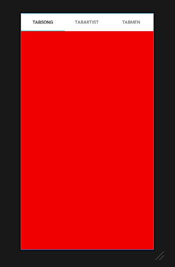


상단의 탭에 따라 보이는 화면이 달라짐.

<div style="display: flex; justify-content: center; align-items: center;">
  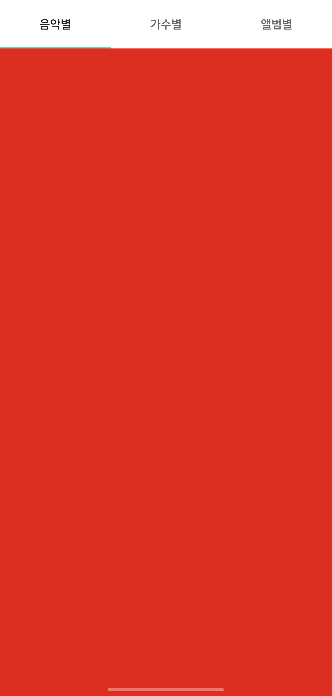
  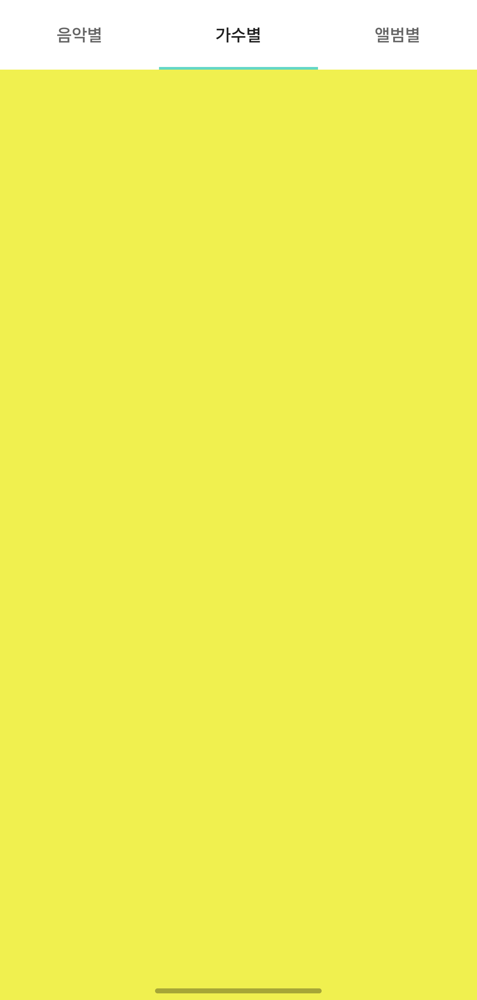
  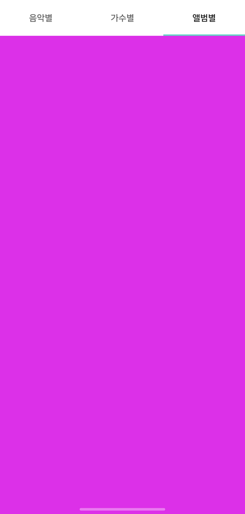
</div>


---

실습
### 요구사항

FrameLayout 에 
`android:layout_weight="1"` 을 주고 위치를 조정해준다 상다탭을 하단으로 옮기고
탭은 4개로 해보자.

```xml
<?xml version="1.0" encoding="utf-8"?>
<TabHost xmlns:android="http://schemas.android.com/apk/res/android"
    android:id="@android:id/tabhost"
    android:layout_width="match_parent"
    android:layout_height="match_parent">

    <LinearLayout
        android:id="@+id/linearLayout1"
        android:layout_width="match_parent"
        android:layout_height="match_parent"
        android:orientation="vertical">


        <FrameLayout
            android:id="@android:id/tabcontent"
            android:layout_width="match_parent"
            android:layout_height="match_parent"
            android:layout_weight="1">

            <ImageView
                android:id="@+id/imageView1"
                android:layout_width="match_parent"
                android:layout_height="match_parent"
                android:scaleType="center"
                android:src="@drawable/windows_11" />

            <ImageView
                android:id="@+id/imageView2"
                android:layout_width="match_parent"
                android:layout_height="match_parent"
                android:scaleType="center"

                android:src="@drawable/ubuntu_2" />

            <ImageView
                android:id="@+id/imageView3"
                android:layout_width="match_parent"
                android:layout_height="match_parent"
                android:scaleType="center"

                android:src="@drawable/android" />

            <ImageView
                android:id="@+id/imageView4"
                android:layout_width="match_parent"
                android:layout_height="match_parent"
                android:scaleType="center"

                android:src="@drawable/u14" />

        </FrameLayout>

        <TabWidget
            android:id="@android:id/tabs"
            android:layout_width="match_parent"
            android:layout_height="wrap_content" />

    </LinearLayout>
</TabHost>
```

kotlin 코드

```kotlin
package com.example.android_kotlin_basic

import android.app.TabActivity
import android.os.Bundle

class MainActivity_tabhost02 : TabActivity() {
    override fun onCreate(savedInstanceState: Bundle?) {
        super.onCreate(savedInstanceState)
        setContentView(R.layout.tabhost02_exam)


        /* tab host */
        val tabHost = this.tabHost

        val windows11 = tabHost.newTabSpec("windows").setIndicator("윈도우")
        windows11.setContent(R.id.imageView1)
        tabHost.addTab(windows11)

        val ubuntu = tabHost.newTabSpec("ubuntu").setIndicator("우분투")
        ubuntu.setContent(R.id.imageView2)
        tabHost.addTab(ubuntu)

        val android = tabHost.newTabSpec("android").setIndicator("안드로이드")
        android.setContent(R.id.imageView3)
        tabHost.addTab(android)

        val android14 = tabHost.newTabSpec("android14").setIndicator("안드14")
        android14.setContent(R.id.imageView4)
        tabHost.addTab(android14)


        tabHost.currentTab = 0

    }
}
```

<div style="display: flex; justify-content: center; align-items: center;">
  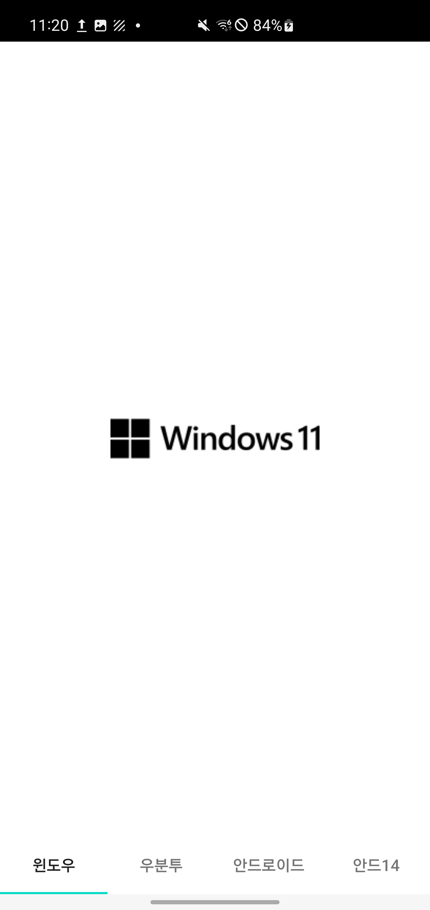
  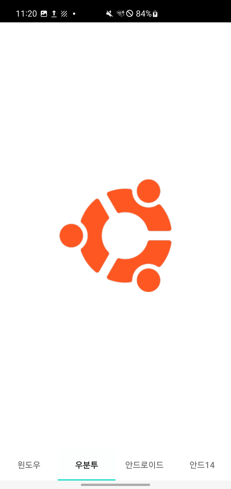
</div>

<div style="display: flex; justify-content: center; align-items: center;">
  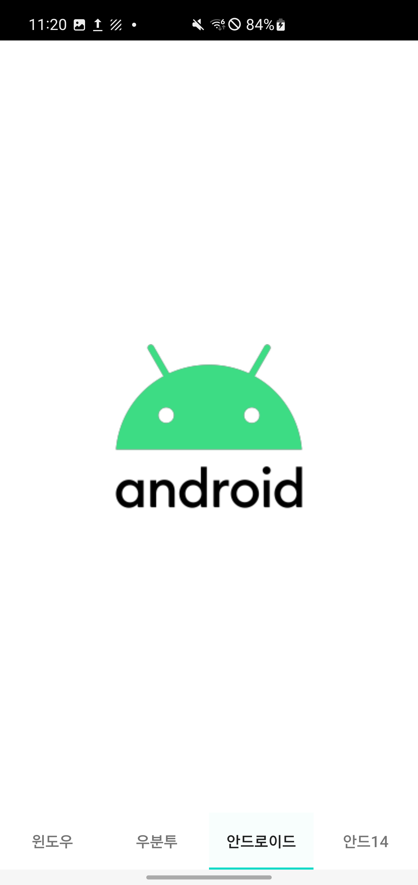
  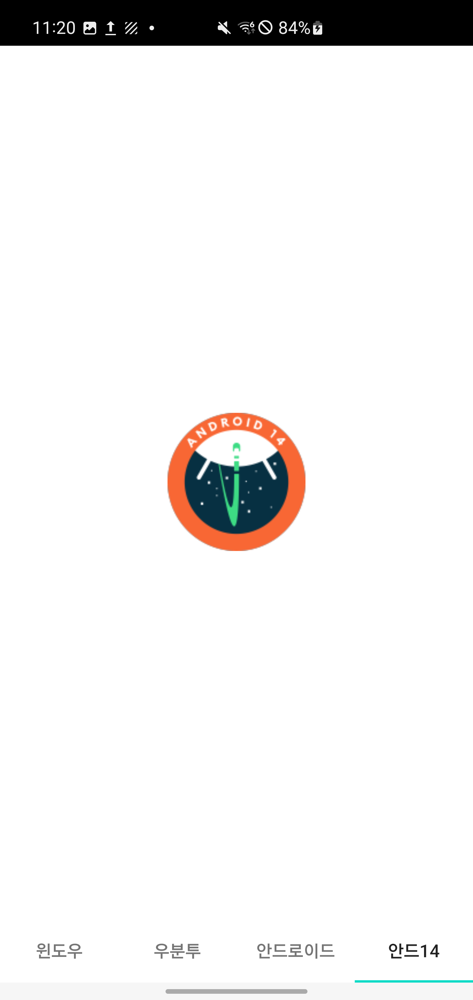
</div>


---

### 3. 웹뷰


종류는 위젯인데
웹뷰 WebView 는 사용자가 웹브라우저 기능을 앱 안에 직접 포함할 수 있는 위젯.

안드로이드와 iOS 플랫폼 모두에서 제공되며, 애플리케이션 내에서 웹 기반의 콘텐츠를 표시할 수 있게 해줌

---
위젯 프로젝트1


#### 1. 아이콘 등록

`수정전`
```xml
<?xml version="1.0" encoding="utf-8"?>
<manifest xmlns:android="http://schemas.android.com/apk/res/android"
    xmlns:tools="http://schemas.android.com/tools">

    <application
        android:allowBackup="true"
        android:dataExtractionRules="@xml/data_extraction_rules"
        android:fullBackupContent="@xml/backup_rules"
        android:icon="@mipmap/ic_launcher"
        android:label="@string/app_name"
        android:roundIcon="@mipmap/ic_launcher_round"
        android:supportsRtl="true"
        android:theme="@style/Theme.MaterialComponents.DayNight.DarkActionBar"
        tools:targetApi="31">
        <activity
            android:name=".MainActivity_tabhost02"
            android:exported="true">
            <intent-filter>
                <action android:name="android.intent.action.MAIN" />

                <category android:name="android.intent.category.LAUNCHER" />
            </intent-filter>
        </activity>
    </application>

</manifest>
```

`수정 후`
- `android:icon`과 `android:roundIcon`, `android:logo` 모두 @drawable/emo_im_cool로 변경
- 앱 이름은 '간단 웹브라우저' 로 변경

```xml
<?xml version="1.0" encoding="utf-8"?>
<manifest xmlns:android="http://schemas.android.com/apk/res/android"
    xmlns:tools="http://schemas.android.com/tools">

    <application
        android:allowBackup="true"
        android:dataExtractionRules="@xml/data_extraction_rules"
        android:fullBackupContent="@xml/backup_rules"
        android:icon="@drawable/emo_im_cool"
        android:label="@string/app_name"
        android:roundIcon="@drawable/emo_im_cool"
        android:supportsRtl="true"
        android:theme="@style/Theme.MaterialComponents.DayNight.DarkActionBar"
        android:logo="@drawable/web"
        tools:targetApi="31">
        <activity
            android:name=".MainActivity_tabhost02"
            android:exported="true">
            <intent-filter>
                <action android:name="android.intent.action.MAIN" />

                <category android:name="android.intent.category.LAUNCHER" />
            </intent-filter>
        </activity>
    </application>

</manifest>
```

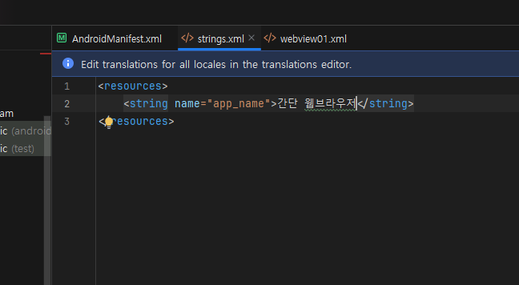

webview XML
```xml
<?xml version="1.0" encoding="utf-8"?>
<LinearLayout xmlns:android="http://schemas.android.com/apk/res/android"
    xmlns:tools="http://schemas.android.com/tools"
    android:layout_width="match_parent"
    android:layout_height="match_parent"
    android:orientation="vertical">

    <LinearLayout
        android:layout_width="match_parent"
        android:layout_height="wrap_content">

        <EditText
            android:id="@+id/editURL"
            android:layout_width="wrap_content"
            android:layout_height="wrap_content"
            android:layout_weight="1"
            android:hint="URL을 입력하세요."
            android:singleLine="true" />

        <Button
            android:id="@+id/btnGo"
            android:layout_width="wrap_content"
            android:layout_height="wrap_content"
            android:text="이동" />

        <Button
            android:id="@+id/btnBack"
            android:layout_width="wrap_content"
            android:layout_height="wrap_content"
            android:text="이전" />

    </LinearLayout>
    <WebView
        android:layout_width="match_parent"
        android:layout_height="match_parent"
        android:id="@+id/webView"
        android:clickable="true"
        />

</LinearLayout>
```

<p align="center">
  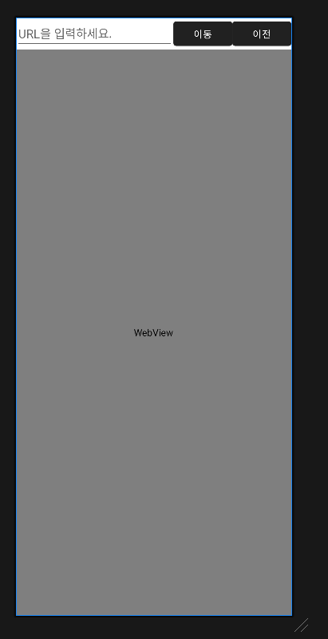
</p>


```kotlin
package com.example.android_kotlin_basic

import android.os.Bundle
import androidx.appcompat.app.AppCompatActivity

class MainActivity_webview01 : AppCompatActivity() {
    override fun onCreate(savedInstanceState: Bundle?) {
        super.onCreate(savedInstanceState)
        setContentView(R.layout.webview01)

        supportActionBar?.setDisplayHomeAsUpEnabled(true)
        supportActionBar?.setIcon(R.drawable.web)
    }
}
```

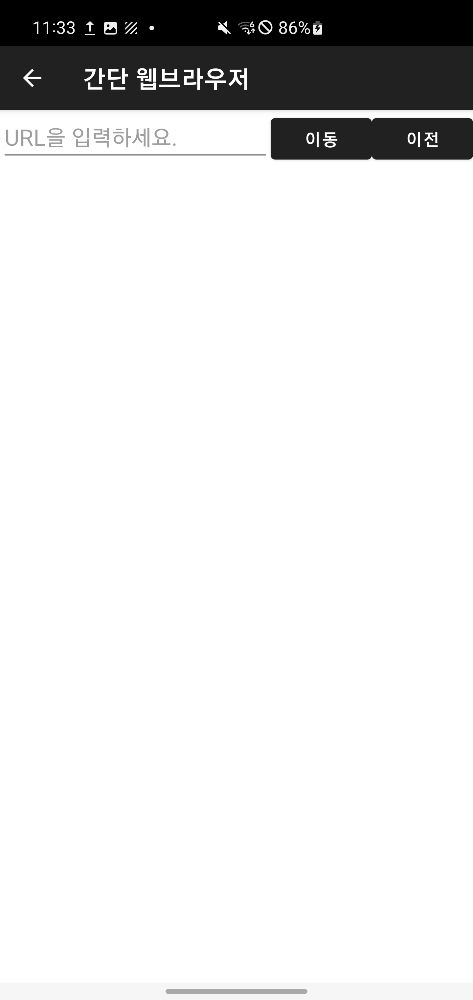

인터넷 접속이 안된다. 뒤에서 해결 하겠음.

---

#### 실습

1. Main Activity.kt 수정

4개의 위젯에 대응할 위젯 변수 4개를 전역 변수로 선언.
onCreate() 메서드안에 각 변수에 위젯을 대입

일단 위젯에 id를 부여해야 한다
xml
<?xml version="1.0" encoding="utf-8"?>
<LinearLayout xmlns:android="http://schemas.android.com/apk/res/android"
    xmlns:tools="http://schemas.android.com/tools"
    android:layout_width="match_parent"
    android:layout_height="match_parent"
    android:orientation="vertical">

    <LinearLayout
        android:layout_width="match_parent"
        android:layout_height="wrap_content">

        <EditText
            android:id="@+id/editURL"
            android:layout_width="wrap_content"
            android:layout_height="wrap_content"
            android:layout_weight="1"
            android:hint="URL을 입력하세요."
            android:singleLine="true" />

        <Button
            android:id="@+id/btnGo"
            android:layout_width="wrap_content"
            android:layout_height="wrap_content"
            android:text="이동" />

        <Button
            android:id="@+id/btnBack"
            android:layout_width="wrap_content"
            android:layout_height="wrap_content"
            android:text="이전" />

    </LinearLayout>
    <WebView
        android:layout_width="match_parent"
        android:layout_height="match_parent"
        android:id="@+id/webView"
        android:clickable="true"
        />

</LinearLayout>
```


전역 변수 선언
```kotlin
    // 전역 변수 선언
    lateinit var editURL: EditText
    lateinit var btnGo: Button
    lateinit var btnback: Button
    lateinit var webView: WebView
```

```kotlin
        editURL = findViewById(R.id.editURL)
        btnGo = findViewById(R.id.btnGo)
        btnback = findViewById(R.id.btnBack)
        webView = findViewById(R.id.webView)
```

밑에서 두번째 메소드 오버라이드

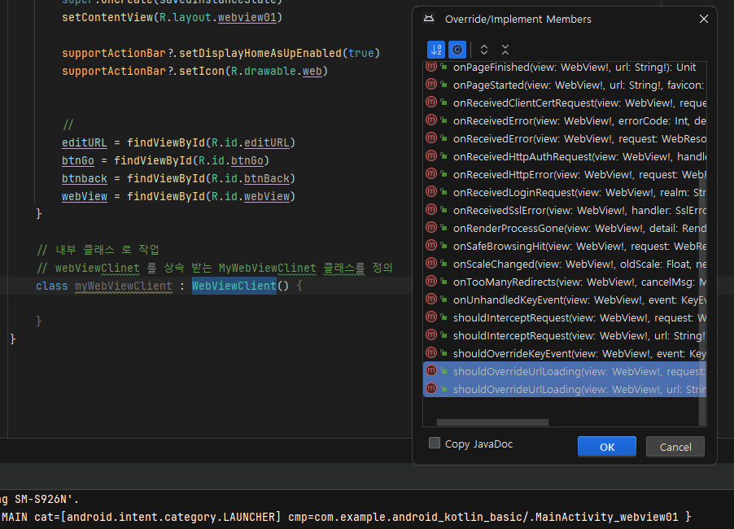


```kotlin
    // 내부 클래스 로 작업
    // webViewClinet 를 상속 받는 MyWebViewClinet 클래스를 정의
    class myWebViewClient : WebViewClient() {


        override fun shouldInterceptRequest(view: WebView?, url: String?): WebResourceResponse? {
            return super.shouldInterceptRequest(view, url)
        }
    }
```

`최종`
```kotlin
package com.example.android_kotlin_basic

import android.annotation.SuppressLint
import android.os.Bundle
import android.webkit.WebResourceRequest
import android.webkit.WebResourceResponse
import android.webkit.WebView
import android.webkit.WebViewClient
import android.widget.Button
import android.widget.EditText
import android.widget.Toast
import androidx.appcompat.app.AppCompatActivity

class MainActivity_webview02 : AppCompatActivity() {

    // 전역 변수 선언
    private lateinit var editURL: EditText
    private lateinit var btnGo: Button
    private lateinit var btnback: Button
    private lateinit var webView: WebView

    @SuppressLint("SetJavaScriptEnabled")
    override fun onCreate(savedInstanceState: Bundle?) {
        super.onCreate(savedInstanceState)
        setContentView(R.layout.webview02_exam)

        supportActionBar?.setDisplayHomeAsUpEnabled(true)
        supportActionBar?.setIcon(R.drawable.web)

        editURL = findViewById(R.id.editURL)
        btnGo = findViewById(R.id.btnGo)
        btnback = findViewById(R.id.btnBack)
        webView = findViewById(R.id.webView)

        webView.webViewClient = myWebViewClient()

        val webSet = webView.settings
        webSet.builtInZoomControls = true
        webSet.javaScriptEnabled = true

        btnGo.setOnClickListener {
            Toast.makeText(applicationContext, editURL.text.toString(), Toast.LENGTH_SHORT).show()
            webView.loadUrl(editURL.text.toString())
        }

        btnback.setOnClickListener {
            webView.goBack()
        }
    }

    // 내부 클래스 로 작업
    // webViewClinet 를 상속 받는 MyWebViewClinet 클래스를 정의
    class myWebViewClient : WebViewClient() {

        override fun shouldInterceptRequest(view: WebView?, url: String?): WebResourceResponse? {
            return super.shouldInterceptRequest(view, url)
        }
    }
}

```

바로 실행하면 발생하는 문제점

네트워크가 허용이 기본적으로 막혀있어서 웹 검색이 안된다.


1. `AndroidManifest.xml`

```xml
    <!-- 네트워크 접속 권한 -->
    <uses-permission android:name="android.permission.INTERNET"/>
```
- 인터텟 기능을 사용하기 위해 인터넷 권한을 주도록 코드 추가

```xml
   <application
        android:allowBackup="true"
        android:dataExtractionRules="@xml/data_extraction_rules"
        android:fullBackupContent="@xml/backup_rules"
        android:icon="@drawable/emo_im_cool"
        android:label="@string/app_name"
        android:roundIcon="@drawable/emo_im_cool"
        android:supportsRtl="true"
        android:theme="@style/Theme.MaterialComponents.DayNight.DarkActionBar"
        android:logo="@drawable/emo_im_cool"
        android:usesCleartextTraffic="true"
        
        tools:targetApi="31">
        <activity
            android:name=".MainActivity_webview01"
            android:exported="true">
            <intent-filter>
                <action android:name="android.intent.action.MAIN" />

                <category android:name="android.intent.category.LAUNCHER" />
            </intent-filter>
        </activity>
    </application>
```


-  `android:usesCleartextTraffic="true"`도 추가한다.

실행

<div style="display: flex; justify-content: center; align-items: center;">
  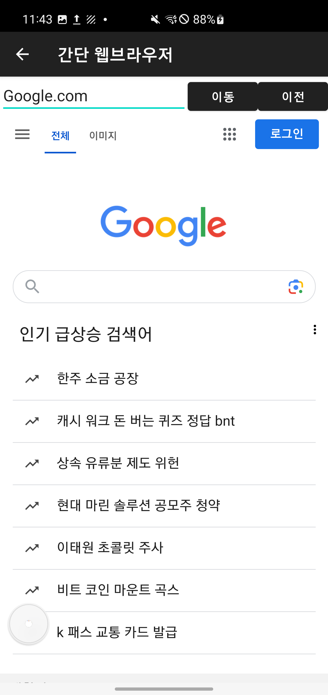
  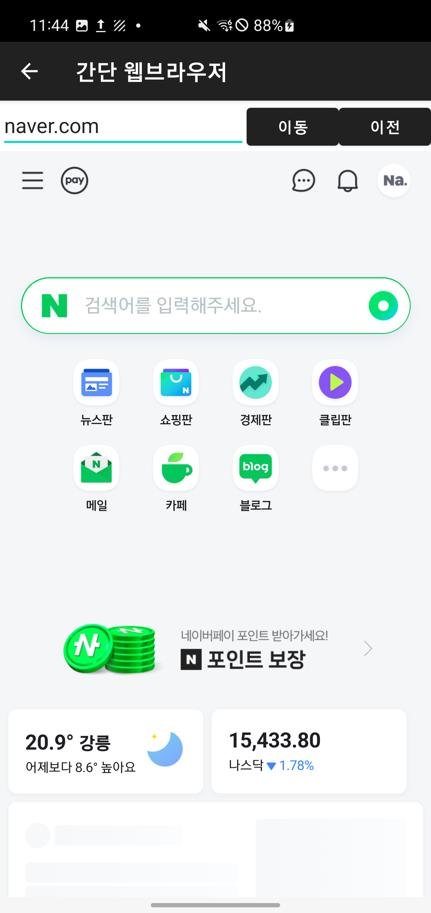
  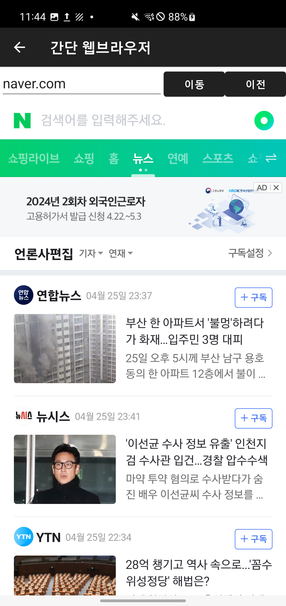
</div>


잘된다!


아까 오버라이드 한 메소드에 대해 알아보자면
#### `override fun shouldInterceptRequest(view: WebView?, url: String?): WebResourceResponse? {return super.shouldInterceptRequest(view, url)}`

`WebResourceResponse` 클래스의 메소드를 오버라이드하는 것으로, `WebView`가 웹 콘텐츠를 로드할 때마다 호출됩니다. 

웹 요청을 가로채서 다양한 처리를 할 수 있게 해 줍니다.

이 함수의 사용 목적은 다음과 같습니다:
1. 특정 URL에 대한 요청을 차단하거나 수정할 때.
2. 네트워크를 사용하지 않고 로컬 콘텐츠를 로드하려고 할 때.
3. 웹 리소스 요청을 모니터링하거나 로그를 기록하고 싶을 때.

함수는 `WebView`의 인스턴스와 요청된 URL을 매개변수로 받으며, `WebResourceResponse` 객체를 반환할 수 있습니다. 이 객체를 사용하여 커스텀 응답을 제공하거나, `null`을 반환하여 기본 처리를 계속하도록 할 수 있습니다.

예를 들어, 특정 URL을 차단하고자 할 때 다음과 같이 작성할 수 있습니다:
```kotlin
override fun shouldInterceptRequest(view: WebView?, url: String?): WebResourceResponse? {
    if (url != null && url.contains("example.com")) {
        // 특정 도메인의 요청을 차단
        return WebResourceResponse("text/plain", "utf-8", null)
    }
    return super.shouldInterceptRequest(view, url)
}
```


---

실습
요구사항

- 화면 전체를 웹뷰로 할 것.
- 앱을 실행하면 스타벅스 홈페이지가바로 뜨도록 할 것

```xml
<?xml version="1.0" encoding="utf-8"?>
<LinearLayout xmlns:android="http://schemas.android.com/apk/res/android"
    xmlns:tools="http://schemas.android.com/tools"
    android:layout_width="match_parent"
    android:layout_height="match_parent"
    android:orientation="vertical">


    <WebView
        android:layout_width="match_parent"
        android:layout_height="match_parent"
        android:id="@+id/webView"
        android:clickable="true"
        />

</LinearLayout>
```

```kotlin
package com.example.android_kotlin_basic

import android.os.Bundle
import android.webkit.WebResourceResponse
import android.webkit.WebView
import android.webkit.WebViewClient
import androidx.appcompat.app.AppCompatActivity

class MainActivity_webview03_exam : AppCompatActivity() {

    // 전역 변수 선언
    lateinit var webView: WebView

    override fun onCreate(savedInstanceState: Bundle?) {
        super.onCreate(savedInstanceState)
        setContentView(R.layout.webview_03_exam_only)

        supportActionBar?.setDisplayHomeAsUpEnabled(true)
        supportActionBar?.setIcon(R.drawable.web)


        webView = findViewById(R.id.webView)
        webView.webViewClient = myWebViewClient()

        val webSet = webView.settings
        webSet.builtInZoomControls = true
        webSet.javaScriptEnabled = true
        webView.loadUrl("https://www.starbucks.co.kr:7643/index.do")

    }

    // 내부 클래스 로 작업
    // webViewClinet 를 상속 받는 MyWebViewClinet 클래스를 정의
    class myWebViewClient : WebViewClient() {


        override fun shouldInterceptRequest(view: WebView?, url: String?): WebResourceResponse? {
            return super.shouldInterceptRequest(view, url)
        }
    }
}

```

<p align="center">
  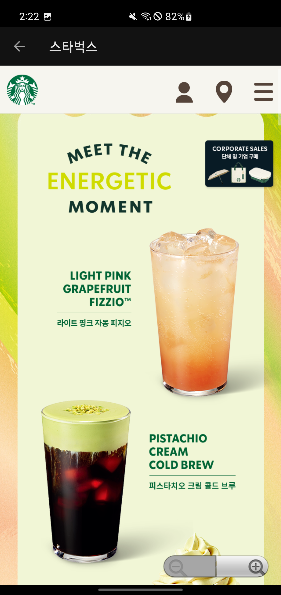
</p>

---

실습2

앱이 실행되면 이디야 커피 홈페이지가 로딩

- 하단에 홈 / 매장 찾기 / 가맹점 개설 / 공지사항 메뉴 만들기.


xml
```xml
<?xml version="1.0" encoding="utf-8"?>
<LinearLayout xmlns:android="http://schemas.android.com/apk/res/android"
    xmlns:tools="http://schemas.android.com/tools"
    android:layout_width="match_parent"
    android:layout_height="match_parent"
    android:orientation="vertical">


    <WebView
        android:id="@+id/webView"
        android:layout_width="match_parent"
        android:layout_height="0dp"
        android:clickable="true"

        android:layout_weight="1"
        tools:ignore="Suspicious0dp" />

    <LinearLayout
        android:id="@+id/linearLayout1"
        android:layout_width="match_parent"
        android:layout_height="wrap_content"
        android:layout_margin="5dp"
        android:orientation="horizontal">

        <TextView
            android:id="@+id/textview1"
            android:layout_width="wrap_content"
            android:layout_height="wrap_content"
            android:layout_weight="1"
            android:gravity="center"
            android:clickable="true"
            android:text="홈으로"
            android:textSize="20dp" />


        <TextView
            android:id="@+id/textview2"
            android:layout_width="wrap_content"
            android:layout_height="wrap_content"
            android:layout_weight="1"
            android:gravity="center"
            android:text="매장찾기"
            android:clickable="true"


            android:textSize="20dp" />


        <TextView
            android:id="@+id/textview3"
            android:layout_width="wrap_content"
            android:layout_height="wrap_content"
            android:layout_weight="1"
            android:gravity="center"
            android:text="고객의 소리"
            android:clickable="true"


            android:textSize="20dp" />


        <TextView
            android:id="@+id/textview4"
            android:layout_width="wrap_content"
            android:layout_height="wrap_content"
            android:layout_weight="1"
            android:gravity="center"
            android:text="공지사항"
            android:clickable="true"

            android:textSize="20dp" />

    </LinearLayout>
</LinearLayout>
```

MainActivity

```kotlin
package com.example.android_kotlin_basic

import android.annotation.SuppressLint
import android.os.Bundle
import android.webkit.WebResourceResponse
import android.webkit.WebView
import android.webkit.WebViewClient
import android.widget.Button
import android.widget.LinearLayout
import android.widget.TextView
import androidx.appcompat.app.AppCompatActivity

class MainActivity_webview04_exam : AppCompatActivity() {

    // 전역 변수 선언
    lateinit var webView: WebView

    lateinit var textview1: TextView
    lateinit var textview2: TextView
    lateinit var textview3: TextView
    lateinit var textview4: TextView

    @SuppressLint("MissingInflatedId")
    override fun onCreate(savedInstanceState: Bundle?) {
        super.onCreate(savedInstanceState)
        setContentView(R.layout.webview04_exam)

        supportActionBar?.setDisplayHomeAsUpEnabled(true)
        supportActionBar?.setIcon(R.drawable.web)


        webView = findViewById(R.id.webView)

        textview1 = findViewById(R.id.textview1)
        textview2 = findViewById(R.id.textview2)
        textview3 = findViewById(R.id.textview3)
        textview4 = findViewById(R.id.textview4)

        webView.webViewClient = myWebViewClient()


        val webSet = webView.settings
        webSet.builtInZoomControls = true
        webSet.javaScriptEnabled = true
        webView.loadUrl("https://www.ediya.com/")

        textview1.setOnClickListener {
            webView.loadUrl("https://www.ediya.com/")
        }

        textview2.setOnClickListener {
            webView.loadUrl("https://ediya.recruiter.co.kr/appsite/company/index/")
        }
        textview3.setOnClickListener {

            webView.loadUrl("https://www.ediya.com/contents/customer_intro.html")
        }
        textview4.setOnClickListener {

            webView.loadUrl("https://www.ediya.com/contents/notice.html")
        }


    }

    // 내부 클래스 로 작업
    // webViewClinet 를 상속 받는 MyWebViewClinet 클래스를 정의
    class myWebViewClient : WebViewClient() {


        override fun shouldInterceptRequest(view: WebView?, url: String?): WebResourceResponse? {
            return super.shouldInterceptRequest(view, url)
        }
    }
}

```


<p align="center">
  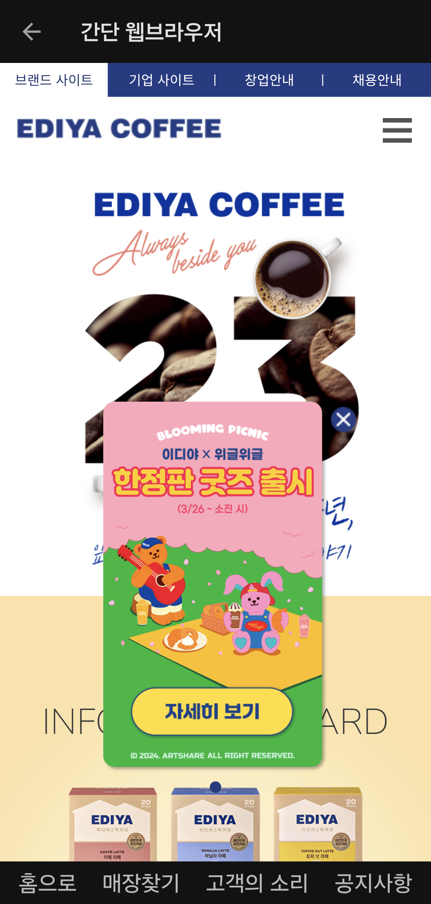
</p>

<p align="center">
  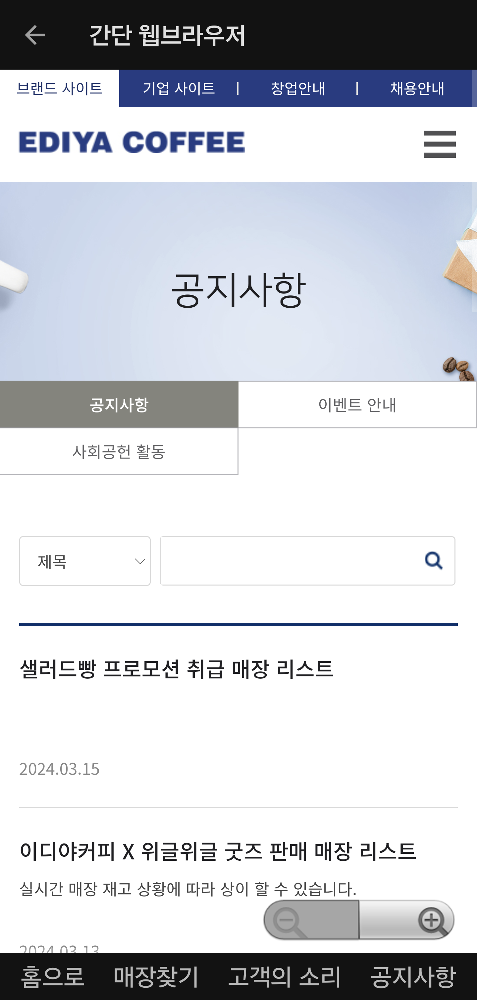
</p>

<p align="center">
  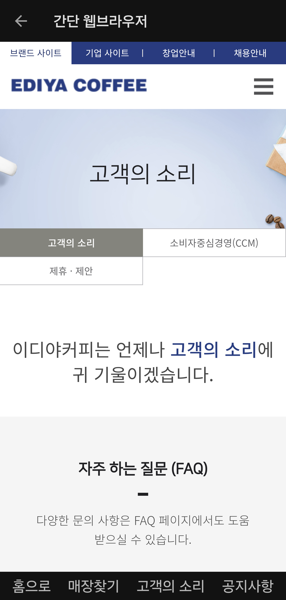
</p>

