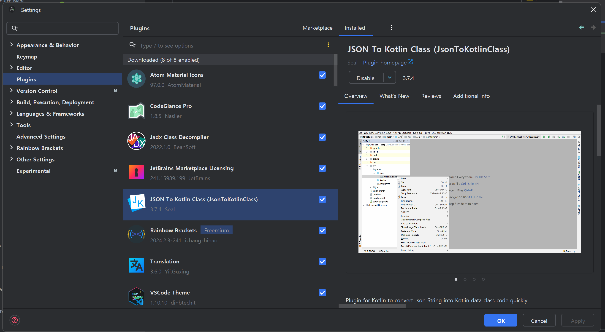

Retrofit 이란?
안드로이드에서 Retrofit은 서버와 클라이언트 간 HTTP API 통신을 할 때 사용하는 라이브러리입니다.


REST API 기반의 웹 서비스를 통해 JSON 구조의 데이터를 쉽게 가져오고 업로드할 수 있습니다.

 > [!NOTE] Retrofit
> 안드로이드 프로그래밍을 할때 API 서버에 Request를 보낼때 사용하는 라이브러리이다.


Retrofit 인터페이스에서 어노테이션(@)을 사용해 서버에 요청할 함수와 파라미터를 미리 정의해 놓고, 네트워크 통신이 필요할 때 해당 함수를 호출하는 형태이기 때문에 코드를 작성하기도 수월하고 가독성도 좋다는 특징도 있습니다.


## Retrofit 사용 방법

Retrofit은 REST API와 통신할 때 유용한 HTTP 클라이언트 라이브러리

Retrofit 공식 : https://square.github.io/retrofit/ 


### 1. 프로젝트 설정

1. **Gradle 파일 수정**:
    - `build.gradle ` 파일에서 `dependencies` 블록에 Retrofit과 관련된 의존성을 추가한다.
    - converter-gson은 레트로핏에서 JSON 데이터를 사용하기 위해서 사용하는 부가적인 라이브러리.
      ```groovy
      dependencies {
          implementation "com.squareup.retrofit2:retrofit:2.9.0"
          implementation "com.squareup.retrofit2:converter-gson:2.9.0"
      }
      ```

2. **인터넷 권한 추가**:
    - `AndroidManifest.xml` 파일에 인터넷 권한을 추가한다.
      ```xml
      <uses-permission android:name="android.permission.INTERNET" />
      ```

레트로핏을 위한 기본적인 프로젝트 설정은 완료되었다.

### 2. Retrofit 을 위한 준비 사항
1. 데이터를 가져올 곳 (웹 사이트 또는 API 서버) 결정
2. 어떤 (표준 프로토콜) 데이터를 사용할 것인지 데이터의 형식을 결정

1번의 경우 웹 사이트의 주소만 알면 되므로 별다른 학습은 필요하지 않다. 2번의 경우 어떤 데이터 형식을 사용할 것인지는 프로토콜이 정해지면 해당 프로토콜에 대한 공부가 필요함.

학습에서는 사용자 정보 API를 무료로 제공하는 `Github API`을 이용 하기로 한다.

- Github REST API : https://docs.github.com/ko/rest?apiVersion=2022-11-28


결정.<br>
3. 이번에 사용할 데이터를  가져올 곳
- https://api.github.com/users/Kotlin/repos

- 위 사이트는 
    <p align="center">
    
    </p>
4. JSON 형식으로 가져오기로 한다.
- Github API는 JSON 형식으로 만들어진 데이터를 제공하므로 JSON 형식으로 받기로 함


<p align="center">
  
</p>


포스트맨으로 사이트 제대로 불러와지는지 테스트

깃허브에서 가져온 목록 데이터에서 `avatar_url` 값에 이미지 정보가 포함되어있다. 
`HttpURLConnection` 을 이용해 직접 구현도 가능하지만, 구현 난이도는 높고 효율성이 떨어지므로 라이브러리를 이용한다.

여기서 유명한 라이브러리가 `Glide`와 `피카소` 가 있으며 `Glide` 를 사용해보기로 한다.

#### Retrofit과 Glide 설정하기
1. `build.gradle` 파일을 열고 viewBinding 설정하기
```gradle
    buildFeatures {
        viewBinding = true
    }
```

2. dependencies에 Glide 의존성을 추가.
```gradle
    implementation 'com.github.bumptech.glide:glide:4.12.0'
    annotationProcessor 'com.github.bumptech.glide:compiler:4.12.0'
```

---
여기서 안드로이드 스튜디오의 플러그인을 이용하면 JSON 형식으로 된 텍스트 데이터를 코틀린 클래스로 간단하게 변환해주는 플러그인도 함께 사용하기로 한다.

해당 플러그인 정보 : https://plugins.jetbrains.com/plugin/9960-json-to-kotlin-class-jsontokotlinclass-

설치는 안드로이드 스튜디오 - 플러그인에서 검색을 하여 설치하면 된다.


<p align="center">
  
</p>


---

JSON 문자열을 Kotlin 데이터 클래스로 변환하기
https://api.github.com/users/Kotlin/repos 에 접속해서 전체 복사한다.

안드로이드 스튜디오로 돌아가서 기본 패키지를 우클릭하고 [NEW] - [Kotlin data class File from JSON] 클릭

<p align="center">
  
</p>

붙여넣고 클래스 이름은 `Repository` 로 입력하고 `Generate` 을 누르면 JSON 문자열을 데이터 클래스로 자동으로 변환해준다.


<p align="center">
  
</p>


<p align="center">
  
</p>

4개의 데이터 클래스가 생성되었다고 뜬다.

License, Owner, Repository, RepositoryItem 클래스가 생성.


<p align="center">
  
</p>

License, Owner 클래스는 JSON 데이터가 JSON 오브젝트를 값으로 사용하는
경우, 해당 데이터의 이름으로 클래스를 생성하고 사용.


화면 구성(레이아웃)

깃허브의 데이터 데이터 API 주소를 요청하기 위한 버튼을 화면 상단에 배치했다.<br>


`activity_main.xml`
```xml
<?xml version="1.0" encoding="utf-8"?>
<androidx.constraintlayout.widget.ConstraintLayout xmlns:android="http://schemas.android.com/apk/res/android"
    xmlns:app="http://schemas.android.com/apk/res-auto"
    xmlns:tools="http://schemas.android.com/tools"
    android:layout_width="match_parent"
    android:layout_height="match_parent"
    tools:context=".MainActivity">

    <Button
        android:id="@+id/buttonRequest"
        android:layout_width="0dp"
        android:layout_height="wrap_content"
        android:layout_marginStart="24dp"
        android:layout_marginLeft="24dp"
        android:layout_marginTop="16dp"
        android:layout_marginEnd="24dp"
        android:layout_marginRight="24dp"
        android:text="GITHUB 사용자 가져오기"
        android:textSize="24sp"
        app:layout_constraintEnd_toEndOf="parent"
        app:layout_constraintStart_toStartOf="parent"
        app:layout_constraintTop_toTopOf="parent" />

    <androidx.recyclerview.widget.RecyclerView
        android:id="@+id/recyclerView"
        android:layout_width="0dp"
        android:layout_height="0dp"
        android:layout_marginStart="24dp"
        android:layout_marginLeft="24dp"
        android:layout_marginTop="4dp"
        android:layout_marginEnd="24dp"
        android:layout_marginRight="24dp"
        android:layout_marginBottom="24dp"
        app:layout_constraintBottom_toBottomOf="parent"
        app:layout_constraintEnd_toEndOf="parent"
        app:layout_constraintStart_toStartOf="parent"
        app:layout_constraintTop_toBottomOf="@+id/buttonRequest" />

</androidx.constraintlayout.widget.ConstraintLayout>
```


<p align="center">
  
</p>


가져온 데이터의 목록을 보여줄 리사이클러뷰를 버튼 아래쪽에 배치.<br>

리사이클러뷰 안에 넣을 아이템을 위한 새 레이아웃 생성


- 리사이클러뷰 어댑터 만들기
CustomAdater 이름으로 클래스 생성.


<p align="center">
  
</p>


홀더의 생성자에 바인딩을 전달하고 상속받은 ViewHolder()에는 binding.root
를 전달.<br>

CustomAdapter에 RecyclerView.Adapter를 상속하고 제네릭으로 Holder를 지정

```kotlin
class CustomAdapter : RecyclerView.Adapter<Holder>() {
}

class Holder(val binding: ItemRecyclerBinding) : RecyclerView.ViewHolder(binding.root) {
}
```
RecyclerView.Adapter 에는 3개의 추상 메소드가 있으므로 필수적으로 오버라이딩 해야 된다.

RecyclerView가 어댑터를 통해 아이템을 관리하고 표시하기 위해 필요한 특정 메소드들을 추상메소드로 선언해두어 무조건 사용하도록 했다.

`public abstract VH onCreateViewHolder()`<br>
`public abstract void onBindViewHolder()`<br>
`public abstract int getItemCount();`<br>


<p align="center">
  
</p>

CustomAdapter 클래스 바로 밑에 어댑터에서 사용할 데이터 컬렉션을 변수로 만들어 둠.
-> 여기서 사용할 데이터셋은 자동생성 해두었던 Repository이고 nullable로 선언한다.

```kotlin
class CustomAdapter : RecyclerView.Adapter<Holder>() {
    var userList: Repository? = null
```

목록에 출력되는 총 아이템 개수를 정하는 `getItemCount()를 구현한다.

```kotlin
    /**
     * RecyclerView 의 아이템 수를 반환한다.
     * userList 가 0 인 경우 0 을 반환한다.
     */
    override fun getItemCount(): Int {
        return userList?.size ?: 0
    }
```

홀더를 생성하는 onCreateViewHolder()를 구현.
레이아웃을 인플레이트한 뷰 바인딩에 담아서 반환.

```kotlin
    /**
     * 새로운 뷰 홀더 객체를 생성한다.
     * ItemRecyclerBinding 을 사용해 XML 레이아웃 파일을 인플레이트 하고 이을 Holder 에 전달한다.
     */
    override fun onCreateViewHolder(parent: ViewGroup, viewType: Int): Holder {
        val binding =
            ItemRecyclerBinding.inflate(LayoutInflater.from(parent.context), parent, false)
        return Holder(binding)
    }
```

실제 목록에 뿌려지는 아이템을 그려주는 onBindViewHolder()를 구현.
현 위치의 사용자 데이터를 userList에서 가져오고 아직 만들어지지 않은 홀더의
setUser()메서드에 넘겨줌.


```kotlin
 /**
     * 주어진 위치에 데이터를 바인딩합니다.
     * userList에서 해당 위치의 데이터를 가져와서 Holder의 setUser() 메소드를 호출하여 데이터를 설정합니다.
     */
    override fun onBindViewHolder(holder: Holder, position: Int) {
        // 실제 화면에 아이템을 그려주는 메소드
        val user = userList?.get((position))
        holder.setUser(user)
    }
```

다시 Holder 클래스로 돌아가서 setUser() 메서드를 구현.
setUser() 메서드는 1개의 RepositoryItem을 파라미터로 사용.
클래스의 가장 윗줄에서 userList가 nullable이기 때문에 user 파라미터도
nullable로 설정되어야 함.


```kotlin
class Holder(val binding: ItemRecyclerBinding) :
ViewHolder(binding.root) {
fun setUser(user: RepositoryItem?) {
    }
}
```

홀더가 가지고 있는 아이템 레이아웃에 데이터를 하나씩 세팅해주면 되는데 우리
가 사용하는 데이터는 세 가지.


변수 user: RepositoryItem에 있는 각각의 데이터 이름은 다음과 같음.

* 아바타 주소 : user.owner.user.owner.avatar_url
* 사용자 이름 : user.name
* 사용자 ID : user.node_id


먼저 사용자 이름과, 아이디를 세팅하고 아바타는 Glide를 사용해서 이미지뷰에 세팅한다.

```kotlin
// RecyclerView 을 상속받고 viewHolder()에 있는 binding.root 를 상속받음
/**
 * user 객체가 null 이 아닌 경우 사용자 이름, ID, 아바타 이미지를 설정한다.
 */
class Holder(val binding: ItemRecyclerBinding) : RecyclerView.ViewHolder(binding.root) {
    fun setUser(user: RepositoryItem?) {
        user?.let {
            binding.textName.text = user.name // 사용자 이름 설정
            binding.textId.text = user.node_id // 사용자ID 설정
            Glide.with(binding.imageAvatar).load(user.owner.avatar_url).into(binding.imageAvatar) // 사용자 아바타 이미지를 로드함
        }
    }
```

--- 

레트로핏 사용하기

이제 레트로핏을 사용해서 데이터를 조회해서 가져오고 어댑터를 통해 목록에 출
력하면 됨.
레트로핏을 사용하기 위해서는 인터페이스가 정의되어 있어야 함.

MainActivity.kt를 열고 onCreate() 메서드 위에 바인딩을 생성한 후 binding 프
로퍼티에 저장하고
setContentView()에 binding.root를 입력.

```kotlin
import android.os.Bundle
import androidx.appcompat.app.AppCompatActivity
import com.fpkm9999.myapplication.databinding.ActivityMainBinding

class MainActivity : AppCompatActivity() {
    private val binding by lazy {
        ActivityMainBinding.inflate(layoutInflater)
    }

    override fun onCreate(savedInstanceState: Bundle?) {
        super.onCreate(savedInstanceState)

        setContentView(binding.root)
        
    }
}
```

클래스 아래에 탑레벨에 GithhubService 인터페이스를 만듬.


```kotlin
import android.os.Bundle
import androidx.appcompat.app.AppCompatActivity
import com.fpkm9999.myapplication.databinding.ActivityMainBinding

class MainActivity : AppCompatActivity() {
    private val binding by lazy {
        ActivityMainBinding.inflate(layoutInflater)
    }

    override fun onCreate(savedInstanceState: Bundle?) {
        super.onCreate(savedInstanceState)

        setContentView(binding.root)

    }
}
interface GithubService {

}
```

GithubService 인터페이스안에 Github API를 호출할 `users()` 메서드를 만들고 @GET 어노테이션을 사용해 요청 주소를 결정.
(요청 주소는 Github 의 도메인을 제외하고 작성.)

반환값은 Call<List><데이터 클래스>> 형태로 작성.

* Call 클래스를 임포트하면 retrifit2 패키지에 있는 것을 선택한다.

레트로핏은 이렇게 만들어진 인터페이스에 지정된 방식으로 서버와 통신하고 데
이터를 가져옴.

```kotlin
interface GithubService {

    @GET("users/Kotlin/repos")
    fun users(): Call<Repository>


}
```

이제 레트포릿을 사용할 준비가 되었으니 데이터를 요청할 차례.


```kotlin
package com.fpkm9999.a2024_05_23_networkretrofit01

import android.annotation.SuppressLint
import android.os.Bundle
import android.util.Log
import androidx.appcompat.app.AppCompatActivity
import androidx.recyclerview.widget.LinearLayoutManager
import com.fpkm9999.a2024_05_23_networkretrofit01.databinding.ActivityMainBinding
import retrofit2.Call
import retrofit2.Callback
import retrofit2.Response
import retrofit2.Retrofit
import retrofit2.converter.gson.GsonConverterFactory
import retrofit2.http.GET

class MainActivity : AppCompatActivity() {
    private val binding by lazy { ActivityMainBinding.inflate(layoutInflater) }
    override fun onCreate(savedInstanceState: Bundle?) {
        super.onCreate(savedInstanceState)
        setContentView(binding.root)

        val adapter = CustomAdapter()
        binding.recyclerView.adapter = adapter

        // 리니어 레이아웃 매니저도 연결
        binding.recyclerView.layoutManager = LinearLayoutManager(this)

        // 레트로핏생성에 빌더패턴을 이용함
        /**
         * Retrofit.Builder() 를 사용해서 레트로핏을 생성하고 retrofit 변수에 저장.
         * baseUrl : Github 도메인 주소
         * addConverterFactory : Repository 클래스의 컬렉션으로 변환해주는 컨버터
         */
        val retrofit = Retrofit.Builder()
            .baseUrl("https://api.github.com/") // 총 주소 : https://api.github.com/users/Kotlin/repos
            .addConverterFactory(GsonConverterFactory.create())
            .build()
        // https://api.github.com/ 도메인  + kotlin/repos <-- 메서드로 추가함


        /**
         * buttonRequest : 깃허브 사용자 버튼 이벤트 핸들러 설정
         *
         */
        binding.buttonRequest.setOnClickListener {
            // 레트로핏의 create() 메서드에 앞에서 정의한 인터페이스를 파라미터로 넘겨주면
            // 실행 가능한 서비스 객체를 생성해서 반환.
            val githubService = retrofit.create(GithubService::class.java)

            githubService.users().enqueue(object : Callback<Repository> {

                /**
                 * 실패
                 */
                override fun onFailure(call: Call<Repository>, t: Throwable) {
                    Log.d("adb","실패")
                }

                /**
                 * response 값을 받았을 때 (성공시)
                 */
                @SuppressLint("NotifyDataSetChanged")
                override fun onResponse(call: Call<Repository>, response: Response<Repository>) {
                    // 여기 adapter 작업을 하면 된다.
                    adapter.userList = response.body() as Repository
                    adapter.notifyDataSetChanged()
                    // 통신에서 서버로부터 데이터를 꺼냄 as Repository는 형변환

                    for (repo in adapter.userList!!) {
                        Log.d("adb", "Repository: ${repo.name}")
                        Log.d("akaps","Repositroy: ${repo}")
                    }
                }
            })
            // users()을 호출하면 Call<Repository> 객체가 반환되는데 그 객체로 통신 enqueue을 시작한다.
        }
    }
}

/**
 *
 */
interface GithubService {
    /**
     * Github API 를 호출할 users() 메서드를 만들고 @GET 어노테이션을 사용해서 요청 주소를 설정.
     */
    @GET("users/kotlin/repos")
    fun users(): Call<Repository>

}
```

실행


<p align="center">
  
</p>


<p align="center">
  
</p>