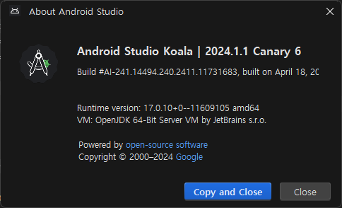
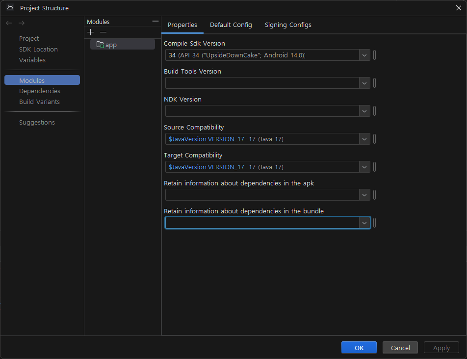

```log
Caused by: org.gradle.api.GradleException: 'compileDebugJavaWithJavac' task (current target is 17) and 'compileDebugKotlin' task (current target is 1.8) jvm target compatibility should be set to the same Java version.
```

JDK 버전을 17을 사용하고 있기에 Target JDK를 17로 잡고 실행해보니 위와 같은 오류가 튀어나왔다.

<p align="center">
  
</p>

<p align="center">
  
</p>

## 에러원인
글자 그대로 현재 Kotlin 버전과, Kotlin Compile시 JVM 타겟 버전이 서로 달라서 생기는 문제였다.

프로젝트 구조설정을 변경한다고 해서 코틀린 컴파일 JVM 버전은 같이 변경되지 않아서 `build.gradle.kts` 파일 의 kotlinOptionns {} 의 jvmTarget 버전을 `"17"` 로 적어주면된다.


## 에러 해결 방법
```gradle
android {
    ...
    kotlinOptions {
        jvmTarget = "[JVM 타겟 버전]"
    }
    ...
}
```

위 부분을 오류에서 설명하는 Kotlin 타겟 버전으로 변경하면 된다.

소수점이나 언더바를 사용하지않고 `""` 안에 17이라고 쓰면 된다.

```gradle
android {
    ...
    kotlinOptions {
        jvmTarget = "17"
    }
    ...
}
```

---

참고 : https://kotlinworld.com/426